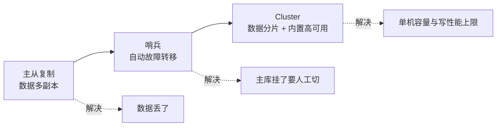
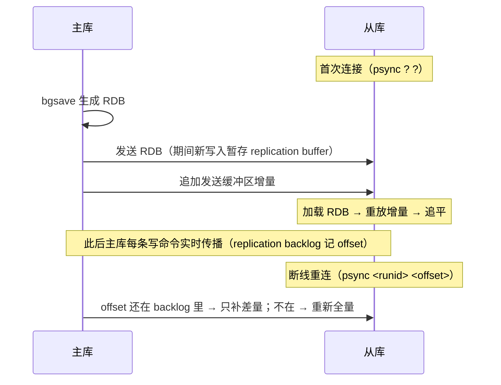
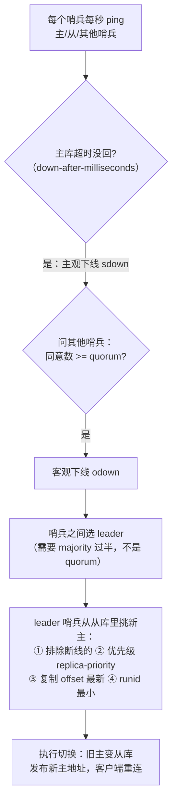
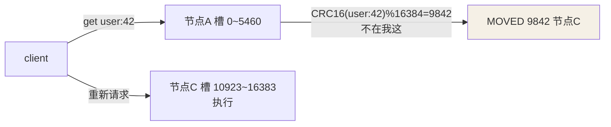

## 演进主线



## 主从复制

第一次是**全量**，之后是**增量**：



要点：

- 主库为每个从库起一个**子进程**发 RDB，不阻塞主线程。
- **replication backlog（环形缓冲区）** 记最近的写命令与位点，短断线
  只需补差——backlog 太小，断线久了就退化成全量同步。
- 异步复制：主库不等从库确认——**主库刚写入未同步就宕机，这条数据
  就丢了**（这就是分布式锁篇说主从切换丢锁的根源）。

## 哨兵（Sentinel）：自动故障转移

主从只解决了"数据有备份"，主库挂了仍要人工切换。哨兵集群做三件事：
**监控、裁决、选主**。



两个容易混的数：**quorum 只用于"认定客观下线"**（门槛可低）；**leader
选举必须过半哨兵**（保证同一任期内只有一个 leader）——所以哨兵要部署
奇数个（≥3）。

**脑裂**残留风险：旧主没死只是卡（网络分区），分区恢复后旧主上有新写入
——会因被视为从库被**清空重同步**，分区期间的写入丢失。缓解参数：

```conf
min-replicas-to-write 1        # 主库至少有 1 个从库在同步才接受写
min-replicas-max-lag 10        # 从库延迟超 10s 视为失联 → 拒绝写入
```

## Cluster：16384 个槽

主从 + 哨兵仍是"**一个容量、单点写入**"。Cluster 把数据切片：

- 全键空间切成 **16384 个槽**，`slot = CRC16(key) % 16384`，每个主节点
  负责一段槽位。
- 客户端直连任意节点：槽在本地直接执行；不在则返回 **MOVED 重定向**。
- 槽迁移中途的 key：**ASK 重定向**到目标节点（迁移完成前新旧各持一半
  职责，客户端应答后继续向新节点发请求但记住旧节点的槽归属没变）。
- 节点间用 **Gossip 协议**（ping/pong 携带集群拓扑）互相探活与传播状态；
  主挂了它的**内置从库自动顶上**（每主至少配一个从，哨兵的活被内置了）。



**为什么是 16384**：心跳包里要携带"我负责哪些槽"的位图，16384 bit =
2KB 刚好；槽越多图越大浪费带宽；且官方定位集群 ≤1000 节点，16384 个槽
足够分。**为什么不用一致性哈希**：槽是**显式分配**的——扩缩容时按槽
迁移、粒度可控，数据归属一目了然，不依赖哈希环的虚节点技巧。

限制：多 key 操作（mget/事务/lua）要求所有 key **同槽**——业务上用
hash tag `{orderId}:items`、`{orderId}:detail` 强制同槽。

## 选型

| 方案 | 适用 | 代价 |
|---|---|---|
| 主从 | 读多写少、可人工兜底 | 故障要人切 |
| 哨兵 | 数据量单机放得下（经验值 ≤ 10G）、要自动转移 | 仍是单主容量/写入上限 |
| Cluster | 超过单机容量或写入瓶颈 | 运维复杂、多 key 受同槽限制 |

## 小结

- 复制：首连全量 RDB + 增量差补，异步复制存在丢数据窗口。
- 哨兵：quorum 定客观下线、majority 选 leader、再挑新主；脑裂用
  min-replicas 参数缓解。
- Cluster：CRC16 分 16384 槽 + MOVED/ASK 重定向 + Gossip 探活，
  分片与高可用一体化。
