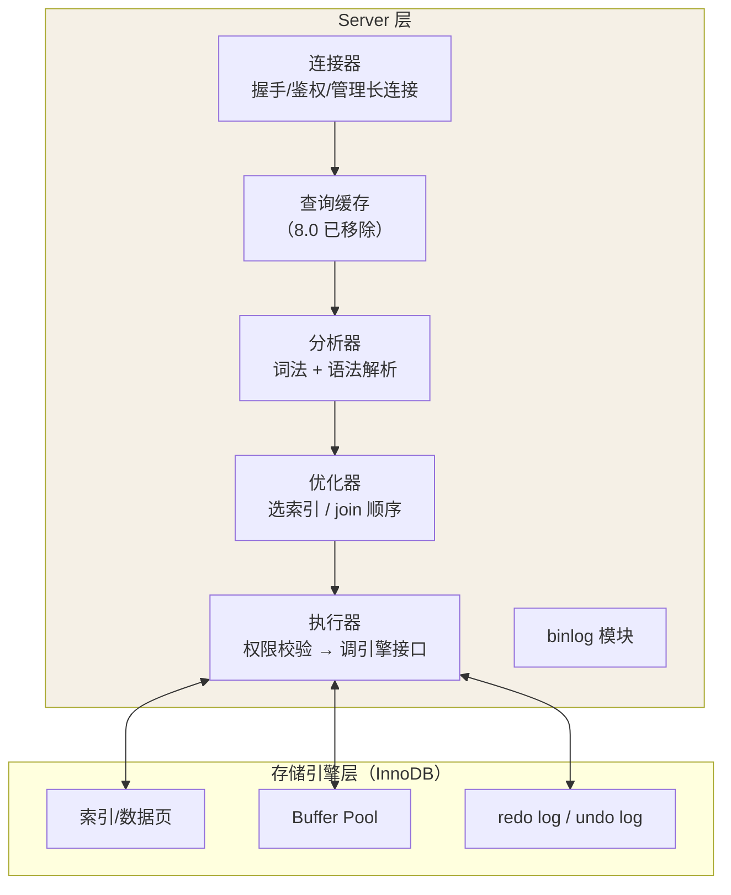

## 两层架构

MySQL 分 **Server 层**（所有内置功能跨引擎通用）和**存储引擎层**
（负责数据的存取，插件式，InnoDB 是 5.5+ 默认）。



## 一条查询语句的旅程

```sql
select * from users where id = 7;
```

1. **连接器**：TCP 握手、账号密码鉴权、拿到权限表快照（这就是改权限
   只对新连接生效的原因）。长连接省握手，但内存随命令堆积——定期
   `mysql_reset_connection` 或连接池代劳。
2. **查询缓存**（8.0 已移除）：key 为 SQL 文本的哈希。任何一张表的更新
   都要清空相关缓存——命中率极低，收益为负，官方直接砍掉。
3. **分析器**：词法分析（拆出 select / users / id）+ 语法分析（AST），
   `ERROR 1064` 就是这层抛的。
4. **优化器**：决定用哪个索引、多表 join 用什么顺序——同一个语句的
   "执行计划"在这定型（explain 看的就是它的决策）。
5. **执行器**：先做权限校验（所以存储引擎看不到鉴权逻辑），然后循环
   调用存储引擎接口逐行取数、按 where 过滤、返回结果集。

## 一条更新语句的额外旅程

```sql
update users set name = 'tom' where id = 7;
```

与查询共用同一套解析链路，但执行器调用 InnoDB 时多了**日志协议**：


**WAL（Write-Ahead Logging）**：先顺序写日志、再择机随机写数据页——
顺序 IO 快几个数量级，这是 InnoDB 高吞吐的核心设计。redo 与 binlog 的
两阶段提交细节见「三大日志」篇。

## InnoDB vs MyISAM

| 维度 | InnoDB | MyISAM |
|---|---|---|
| 事务 | 支持（ACID） | 不支持 |
| 锁粒度 | 行级锁 | 只有表锁 |
| 外键 | 支持 | 不支持 |
| 索引结构 | **聚簇索引**（叶子存整行） | 非聚簇（叶子存地址指针） |
| 崩溃恢复 | redo log 保证 | 基本没有 |
| count(*) | 扫表（MVCC 下每事务可见性不同） | 有专门的计数器，秒回 |

历史转折：5.5 之后 MyISAM 的事务与崩溃恢复短板在互联网场景被无限放大，
InnoDB 成为默认——**没有事务的系统几乎不值得上 MySQL**。

## 长连接为什么涨内存

连接对象在断开前一直持有：权限快照、会话变量、每条命令执行过的内存
（sort_buffer、临时表等，规则是"用完即释"但集中在断开时归还）。连接池
的 `idleTimeout` + `resetConnection` 就是为了治这个。

## 小结

- 链路：连接器 →（缓存已死）→ 分析器 → 优化器 → 执行器 → 引擎。
- 更新走 WAL：undo → 改内存页 → redo(prepare) → binlog → commit。
- Server 层管"想清楚"，引擎层管"存取快"；binlog 属于前者，redo/undo
  属于后者。
