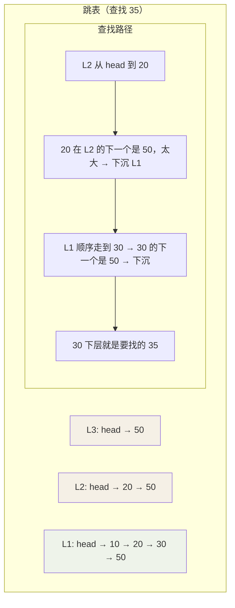
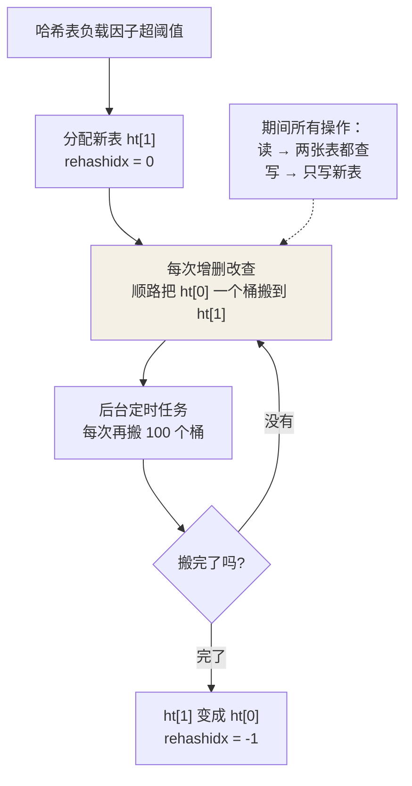

## 一个类型，多种编码

Redis 对外的 String / Hash / List / Set / ZSet 只是**接口**，底层按数据
量与特征动态换实现（`object encoding key` 可查看）：

| 类型 | 小数据 | 大数据 / 特征 |
|---|---|---|
| String | int（整数）/ embstr（≤44B 短串） | raw |
| Hash | listpack | hashtable |
| List | quicklist（双端链表 + 每节点一个 listpack） | 同左 |
| Set | intset（纯整数）/ listpack | hashtable |
| ZSet | listpack | **skiplist + dict 双结构** |

核心思想：**小数据用紧凑结构省内存，长大了换成查询高效的结构**——
切换阈值（如 hash-max-listpack-entries=128）可配。

## SDS：C 字符串的改造

```c
struct sdshdr {
    uint32_t len;      // 已用长度
    uint32_t alloc;    // 总容量
    unsigned char flags;
    char buf[];        // 内容，可含 '\0'
};
```

对比 C 字符串的三大改造：

1. **O(1) 取长度**：len 字段直接读，不用 strlen 遍历。
2. **二进制安全**：以 len 而非 '\0' 判结尾——图片、序列化字节流都能存。
3. **空间预分配 + 惰性释放**：扩容多留一截，缩短先记账不真释放，
   减少反复 realloc。

## 跳表：ZSet 的骨架

多层索引的有序链表，用"空间换层数"实现 O(logN) 查找：



- 插入时**随机决定层数**：每层晋升概率 1/4，最高 64 层——期望层数
  O(logN)，不靠严格平衡就维持了性能。
- **为什么不用红黑树**：实现简单得多；**范围查询 zrange 更顺手**（找到
  起点后沿底层链表扫即可，红黑树要中序回溯）；且按排名操作（zrank）
  在节点记 span（跨度）后天然支持。

ZSet 同时挂着 **dict（member → score）**：单点查分数 O(1) 走 dict，
按分数范围查走跳表——两个结构各干各的活，内存双份换双向高效。

## listpack：紧凑列表（7.0 全面替代 ziplist）

一块连续内存，每个 entry 孆 `[总长][内容][回看长度]`，**从任意元素可
向前向后遍历**。小 Hash / 小 ZSet 用它：省内存、缓存友好。

被它取代的 ziplist 有个著名缺陷——**连锁更新**：每个 entry 记录"前一
项长度"，前项变长可能引起后项长度字段级联扩容，最坏 O(n²)。listpack
改为只记**自己的**长度，问题根除。

## dict：渐进式 rehash

键值对的最终归宿。扩容时如果一次性把几百万 key 搬到新表，主线程会
卡顿——Redis 的解法是**分多次、顺路搬**：



期间查询要查两张表、新增只进新表——这就是"渐进式"：把一次大停顿摊薄
成无数次微小的顺路操作。

## intset 与小 Set

全整数且数量少时，Set 用有序 int16/32/64 数组（intset）：省内存、
二分查找。一旦混入非整数或数量超限，整体转 hashtable。

## 小结

- 类型 ≠ 实现：编码按数据量动态切换，小而省、大而快。
- SDS 修好 C 字符串三宗罪；跳表靠随机层数替代平衡树且范围查询更顺。
- 渐进式 rehash 把大停顿摊成顺路小步——这个思想值得搬进自己的系统设计。
