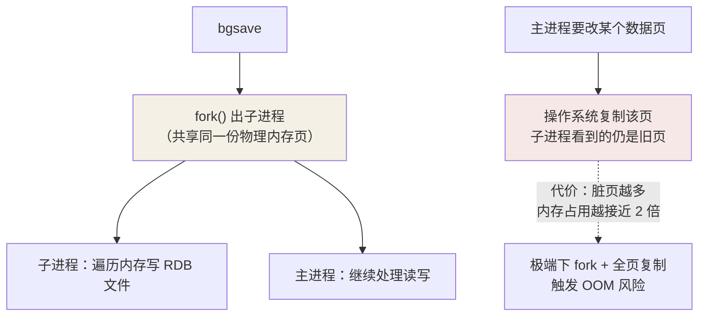
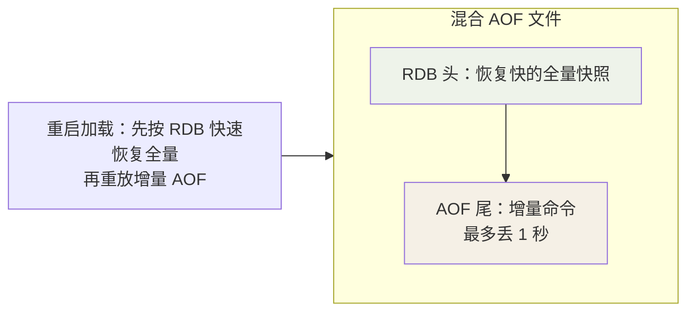

## 两条路线

内存数据库断电即失，Redis 提供两条持久化路线：

| | RDB | AOF |
|---|---|---|
| 内容 | **某时刻全量数据的二进制快照** | 每条**写命令**的文本追加 |
| 文件 | 紧凑、恢复快 | 体积大、恢复慢（逐条重放） |
| 丢失窗口 | 两次快照之间的数据 | 最多 1 秒（everysec） |
| 性能影响 | fork 瞬间开销 | 持续小幅写入 |

## RDB：fork + 写时复制

`bgsave` 触发快照，**子进程**写 RDB 文件，主进程继续服务——靠操作
系统的**写时复制（COW）**保证一致性：



COW 让子进程拍到的永远是 fork 那一刻的"照片"，但代价是**主进程改多少
数据，就要复制多少页**——大实例在快照期间内存可能接近翻倍，部署容量
要留这份余量。

自动触发：`save 900 1`（15 分钟 1 次修改）、`save 300 10`、`save 60 10000`
任一满足即 bgsave；主从全量同步也走 RDB。

## AOF：命令追加 + 刷盘三档

写命令先进入 AOF 缓冲区，再按策略刷盘：

```conf
appendfsync always    # 每条命令都 fsync：最多丢 1 条，最慢
appendfsync everysec  # 【默认】后台线程每秒刷：最多丢 1 秒
appendfsync no        # 交给操作系统（约 30s）：最快最不安全
```

AOF 是文本协议，恢复 = 逐条重放命令——文件越长恢复越慢，于是有**重写**：
`bgrewriteaof` fork 子进程，把当前内存**状态**反向生成最小等价命令集
（100 次 `incr counter` 合并成一条 `set counter 100`）。重写期间的新写
命令进重写缓冲，最后追加到新文件——与 RDB 同样依赖 fork + COW。

Redis 7.0 起 AOF 变成多部件（base + incr + manifest）：重写只清增量
部分，期间 fsync 不中断，重写期间写入不再丢。

## 混合持久化（4.0+，推荐）

```conf
aof-use-rdb-preamble yes   # 4.8 默认开启
```

重写时 base 部分写 **RDB 格式的全量快照**，之后的增量是 AOF 命令：



兼得两家之长：恢复速度接近 RDB，丢失窗口保持 1 秒。

## 怎么选

| 场景 | 配置 |
|---|---|
| 纯缓存，丢了能回源重建 | 关持久化（或只留 RDB 兜底） |
| 一般业务，可接受秒级丢失 | 混合持久化 + everysec（默认组合） |
| 金融级每条必保 | AOF always（吞吐自己掂量） |
| 宕机恢复速度优先 | RDB（快照间隔换速度） |

另一个常被忽略的点：**主从架构里主库可以关掉持久化**，把快照压力挪给
从库——前提是从库必须可靠，且主库重启后要靠从库做全量同步，不能凭空
对外服务（空数据的主库会把从库同步成空库）。

## 小结

- RDB 靠 fork + COW 拍全量照，快但丢窗口大；AOF 追加命令，丢得少但恢复慢。
- everysec 是安全与性能的默认甜点；重写本质是"状态压缩成最小命令集"。
- 混合持久化 = RDB 头 + AOF 尾，默认就该开它。
