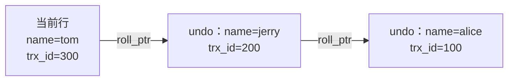
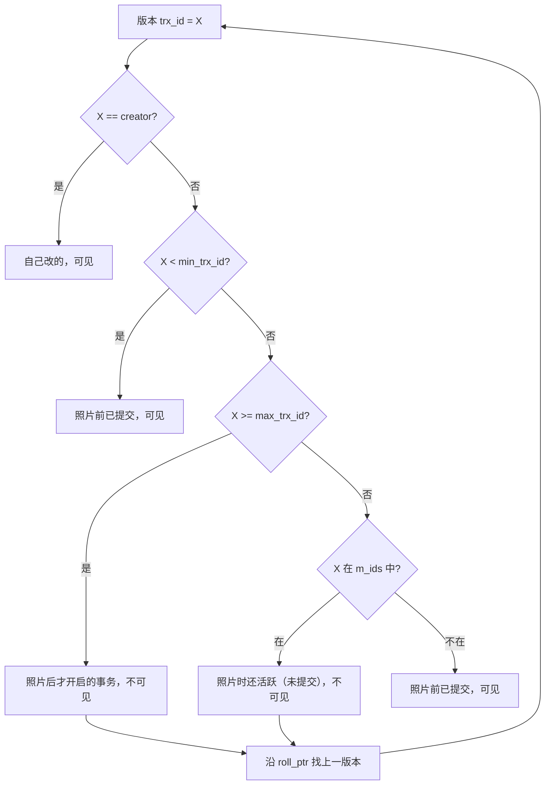

## ACID 分别由谁保证

| 特性 | 含义 | 实现者 |
|---|---|---|
| A 原子性 | 全做或全不做 | **undo log**（反向补偿） |
| C 一致性 | 数据从一个合法状态到另一个 | A + I + D 共同的结果 + 应用层约束 |
| I 隔离性 | 并发事务互不干扰 | **锁 + MVCC** |
| D 持久性 | 提交即落盘 | **redo log**（WAL） |

## 并发问题与隔离级别

| 问题 | 现象 |
|---|---|
| 脏读 | 读到别的事务**未提交**的数据（它一回滚你手里就是错的） |
| 不可重复读 | 同事务内两次读同一行值不同（别人 update 提交了） |
| 幻读 | 同事务内两次范围查询**行数**不同（别人 insert 提交了） |

| 隔离级别 | 脏读 | 不可重复读 | 幻读 |
|---|---|---|---|
| READ UNCOMMITTED | 有 | 有 | 有 |
| READ COMMITTED（RC） | 无 | 有 | 有 |
| **REPEATABLE READ（RR，默认）** | 无 | 无 | 快照读无*/当前读靠锁 |
| SERIALIZABLE | 无 | 无 | 无（完全串行，性能差） |

Oracle/PostgreSQL 默认 RC，MySQL 默认 RR——历史原因是早期 binlog 的
statement 格式在 RC 下会主从不一致，RR 更安全。

## MVCC：读不阻塞写

InnoDB 的多版本并发控制，靠三样东西：

**① 隐藏列**（每行都有）：

```
DB_TRX_ID   最后修改它的事务 id
DB_ROLL_PTR 回滚指针 → undo log 里的旧版本（链成版本链）
```

**② undo log 版本链**：每次修改都留旧版本，链头是最新：



**③ ReadView**：快照读开始时对"世界"拍的照片：

```
m_ids         生成时仍活跃（未提交）的事务 id 集合
min_trx_id    m_ids 里最小的
max_trx_id    下一个即将分配的事务 id
creator_trx_id 创建该 ReadView 的事务自己
```

**可见性判断**（沿版本链从新到旧找第一个可见版本）：



不可见就顺版本链往旧走，直到找到可见的那版——**这就是"可重复读"的
实现：读的是历史快照，不是最新数据**。

## RC 与 RR 的唯一区别

**ReadView 的生成时机**：

| 级别 | 生成 ReadView |
|---|---|
| RC | **每次**快照读都重新生成——所以能看到别人新提交的（不可重复读） |
| RR | 事务**第一次**快照读生成，之后复用——整个事务看到的世界定格 |

```sql
-- RR 下验证：
BEGIN;
select * from t where id = 1;   -- ① 建快照，值 = 100
-- 另一个事务：update t set v=200 where id=1; commit;
select * from t where id = 1;   -- ② 复用旧 ReadView，还是 100（可重复读）
COMMIT;
```

## 快照读与当前读

| | 语句 | 读到什么 |
|---|---|---|
| 快照读 | 普通 select | MVCC 版本链的历史版本 |
| 当前读 | select ... for update / lock in share mode、**insert / update / delete** | 最新已提交版本 + 加锁 |

**RR 下幻读的真相**：快照读靠 MVCC 防住幻读；当前读靠 Next-Key Lock
（记录 + 间隙锁，见锁篇）阻止别的事务插入。但两者**混用会破防**：

```sql
BEGIN;
select * from t where age > 10;          -- 快照读：看到 3 行
-- 另一事务 insert 一行 age=15 并提交
select * from t where age > 10;          -- 快照读：仍 3 行（MVCC 防住了）
update t set name='x' where age > 10;    -- 当前读！此刻作用的是最新数据（4 行）
select * from t where age > 10;          -- 4 行且 name 全变了 ← 幻影现身
COMMIT;
```

要彻底防住，第一次就用 `select ... for update` 锁住范围。

## 小结

- ACID 分工：A 靠 undo、D 靠 redo、I 靠锁 + MVCC。
- MVCC = 隐藏列 + undo 版本链 + ReadView；RC 和 RR 只差"照片拍几次"。
- 快照读不幻读靠 MVCC，当前读不幻读靠 Next-Key Lock，混用仍可能幻读。
