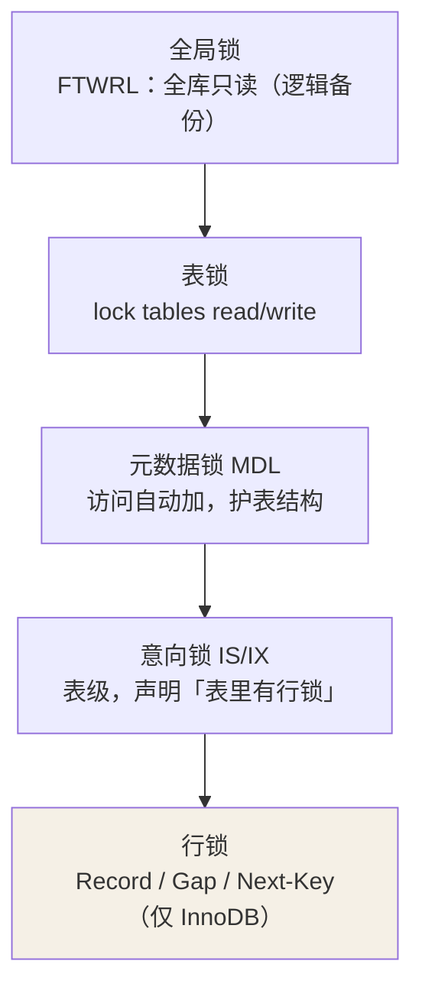
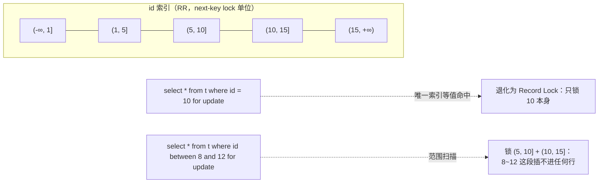

## 锁的粒度层级



- **全局锁**：`flush tables with read lock`，全库阻塞更新。InnoDB 逻辑
  备份用 `mysqldump --single-transaction` 走 MVCC 快照，可以不锁。
- **MDL（元数据锁）**：查询自动加 MDL 读锁，改表结构要 MDL 写锁——所以
  **在线 DDL 会卡在长事务后面**：一个慢查询握着读锁，DDL 排队等写锁，
  后续所有新查询又排在 DDL 后面，整表雪崩。DDL 前先杀长事务。
- **意向锁**：行锁之前先在表上打个"我里面有行锁"的标记。作用：**想加
  表锁的人看一眼意向锁就知道有没有行锁**，不用逐行扫。

## 行锁三兄弟

行锁锁的是**索引记录**（不是物理行——没有索引走全表扫描时，行锁全部
升级成表级效果，这是慢 SQL 拖死库的元凶之一）：

| 锁 | 锁什么 | 场景 |
|---|---|---|
| Record Lock | 索引上的**一条记录** | `where id = 7` 且 id 是唯一索引 |
| Gap Lock | 索引记录之间的**开区间** | 阻止别人往缝里插数据 |
| **Next-Key Lock** | 记录 + 前面的间隙（左开右闭） | **InnoDB 加锁的基本单位**，RR 防幻读的主力 |

假设表里有 id：1、5、10、15：



加锁规则速记（8.0，RR）：

1. 默认加 **Next-Key Lock**（前开后闭区间）。
2. **唯一索引等值命中** → 退化为 Record Lock；**没找到**（记录不存在）
   → 退化为 Gap Lock（锁住目标所在的缝隙）。
3. 访问到**第一个不满足条件的边界**时，边界上的 next-key 退化为 Gap。
4. 非唯一索引等值查询 → 命中记录及其前后的 Next-Key + 下一间隙的 Gap。

RC 隔离级别下没有 Gap Lock（除唯一性检查外），幻读防线交给 MVCC。

## 死锁

两个事务互相持有对方想要的锁：

```sql
-- 事务 A                          -- 事务 B
update t set v=1 where id=1;        update t set v=1 where id=2;
                                    -- A 持有 id=1
update t set v=1 where id=2;        -- A 等 B 放 2 → 阻塞
                                    update t set v=1 where id=1;   -- B 等 A 放 1 → 死锁
```

InnoDB 检测到等待环（wait-for graph），**回滚代价小的事务**并返回
`ERROR 1213 Deadlock found`。查看现场：

```sql
show engine innodb status\G     -- LATEST DETECTED DEADLOCK 段
```

防死锁实践：

- **按固定顺序**访问行（如统一按主键升序）——破坏"环路"。
- 事务尽量小、快提交，别在事务里做 RPC/IO。
- 索引到位，避免锁范围被扫描放大。
- 高并发抢同一行时用 `select ... for update nowait`（8.0）或队列化。

## 乐观锁 vs 悲观锁

| | 悲观锁 | 乐观锁 |
|---|---|---|
| 思路 | 先锁后改：`select ... for update` | 不加锁，提交时校验版本 |
| 实现 | 数据库行锁 | `update ... set v=..., version=version+1 where version=#{old}` |
| 适用 | 冲突多、临界区长 | 冲突少、读多写少 |

乐观锁失败要业务侧重试，本质是把冲突成本从数据库挪到了应用层。

## 小结

- 表级看 MDL（DDL 卡长事务）与意向锁；行级记住基本单位是 Next-Key。
- 行锁锁索引；唯一索引等值命中退化为 Record Lock。
- 死锁靠破坏环路与减小锁窗口；乐观锁是应用层版本号方案。
