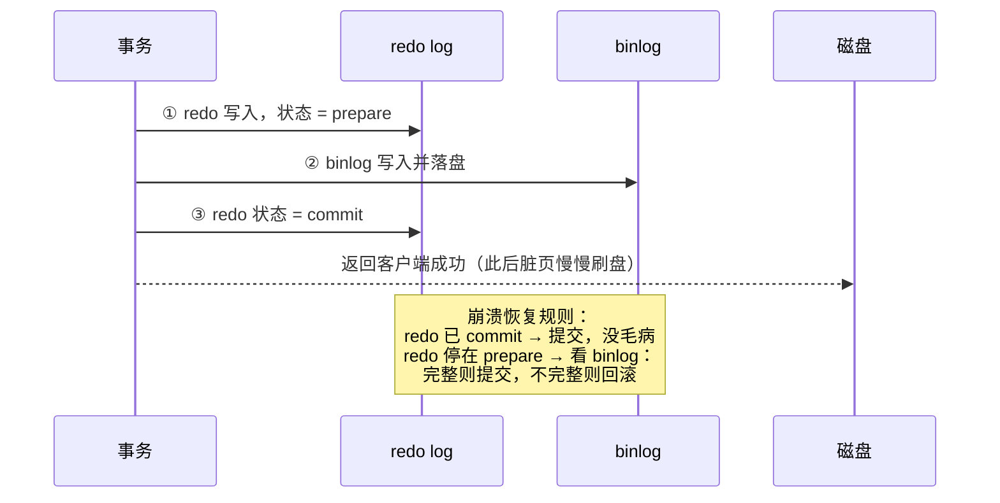

## 三本账各记各的

| | undo log | redo log | binlog |
|---|---|---|---|
| 归属 | InnoDB | InnoDB | **Server 层**（所有引擎都有） |
| 内容 | 逻辑日志：**反向操作**（insert 记 delete） | 物理日志：**某页某偏移改成什么** | 逻辑日志：语句或行变更（statement/row） |
| 写法 | 随事务写 | **顺序追加、循环写**（固定大小，会覆盖） | 追加写（写满换新文件） |
| 用途 | 回滚 + **MVCC 版本链** | 崩溃恢复（持久性） | **主从复制 + 归档** |

redo 的存在理由是 **WAL**：磁盘随机写慢，先把"改了什么"顺序写进小日志，
数据页改在内存（脏页），之后慢慢刷盘——宕机也能靠 redo 重放补齐。

## redo 与 binlog 怎么协作：两阶段提交

它们是两个独立的日志系统（一个引擎层、一个 Server 层），同一次提交必须
保持一致，否则崩溃恢复后主从、数据都会错乱：



**为什么必须两阶段**（反证）：

- 先写 redo 后写 binlog，中间崩了：恢复后主库有这笔数据，**binlog 里
  没有** → 从库丢这笔更新，主从不一致。
- 先写 binlog 后写 redo，中间崩了：binlog 有、主库没这笔数据 → 从库
  **多出**一笔，同样不一致。

把 redo 拆成 prepare/commit 两截、binlog 夹在中间，崩溃恢复就能用
"binlog 完不完整"裁决 prepare 状态的事务该提交还是回滚。

## 刷盘参数

```sql
-- redo 刷盘策略（0/1/2，默认 1）
innodb_flush_log_at_trx_commit = 1   -- 每次提交都 fsync，最安全最慢
                                    -- 0: 每秒刷（宕机丢 1 秒）
                                    -- 2: 交给 OS 缓存（MySQL 挂了不丢，主机挂丢 1 秒）

-- binlog 刷盘策略（默认 1）
sync_binlog = 1                      -- 每次提交 fsync
```

**双 1 配置**（金融级不丢数据）；互联网常见 `1/100` 换吞吐。

## binlog 三种格式

| 格式 | 记录 | 问题 |
|---|---|---|
| statement | 原文 SQL | 主从可能不一致：`now()`、`uuid()`、`limit` 无序 |
| row（默认） | 每行的变更前后镜像 | 体积大；但**绝对一致** |
| mixed | 混合 | 平衡方案，MySQL 自己切换 |

## undo log 的第二生命

除了回滚，undo 版本链是 **MVCC 的地基**——ReadView 顺着 roll_ptr 在
undo 里找历史版本（详见事务篇）。长事务的危险正在于此：**它赖着不提交，
InnoDB 就不敢删它的 undo 日志**，版本链越拖越长，大事务过后总有一波
慢查询。

## 组提交（刷盘优化）

每个事务都单独 fsync 太贵——多个并发事务的日志**攒一拨一起刷**，
一次磁盘 IO 顶 N 个事务，是高并发下两阶段提交的实际性能来源。

## 小结

- undo 管回滚与版本链，redo 管崩溃恢复（WAL），binlog 管复制与归档。
- 两阶段提交 = redo(prepare) → binlog → redo(commit)，崩溃恢复按 binlog
  完整性裁决。
- 双 1 最安全；长事务拖着 undo 不删是隐藏的性能地雷。
