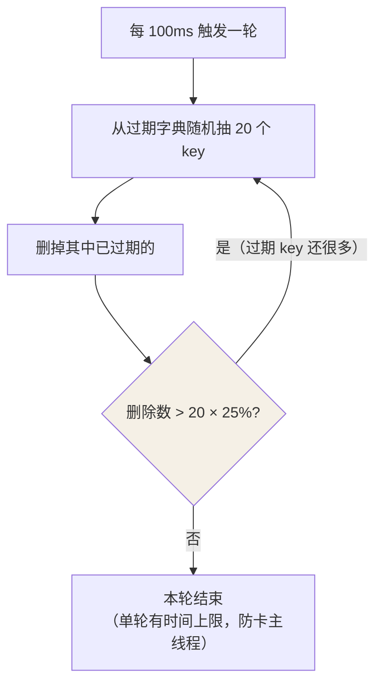

## 两套机制，一个管"到期"，一个管"装满"

- **过期删除**：针对设置了 TTL 的 key——到点了怎么删。
- **内存淘汰**：内存达到 maxmemory 时**强制腾地方**——没到期的也可能被赶走。

## 过期删除：惰性 + 定期

key 的 TTL 记在一个独立的过期字典里。三种思路的取舍：

| 策略 | 问题 |
|---|---|
| 定时删除（每个 key 配定时器） | key 海量时 CPU 被定时器吃光 |
| 惰性删除（访问时才查） | 到期没人访问的 key 永远占着内存 |
| **惰性 + 定期（Redis 的选择）** | 互为补丁 |

定期删除的节奏（默认 `hz = 10`，即每 100ms 一轮）：



**抽样 + 阈值循环**：过期的 key 比例高就接着抽，比例低就收工——
既不让 CPU 空转，也不让过期 key 堆积。即便如此仍有漏网之鱼（从未被
抽中、也无人访问的过期 key），它们最终由内存淘汰兜底回收。

## 内存淘汰：八种策略

`maxmemory` 打满后写入会触发淘汰（4.0 起有 8 种）：

| 策略 | 范围 | 规则 |
|---|---|---|
| **noeviction（默认）** | — | 不淘汰，写入直接报错 |
| allkeys-lru | 全部 key | 近似 LRU |
| volatile-lru | 设了 TTL 的 | 近似 LRU |
| allkeys-lfu | 全部 key | LFU（4.0+） |
| volatile-lfu | 设了 TTL 的 | LFU |
| allkeys-random | 全部 key | 随机 |
| volatile-random | 设了 TTL 的 | 随机 |
| volatile-ttl | 设了 TTL 的 | 谁快到期先赶谁 |

选型口诀：**缓存场景给全部 key 上 allkeys-lru / allkeys-lfu**（缓存
不该有写报错）；volatile-* 系列适合"库里既有缓存又有不可丢数据"的
混合实例——只有打了 TTL 的才是可牺牲的。

## 近似 LRU：省内存的折中

真 LRU 要维护全局双向链表：每次访问都挪节点，内存与 CPU 都贵。Redis
的做法：

- redisObject 头里留 **24bit 的 lru 时钟**（最后访问时间）。
- 淘汰时**随机采样**（`maxmemory-samples`，默认 5 个）放进一个淘汰池，
  从池里挑"最久未访问"的删。

牺牲少量精度（不全局严格有序），换回每个 key 零额外指针——**近似
LRU 的效果随采样数提升而逼近真 LRU**。

## LFU：4.0 的更优解

LRU 的盲区：偶发批量扫描（一次性把冷数据全"摸热"）。LFU 按访问频率
淘汰，实现藏在那 24bit 里：

```
| 16bit 分钟级衰减时间 | 8bit 对数频率计数 |
```

- **对数计数**：0 → 1 必进，之后概率递减（255 封顶）——火山型访问很快
  冲高，随后**按分钟衰减**，不活跃的 key 自然冷却。
- 两个参数可调：`lfu-log-factor`（增长快慢）、`lfu-decay-time`（衰减
  周期）。

## 小结

- 到期靠惰性 + 抽样定期双保险；漏网的交给内存淘汰兜底。
- 八策略先分 allkeys / volatile 两个池，再选 lru / lfu / random / ttl。
- 近似 LRU = 采样 + 淘汰池；LFU 用对数计数 + 时间衰减，治"偶发扫描
  污染"。
