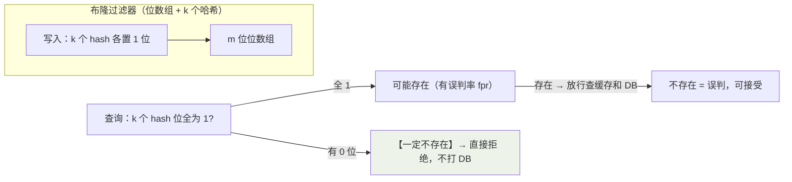

## 一张表先分清三兄弟

| 故障 | 本质 | 触发条件 | 后果 |
|---|---|---|---|
| **穿透** | 查**不存在**的数据 | 恶意伪造 id / 业务缺陷 | 缓存永远不命中，全打到 DB |
| **击穿** | **热点** key 过期瞬间 | 高频 key 恰好到期 | 并发洪峰瞬间压向 DB |
| **雪崩** | **大面积**失效或实例宕机 | 同批 TTL / Redis 挂了 | DB 被打死，服务整体雪崩 |

```mermaid
flowchart TB
    Q["缓存故障定位"] --> A{"数据在 DB 里存在吗?"}
    A -->|"不存在（穿透）"| P["布隆过滤器 / 缓存空值"]
    A -->|"存在" -> B{"失效的是单个热点还是大面积?"}
    B -->|"单个热点（击穿）"| H["互斥重建 / 逻辑过期"]
    B -->|"大面积（雪崩）"| X["随机 TTL / 多级缓存 / 集群高可用"]

    style P fill:#eef3ea
    style H fill:#f5f0e6
    style X fill:#f7e8e8
```

## 穿透：不存在的数据

```java
public User getUser(Long id) {
    User cached = redis.get("user:" + id);
    if (cached != null) return cached == NULL_PLACEHOLDER ? null : cached;
    // 缓存未命中 → 查库 → 也不存在：
    // ① 缓存空值：短 TTL（如 60s）挡住重复穿透
    redis.setex("user:" + id, 60, NULL_PLACEHOLDER);
    return null;
}
```

**缓存空值**治标（内存换安全，key 空间要防爆破）；**布隆过滤器**治本：



核心性质：**判"不存在"绝对可靠，判"存在"有误判率**——正好匹配穿透
场景（挡掉确定不存在的请求，漏过的误判走正常链路）。缺点：不能删除
单个元素（counting BF 可以）、容量要预估。Redis 里的 Bloom 依赖
RedisBloom 模块，或 Guava/Redisson 客户端实现。

## 击穿：热点 key 过期瞬间

**方案一：互斥锁重建**——只放一个请求去查库，其他线程等结果：

```java
public User getUser(String key) {
    String v = redis.get(key);
    if (v != null) return parse(v);

    String lockKey = "lock:" + key;
    if (tryLock(lockKey)) {              // setnx 抢锁（见分布式锁篇）
        try {
            v = redis.get(key);          // double check：等锁期间别人可能已重建
            if (v != null) return parse(v);
            User u = db.load(key);      // 只有抢到锁的这一个请求回源
            redis.setex(key, 300, toJson(u));
            return u;
        } finally { unlock(lockKey); }
    }
    Thread.sleep(50);                    // 没抢到的稍等重试（或直接返回旧值兜底）
    return getUser(key);
}
```

**方案二：逻辑过期**——key 永不设 TTL，过期时间写进 value：

```java
record CacheValue(String data, LocalDateTime expireAt) {}

// 命中后自己判断：未过期直接返回；已过期 → 抢到锁的线程异步重建，
// 抢不到的和后来者先返回【旧数据】——牺牲一点一致性，保住吞吐。
```

两者对比：互斥锁简单但等待会堆积；逻辑过期无等待但**返回旧值**且要
额外占内存预热。热点 key 非常明确（秒杀商品）用逻辑过期更顺。

## 雪崩：大面积失效

- **同批 TTL 同时到**：`TTL = base + random(600)` 把过期时间打散。
- **Redis 实例挂了**：本身是高可用问题——主从 + 哨兵 / Cluster（见
  高可用篇）。
- **兜底防线**：本地多级缓存（Caffeine 挡住大部分读）、网关限流熔断
  （DB 打不死，只是变慢）、DB 侧对热点查询做排队。

## 缓存一致性的顺带提醒

常见组合是 Cache Aside：**先更新 DB，再删缓存**（而不是更新缓存）。
删失败用重试队列 / binlog 订阅（Canal）补偿；要强一致就没必要上缓存了
——缓存换吞吐，本来就接受短暂不一致。

## 小结

- 定位口诀：不存在是穿透、热点单点是击穿、大面积是雪崩。
- 穿透靠"判不存在绝对可靠"的布隆过滤器；击穿靠互斥重建或逻辑过期。
- 雪崩是组合拳：随机 TTL + 高可用 + 多级缓存 + 限流兜底。
