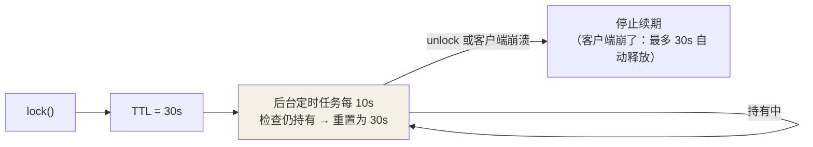

## 为什么单机锁不够

多实例部署后，synchronized 只锁得住**自己这个进程**——两个服务实例同时
放行一个"只能单人执行"的任务。锁必须挪到所有实例都看得见的地方：
Redis。

## 第一版：setnx + expire 的坑

```java
// 坑：两步不原子 —— setnx 成功后、expire 之前进程崩了 → 死锁
jedis.setnx("lock", "1");
jedis.expire("lock", 30);

// 正解：一条命令（2.6.12+）
jedis.set("lock", token, SetParams.setParams().nx().ex(30));
```

## 第二版：别人的锁我能删？

场景：A 拿锁，业务超时 30s，锁自动过期 → B 拿到锁 → A 终于跑完执行
`del lock`——**把 B 的锁删了**，C 又进来……

解法：value 存**唯一标识**（UUID + 线程 id），删除前校验是自己的锁。
校验 + 删除必须是原子操作，上 Lua：

```lua
-- unlock.lua：值匹配才删，防止"查完是自己的、删之前过期被别人拿走"的窗口
if redis.call("GET", KEYS[1]) == ARGV[1] then
    return redis.call("DEL", KEYS[1])
else
    return 0
end
```

## 第三版：业务没跑完锁先过期

锁 30s、业务 40s——第 31 秒起互斥就破了。手动续期又难写对（什么时候
续、失败了怎么办），**Redisson 的看门狗**是工业级答案：

```java
RLock lock = redisson.getLock("order:lock:" + orderId);
lock.lock();               // 不传 leaseTime 才启用看门狗
try {
    doBusiness();          // 看门狗在后台每 10s 把 TTL 续到 30s
} finally {                 // （默认 30s / 每 1/3 即 10s 续一次）
    lock.unlock();         // 主动释放后看门狗停止续期
}
```



## Redisson 的完整答案

- **可重入**：锁结构是 Hash——`field=客户端:线程标识，value=重入计数`，
  同线程再 lock 计数 +1，unlock 计数 -1 归零才真删。加锁/解锁全程 Lua
  保证原子。
- **等待队列**：抢不到的通过 pub/sub 订阅释放消息，避免无脑自旋。
- **主从切换的坑**：加锁写进主库、还没同步到从库时主库宕机 → 从库
  提升后**锁丢了**，两个客户端同时持锁。

## RedLock 与它的争议

针对上面主从切换丢锁，antirez 提出 RedLock：向 **N 个独立的主节点**
依次加锁，**多数（N/2+1）成功且总耗时小于 TTL** 才算拿到锁。

Martin Kleppmann（《DDIA》作者）的著名质疑：

- 加锁成功后发生 **GC 停顿 / 时钟跳变**，客户端"以为"还持锁，实际
  早已过期——分布式锁的安全性依赖时钟与停顿的假设太脆弱。
- 效率型场景（防重复计算）Redis 单实例锁足够；**正确性攸关**（防资金
 超扣）的场景应选 Zookeeper/etcd 这类 CP 系统，或干脆靠 DB 唯一约束/
 乐观锁兜底。

实践结论：**用 Redisson 单主锁解决效率问题；正确性问题交给数据库层
（唯一索引、版本号）或 ZooKeeper**——不要指望一把分布式锁同时便宜
又绝对可靠。

## 与本地锁的对比定位

| | synchronized | Redis 分布式锁 | ZooKeeper 锁 |
|---|---|---|---|
| 作用域 | 单 JVM | 全局（AP 倾向） | 全局（CP） |
| 性能 | 最高 | 高 | 中（写走 ZAB） |
| 可靠性 | 进程内绝对 | 主从切换有丢锁窗口 | 强一致，临时节点自动释放 |

## 小结

- 演进主线：原子加锁（SET NX EX）→ 唯一标识 + Lua 防误删 → 看门狗续期
  → Redisson 可重入。
- 看门狗只在**不指定 leaseTime** 时启动；主动 unlock 会停掉续期。
- RedLock 有学术争议；正确性攸关的互斥别只押注 Redis，加一层 DB 约束
  兜底。
