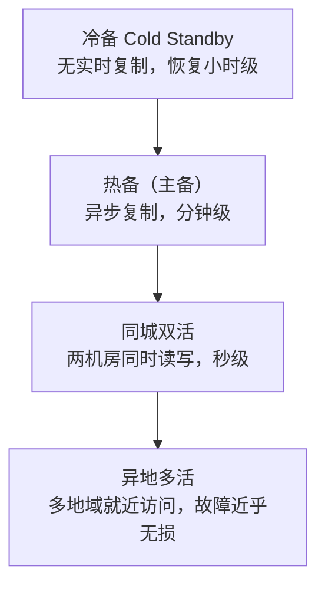
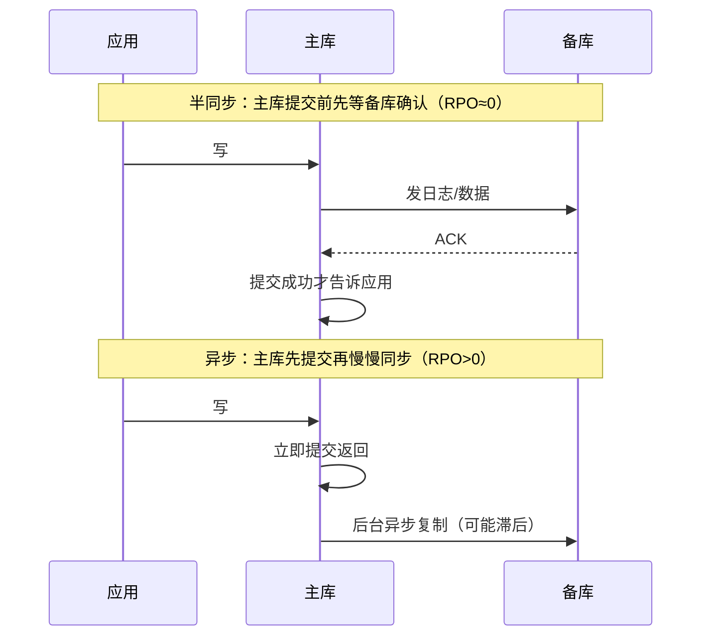
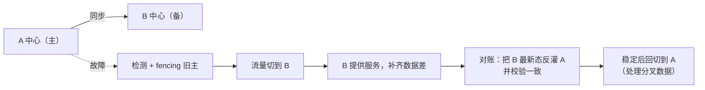

容灾的本质是回答一句话：**机房/区域挂了，多久恢复、丢多少数据**。两个
指标把话说清：

| 指标 | 含义 | 数值越小越好 |
|---|---|---|
| **RTO** 恢复时间目标 | 从故障到业务恢复允许的最大时间 | 冷备→热备→万级不断裂 |
| **RPO** 恢复点目标 | 允许丢失的数据量（时间窗） | 异步同步 → 0 丢失（强同步） |

RTO 靠"切换多快"，RPO 靠"复制多同步"。二者通常此消彼长，成本随严格程度
指数上升。

## 冗余模式的光谱



- **冷备**：只有备份，恢复靠人工拉取 + 重放，RPO/RTO 都差，最便宜。
- **热备（主备）**：主库写入，备库复制；主挂→升级备库。难点是谁来
  **检测主挂了**（见下方"探活与选主"）。
- **同城双活**：同城两机房共用一套 DB（仍需单一主或少数派共识），
  应用层双写双读，网络延迟低，切换快。
- **异地多活**：核心是**拆分流量**（按地域/用户分片），数据跨区域同步走
  最终一致，RTO 趋近 0，但对强一致场景极难。

## 复制机制：RPO 的三种档位

RPO 取决于**复制是异步还是同步**，落到主库提交和备库确认的时序上：



| 同步方式 | 切换时 | 说明 |
|---|---|---|
| 半同步 / 强同步 | 主备各有完整数据，切换不丢 | RPO≈0，但主库性能取决于备库确认延迟，连不上备库还会降级为异步 |
| 异步复制 | 可能丢最近 N 秒 | RPO>0，性能好 |
| 最终一致（跨区域） | 视同步进度 | 多活标配，需对账 |

**半同步的一个坑**：备库故障时，很多实现会**自动降级为异步**继续服务
（否则主库会卡死）。这没错，但你要知道——**备库挂掉的那一刻起，RPO 就从
0 悄悄变成几分钟**了，必须告警并尽快恢复复制通道。

## 探活与选主：谁来决定"主挂了"

切换的第一步是**检测**，误判（假阳性）会引发"双主"灾难，比不切换更糟：

| 机制 | 特点 |
|---|---|
| 心跳超时 + 手动确认 | 最稳但慢，靠人 |
| 仲裁/少数派（etcd、ZooKeeper） | 多数派才算主，天然防脑裂 |
| 三方探测 + 隔离（fencing） | 判定主死后，先用**隔离**保证旧主真的不再写，再提新主 |

> 关键原则：**切换前必须先 fencing（隔离）旧主**——用租约/STONITH/配电
> 手段强制旧主下线，或者用"只有持有最新租约的节点能写"，否则旧主在网络
> 抖动恢复后可能同时接受写，产生**双主脏数据**。这是所有选主方案安全性的核心。

## 切换与回切实战

**切换**：探测失败 → **fencing 旧主** → 把流量从 A 中心切到 B 中心（DNS /
load balancer 改路由 / 注册中心改路由）→ 校验数据（核对 RPO 时间窗内的
数据是否补齐）→ 恢复服务并告警。

**回切**：B 平稳运行后，把数据差异补齐，再把流量切回 A。**回切比切换
更危险**，因为要处理切换期间两边的分叉数据：

1. 切换期间 B 接受了新写，A 也"可能"还剩未送出的旧数据——先做**数据核对
   /对账**，把 A 重放成 B 的最新态。
2. **反向同步**：把 B 的最新数据倒灌回 A，验证 A 与 B 一致（checksum）。
3. 再切流量，灰度验证，全部通过才算回切完成。



## 故障演练清单（不演练等于没方案）

纸上方案在真故障时会当场露馅。把以下清单做成**定期演练剧本**：

| 演练项 | 验证什么 | 期待结果 |
|---|---|---|
| 主库宕机 | RTO 是否达标 | 分钟级自动/手动接管，业务不中断或短暂降级 |
| 主备断网（网络分区） | 防脑裂 + 半同步降级 | 备库故障时主库降级+告警，不造成双主 |
| 从库/备机全挂 | 只读分支是否能用 | 写路径进入降级，读仍正常 |
| 切换后回切 | 分叉数据对账 | 无脏数据，数据一致 |
| 依赖方（DNS/LB/注册中心）故障 | 切换入口是否单点 | 不是只有一个人/一盒能切 |
| 真实故障 vs 演练 | 有无僵尸命令/无人操作 | 切换脚本可一键执行，不用现场翻文档 |

**演练的基本姿势**：先做"只读演练"（切流量不切数据），再做"半破坏性"，最后
做"全破坏"（真杀主库）。每次演练记录：触发了哪个告警、RTO/RPO 实测多少、
有哪些设备/命令是文档没覆盖的。

```bash
# 演练常用工具（示意，具体随栈而定）
# 制造网络分区
iptables -A INPUT -s <备机IP> -j DROP
# 制造主库故障
systemctl stop mysql
# 验证切换脚本是否一键可用（无交互、有日志、能回滚）
./switch-to-b.sh --dry-run   # 先干跑
```

## 小结

- 先定 **RTO/RPO** 目标，再选**模式与同步方式**：半同步保 RPO≈0，异步保性能。
- 切换安全的前提是 **fencing 隔离旧主**防双主；探活要防假阳性脑裂。
- **切换容易、回切难**，分叉数据的对账回灌才是容灾方案真正复杂度。
- 高可用不止靠架构，还靠**故障演练**——把 RTO/RPO 从纸面变成实测。