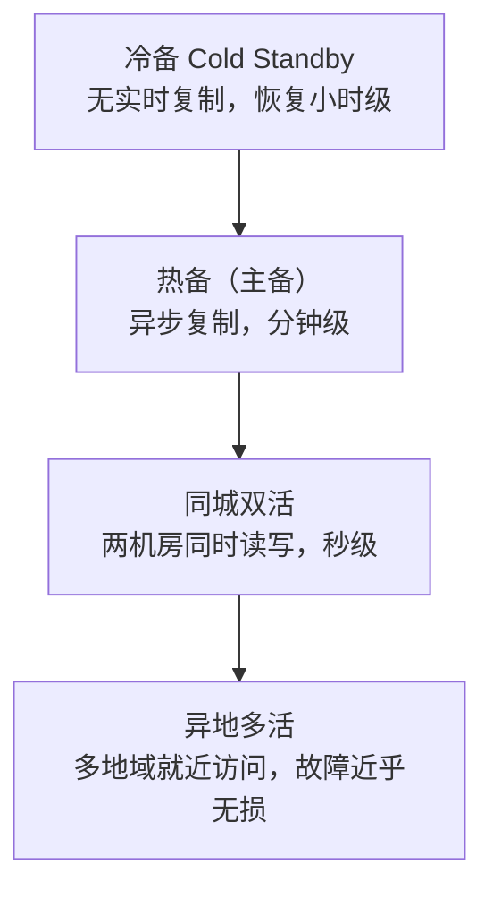
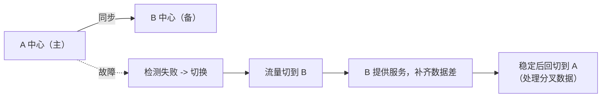

容灾的本质是回答一句话：**机房/区域挂了，多久恢复、丢多少数据**。两个
指标把话说清：

| 指标 | 含义 | 数值越小越好 |
|---|---|---|
| **RTO** 恢复时间目标 | 从故障到业务恢复允许的最大时间 | 冷备→热备→万级不断裂 |
| **RPO** 恢复点目标 | 允许丢失的数据量（时间窗） | 异步同步 → 0 丢失（强同步） |

RTO 靠"切换多快"，RPO 靠"复制多同步"。二者通常此消彼长，成本随严格程度
指数上升。

## 冗余模式的光谱

- **冷备**：只有备份，恢复靠人工拉取 + 重放，RPO/RTO 都差，最便宜。
- **热备（主备）**：主库写入，备库异步复制；主挂→升级备库，有少量丢失
  风险（RPO≈复制延迟）。
- **同城双活**：同城两机房共用一套 DB（仍是单一主），应用层双写双读，
  网络延迟低，切换快。
- **异地多活**：核心是**拆分流量**（按地域/用户分片），数据跨区域
  同步走最终一致，RTO 趋近 0，但对强一致场景极难。

## 副本同步的取舍

| 同步方式 | 切换时 | 说明 |
|---|---|---|
| 异步复制 | 可能丢最近 N 秒 | RPO>0，性能好 |
| 半同步 / 强同步 | 主备各有完整数据，切换不丢 | RPO≈0，双写延迟高 |
| 最终一致（跨区域） | 视同步进度 | 多活标配，需对账 |

## 切换与回切

- **切换**：探测失败 → 把流量从 A 中心切到 B 中心（DNS / 负载均衡 /
  注册中心改路由）→ 校验数据 → 恢复服务。
- **回切**：B 平稳运行后，把数据差异补齐，再把流量切回 A。**回切比切换
  更危险**，因为要处理切换期间两边的分叉数据。

## 小结

- 先定 **RTO/RPO** 目标，再选**模式与同步方式**，投入随严格度指数上涨。
- 冷备→热备→同城双活→异地多活，是"切换更快 vs 成本更高"的权衡线。
- **切换容易、回切难**，分叉数据的处理才是容灾方案的真正复杂度。
- 高可用不止靠架构，还靠**故障演练**——不演练的方案等于没有方案。