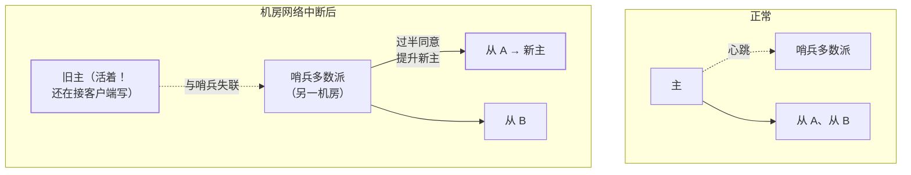

import AlgorithmVizIsland from '../../../../../components/viz/AlgorithmVizIsland.astro';

## 什么是脑裂

脑裂（Split-Brain）：**网络分区把集群裂成两半，两边的"主"各自为政
接收写入，数据从此分叉**。经典场景是主从架构 + 哨兵：

注意旧主**并没有宕机**——它只是被分区隔离了，照样自认为是主、
照样接受写入。等分区恢复，两段互斥的历史要合并，Redis 这类无版本
合并能力的就是丢数据。

## 成因三要素

1. **网络分区**：裂成多个孤岛（交换机故障、机房断连、防火墙误杀）。
2. **心跳超时误判**：主只是卡顿（GC/IO 抖动），哨兵超时判定死亡 →
   完成切换，旧主恢复后成了"前主"。
3. **旧主复活不受控**：切换期间客户端还连着旧主继续写，或前主
   网络恢复后没有降级。

一句话：**故障转移解决"主挂了"，脑裂是"旧主没死透"**。

## quorum：过半机制的数学

仲裁（quorum）规则：**任何决策（选主、提交）都要获得超过半数节点
同意**。

- n 个节点最多容忍 **⌊(n-1)/2⌋** 个故障：3 容 1、5 容 2、7 容 3。
- 两个多数派**必然相交**——分区两边不可能同时凑出过半，就选不出
  两个主；旧主凑不出过半，就被判定为"少数派"拒绝服务。
- 推论：**4 节点和 3 节点容忍度相同（都只容 1）**，偶数节点纯属
  浪费，要么 3 要么 5。

quorum 是 Raft/Paxos/ZAB 的根基（见 [Paxos 与 Raft](/distributed/intermediate/consensus/01-paxos-raft/)），也是下面
所有组件防护的底层原理。

## 主流组件的脑裂防护

| 组件 | 机制 | 关键配置 |
|---|---|---|
| Redis 主从 | 主失联从库即拒绝写 | `min-replicas-to-write 1` + `min-replicas-max-lag 10`：健康从库不足/延迟超标，**主拒绝写入** |
| Redis 哨兵 | 切换须过半哨兵授权 | `quorum` 配置；哨兵自身要 3 节点起 |
| ZooKeeper | 过半写 + 临时会话 | 不可配，天生气；旧主失联即失去会话 |
| Elasticsearch | 选主/元数据变更须过半 master-eligible | `discovery.cluster_initial_master_nodes`；凑不出过半**宁可整集群不可写** |
| Kafka | Raft/KRaft 过半选主；生产端 acks + min.insync.replicas | `min.insync.replicas=2`：同步副本不足直接拒绝写 |
| MySQL MGR | 基于 Paxos 的组复制 | `group_replication_unreachable_majority_timeout` |

Redis 的 `min-replicas-to-write` 就是"主自裁"：感知不到足够从库
（= 可能被分区了），就不再接写，从根上掐掉旧主的写入。

## fencing：拦在存储端

quorum 管住了"谁能当主"，还剩最后一个洞：**客户端缓存了旧主的
地址，照样往旧主写**（旧主可能还在接连接）。fencing（栅栏）思路
同[分布式锁的 fencing token](/distributed/intermediate/coordination/01-distributed-lock-compare/)：

- 每任主一个**单调递增的 epoch/term**（Raft 的 term、ZK 的
  zxid、哨兵的 config epoch 都是它）；
- 存储层记录最新 epoch，**拒绝旧 epoch 的写入**；
- 再粗暴一层是 STONITH（"Shoot The Other Node In The Head"）：
  直接电源级隔离旧主，物理上不让它复活作乱。

三层防线总结：**quorum 选出新主（管选举）→ 主自裁配置（管旧主
不接写）→ fencing/epoch 校验（管旧数据写不进来）**。

分区、双主、旧客户端漏写的全过程按帧放一遍：

<AlgorithmVizIsland demo="split-brain" />

## 灾备场景的"人为脑裂"

同城双中心切换时最容易人为造出脑裂：两边都以为对方挂了，同时
把各自的从库提升为主。防法不在技术参数，在**纪律**：

- 单一仲裁源：切换决策只由仲裁中心/全局元数据（如基于 etcd 的
  全局锁）发放，不允许两边自主提升；
- 写白名单：应用侧只写"当前主中心"配置，回切前先停写、比对
  binlog 位点/GTID、修数据，再放开。

## 小结

- 脑裂 = 分区 + 误判 + 旧主复活；故障转移的代价就是它，必须配套
  防护而不是默认安全。
- quorum 用"多数派必相交"保证唯一主，n 选 2n+1 不选 2n。
- 组件防护一句话：Redis 主自裁（min-replicas-to-write）、ZK/ES/Kafka
  天然过半，宁可不服务也不分裂。
- fencing 把正确性交给存储端按 epoch 拒旧；双中心切换要单一仲裁源，
  别让两个机房各自"以为"。

## 延伸阅读

- [Redis 复制官方文档（min-replicas-to-write）](https://redis.io/docs/latest/operate/oss_and_stack/management/replication/)
- [Elasticsearch 集群发现与选主官方文档](https://www.elastic.co/guide/en/elasticsearch/reference/current/modules-discovery.html)
- [How to do distributed locking（Martin Kleppmann，fencing 论证）](https://martin.kleppmann.com/2016/02/08/how-to-do-distributed-locking.html)
