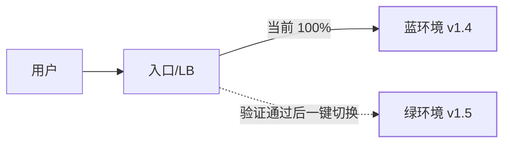

## 发布为什么是高可用问题

集群扛得住机器宕机，却常倒在**人为变更**上——业界共识：多数线上
事故源于变更（发布、配置、数据操作）。发布策略的本质：**在变更
期间保持服务可用，并且出问题时能快速、干净地回滚**。

| 策略 | 做法 | 停机 | 回滚速度 | 资源成本 |
|---|---|---|---|---|
| 停机发布 | 关服务再更 | ✅ | — | 低 |
| 滚动发布 | 逐批替换实例 | ❌ | 中（逐批回） | 低 |
| 蓝绿发布 | 两套环境切流量 | ❌ | **秒级（切回）** | 翻倍 |
| 金丝雀/灰度 | 小流量先试新版本 | ❌ | 快（摘除即可） | 少量额外 |

## 滚动发布：默认姿势

K8s Deployment 的 `RollingUpdate` 就是教科书实现，两个关键配置
决定发布是否"无感"：

```yaml
strategy:
  rollingUpdate:
    maxUnavailable: 0     # 替换期间可用副本数不许低于期望值
    maxSurge: 1           # 允许多起 1 个新实例加速发布
  readinessProbe:         # 新实例真正"就绪"才接流量
    httpGet: { path: /healthz, port: 8080 }
```

配套的两个"隐形环节"更容易出事故：

- **优雅停机**：收到 SIGTERM 后先摘流量（preStop/readiness 置
  false）→ 等在途请求处理完（terminationGracePeriod）→ 再退出。
  直接 kill 会让调用方吃到连接错误。
- **长连接排空**：网关/注册中心有缓存，摘除不是瞬时的——发布
  前先从注册中心反注册，等 TTL 过期再停进程。

## 蓝绿发布：用资源换回滚速度

两套完整环境（蓝=线上、绿=新版本），流量在入口处整体切换：



- 优点：回滚 = 把开关切回来，**秒级**；切换前可以在绿环境做
  全量冒烟。
- 代价：资源翻倍（云上按小时计费尚可接受）；**数据库是共享的**，
  切回时新代码写的数据结构要能被旧代码读——回到兼容性问题。

## 金丝雀/灰度发布：用流量比例控制爆炸半径

新版本先接 1% 流量，观测错误率/延迟/业务指标，逐步放量
1% → 5% → 25% → 100%。与蓝绿的区别：**不是整体切换，而是按
比例/按特征渐进**：

- 按比例：随机抽样流量——最常用。
- 按特征：内部员工、白名单用户、特定渠道先体验——发布即"灰度"
  的常见口径。
- 配套自动化：监控对比新旧版本指标（K8s 里 Istio/Argo Rollouts
  可做到指标异常自动回滚）。
- 与 A/B 测试的区别一句话：灰度求**稳**（验证不出事），A/B 求
  **决策**（比哪个效果好）；与暗发布（dark launch）的区别：
  暗发布把流量打到新版本但不返回结果，纯压测性质。

## 数据库变更：向下兼容纪律

多版本实例并存期间（滚动/灰度必然发生），**代码可以回滚，数据
结构回滚不了**——所以 schema 变更必须分两次发布：

1. 本次发布：只做**加法**（加列、加表、加索引），新代码兼容旧
   结构，读写双写过渡。
2. 下一次发布：确认旧版本死透后，再清理旧列/旧表。

反例：发布里同时"改列名 + 上依赖新列名的代码"——回滚代码后
数据库已是新结构，旧代码直接崩。

## 小结

- 滚动是默认（配好就绪探针 + 优雅停机才"无感"），蓝绿用翻倍资源
  换秒级回滚，金丝雀用小流量控制爆炸半径——按风险等级选。
- 发布事故多出在"隐形环节"：流量摘除延迟、长连接未排空、在途
  请求被 kill。
- schema 只做兼容性变更（两阶段发布），让"代码可回滚"真实成立；
  每次发布前想清楚回滚动作，想不清就不要发。

## 延伸阅读

- [Kubernetes 部署官方文档（滚动更新）](https://kubernetes.io/zh-cn/docs/concepts/workloads/controllers/deployment/#strategy)
- [优雅停机与终止宽限期（K8s）](https://kubernetes.io/zh-cn/docs/concepts/workloads/pods/pod-lifecycle/#pod-termination)
- [Argo Rollouts（金丝雀 + 自动分析）](https://argo-rollouts.readthedocs.io/en/stable/)
