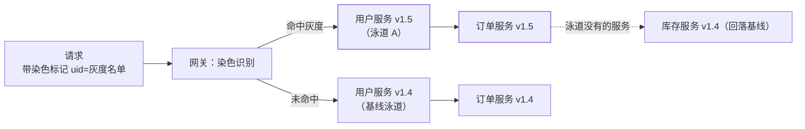

## 为什么单服务灰度不够

[发布策略](/distributed/advanced/availability/03-release-strategies/)里
的金丝雀只灰度**一个服务**。微服务链路上改一次功能要动五六个服务：
用户服务灰度了，订单服务没灰——**新旧版本混跑，接口兼容性稍有
疏忽就串出诡异 bug**。全链路灰度的诉求：**一个请求要么走完整条
新版链路，要么走完整条旧版链路**，互不污染。

## 泳道：链路级的版本隔离

把同一套环境按版本划成"泳道"——比如泳道 A 是全链路 v1.5（本次
发布涉及的所有服务），基线泳道是线上稳定版：

两个关键规则：

- **染色识别在入口**：网关按规则打标——按用户（内部员工/白名单）、
  按比例（随机 1%）、按地域/渠道。
- **缺失服务回落基线**：泳道只部署本次改动的服务，没改的服务
  直接回落基线泳道——不必复制全套环境（与蓝绿"整套翻倍"的
  关键差异）。

## 染色标记：全链路的通行证

染色标记（tag/染标）在入口生成后要**端到端透传**，任何一跳丢了
标记，后续请求就会串到基线泳道：

- **同步调用**：RPC/HTTP Header 透传（traceId 同款机制，见
  [链路追踪](/distributed/advanced/observability/01-distributed-tracing/)）——
  网关注入，各服务消费后继续向下游注入。
- **异步链路（易漏）**：MQ 消息要带染色属性，消费者按标路由到
  泳道消费组；线程池切换、定时任务、异步回调是最常见的丢标点。
- **实现底座**：微服务流量治理框架（Spring Cloud 全链路灰度插件、
  Istio/Header 基路由）都是"标记透传 + 服务发现按标过滤"两件事。

## 路由规则的三层落地

| 层 | 规则 |
|---|---|
| 网关 | 按名单/比例/地域决定是否染色，写入标记 |
| 服务间 | 注册中心/服务网格按标记过滤实例：泳道 A 的实例只接带 A 标的请求，无标记请求只进基线 |
| 存储 | 灰度数据要么落同一套库靠"灰度列"区分，要么走影子表（隔离更彻底） |

## 数据与配套：灰度最容易漏的半边

流量灰度了，**数据不隔离等于没灰**：

- 新版本改了表结构/写入了新格式数据 → 基线版本读不懂 → 需要
  影子表或兼容设计（schema 兼容纪律，见[发布策略](/distributed/advanced/availability/03-release-strategies/)）。
- 缓存 key、MQ topic 若被新旧版本共用，读写的语义差异会互相
  踩——灰度期要么隔离 key 前缀，要么保证读写双向兼容。
- **灰度监控**：泳道实例的指标要单独看（按泳道维度打 tag），
  对比基线的错误率/RT 达标才放量——"灰度了但看不清灰度效果"
  是常见事故源。

## 放量与回收

1. 泳道 A 部署 → 内部员工/白名单验证；
2. 按比例放量 1% → 5% → 50%，每档观察泳道指标与数据校验；
3. 100% 后，基线泳道升级为同版本，**摘除染色逻辑**——染色规则
   是常驻复杂度，用完要收；
4. 异常时摘标记即回滚流量（数据回滚另按 schema 兼容策略处理）。

## 小结

- 全链路灰度 = **泳道隔离 + 染色透传 + 缺失回落基线**，解决的
  是"多服务版本混跑"问题，是金丝雀在链路维度的升级。
- 异步链路（MQ/线程池/定时任务）是丢染标的重灾区，透传要覆盖
  全部跳转形态。
- 数据隔离（影子表/key 隔离）与泳道维度监控是灰度成熟的标志；
  灰度结束要记得摘除染色逻辑，别让规则常驻生产。

## 延伸阅读

- [发布策略：滚动、蓝绿与金丝雀（前篇）](/distributed/advanced/availability/03-release-strategies/)
- [链路追踪：traceId 透传（染标同机制）](/distributed/advanced/observability/01-distributed-tracing/)
- [容灾与多活（流量切分思想的容灾向）](/distributed/advanced/availability/01-dr-multi-active/)
