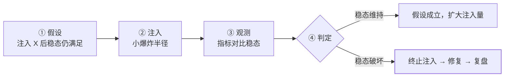

## 核心思想：故障是必然的，演练是可选的

分布式系统里故障不是"会不会"而是"何时"——机器、网络、依赖、
人，每一层都会坏。[容灾篇](/distributed/advanced/availability/01-dr-multi-active/)
的演练清单靠人手动触发，混沌工程把它**自动化、常态化**：在受控
条件下主动注入故障，验证系统韧性。"白天主动坏一次，好过半夜
被动坏十次"。

## 稳态假设：先定义"正常"

混沌实验不是乱搞，Netflix 提出的第一原则是**稳态假设（Steady
State Hypothesis）**：实验前先用指标定义"系统正常长什么样"，
实验后对比是否维持——

- 订单成功率 ≥ 99.9%、P99 RT ≤ 300ms
- MQ 积压 ≤ 1 万条
- 缓存命中率 ≥ 90%

没有稳态指标的实验 = 无对照的盲打，破坏了也无法评估。

## 实验四步法

**关键纪律：注入自动终止**——指标越界时实验平台自动停止注入，
不等值班人反应。

## 故障注入清单

| 层级 | 注入手段 | 验证什么 |
|---|---|---|
| 实例级 | kill -9、OOM、CPU/内存打满 | 自愈能力、流量摘除、优雅停机 |
| 网络级 | 延迟 500ms、丢包 10%、**网络分区**、DNS 故障 | 超时/重试配置、[脑裂防护](/distributed/advanced/availability/02-split-brain/) |
| 依赖级 | DB 主从切换、Redis 只读、MQ 堆积、下游返回 500 | 降级预案、熔断器三态、缓存兜底 |
| 应用级 | 慢 SQL、线程池打满、返回脏数据 | 隔离（舱壁）、快速失败、数据校验 |

最容易暴露问题的三类注入：**网络分区**（脑裂与超时错配）、
**依赖变慢**（拖垮线程池的连锁雪崩）、**优雅停机**（发布期
报错——见[发布策略](/distributed/advanced/availability/03-release-strategies/)）。

## 工具

| 工具 | 特点 |
|---|---|
| Chaos Mesh | CNCF 项目，K8s 原生，实验编排 + 自动终止，社区最活跃 |
| ChaosBlade | 阿里开源，CLI 风格，场景丰富（Java 应用层注入强） |
| Litmus | CNCF，K8s 工作流式实验，贴近 GitOps |

工具是次要的，**实验的治理**（谁批准、什么时间、爆炸半径多大、
怎么终止）才是成熟度标志。

## 安全纪律（红线）

1. **低峰执行**，避开大促与业务高峰；
2. **最小爆炸半径**：从一台实例、一个请求百分比开始；
3. **一键终止**随时可用，且要有"终止不了"的兜底（平台外的人工
   通道）；
4. **没有预案的故障不要注入**——注入是为了验证预案，不是为了
   看系统裸奔；
5. 全量报备：值班、相关服务 owner 知情，避免"误伤当事故"。

## 价值：它总能发现点什么

实战中混沌实验的高频发现，恰好都是前文各篇的缺失形态：

- 没配读超时或配错层级（[超时预算](/distributed/intermediate/traffic/02-timeout-retry/)）；
- 重试风暴拖垮半死系统（重试预算缺失）；
- 缓存失效后直打 DB 的雪崩路径（兜底预案缺失）；
- 发布时优雅停机失效、在途请求报错；
- 单点连接池/单点配置中心（隐蔽 SPOF，见
  [集群形态](/distributed/basic/theory/03-cluster-vs-distributed/)）。

## 小结

- 混沌工程 = 稳态假设 + 受控注入 + 自动终止 + 复盘闭环，
  把容灾预案从"文档"变成"经过验证的能力"。
- 三类高价值注入：网络分区、依赖变慢、优雅停机——分别对应
  脑裂、雪崩、发布三大事故族。
- 治理重于工具：低峰、小半径、一键终止、预案先行，四条红线
  缺一不可。

## 延伸阅读

- [Principles of Chaos（混沌工程原则宣言）](https://principlesofchaos.org/zh/)
- [Chaos Mesh 官方文档](https://chaos-mesh.org/docs/)
- [容灾与多活：RTO/RPO 与演练清单（前篇）](/distributed/advanced/availability/01-dr-multi-active/)
