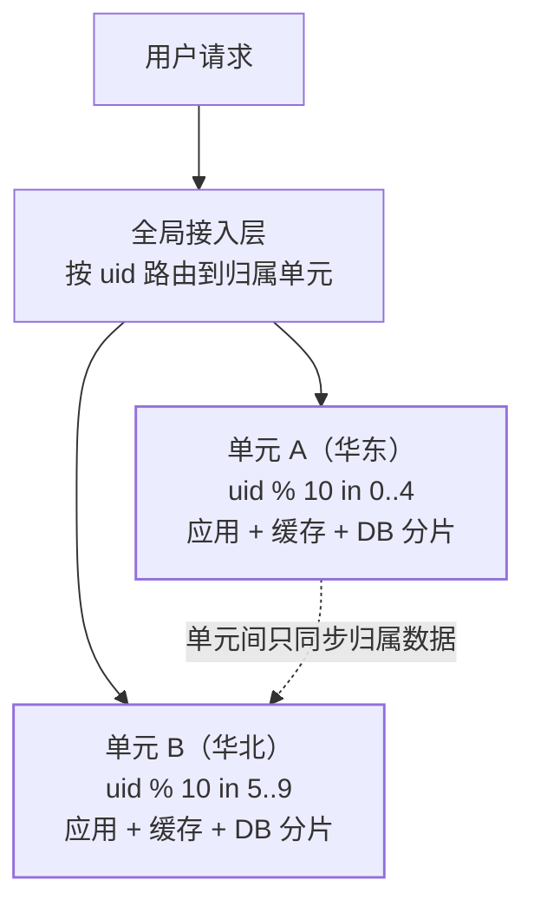

## 问题：多活为什么难

[容灾篇](/distributed/advanced/availability/01-dr-multi-active/)讲了
RTO/RPO 与切换策略，但"异地双活"落地时会撞上根本难题：**两地
都在写，数据怎么不乱？** 跨机房网络延迟 30ms+，任何"两边实时
互写同一份数据"的方案都会被延迟和冲突拖垮。

单元化（set 化）的回答：**别让两边写同一份数据——把用户、流量、
数据、应用圈进独立的"单元"，单元内数据闭环自治，单元之间互为
灾备**。

## 核心思想：分片基因贯穿全链路

单元化的分片逻辑与[分库分表](/distributed/intermediate/sharding/01-sharding-methods/)
的基因法一脉相承——**按同一个 sharding key（通常是用户 ID）切
一切**：

- 用户 A 的注册、下单、支付**全部在归属单元完成**——数据同机房
  闭环，没有跨机房写延迟。
- 单元间互为备份：A 机房故障，接入层把 `0..4` 段的 uid 切到 B，
  B 机房**有 A 的数据副本**可接管（异步复制，承受秒级 RPO）。

## 单元分层：不是所有服务都能切

蚂蚁单元化体系的经典分层（简化版），回答"哪些服务进单元"：

| 类型 | 特征 | 部署形态 |
|---|---|---|
| **RZone**（可分片单元） | 服务 + 数据都能按 uid 分片：订单、账户、积分 | 每地部署，数据归属分片，**多活主力** |
| **GZone**（全局服务） | 强一致的全局数据：库存总账、风控、配置 | 单地部署（或主备），其他单元远程调用 |
| **CZone**（城市级单元） | 读多写少的共享数据：商品、营销活动 | 每地部署，写走主地、读本地化 |

设计推论：**业务改造的核心是让尽量多的服务"可分片化"**——
任何跨用户的强一致写（全局秒杀库存）都是单元化的敌人，要么
挪进 GZone 承受跨机房延迟，要么改造方案（预扣、异步）。

## 路由与切流

- **接入层按 sharding key 路由**：网关解析 uid → 查分片规则 →
  转发到归属单元；uid 缺失的场景（未登录）按就近/默认单元处理。
- **一致性纪律**：归属单元内发起的链路不再跨单元跳——跨单元
  调用不仅慢，还引入"数据在 A、逻辑在 B"的一致性裂缝。链路上
  每一跳都要带分片基因（与[全链路灰度](/distributed/advanced/availability/04-full-link-gray/)
  的染色透传同款机制）。
- **切流**：分片规则是可调配的——正常期按容量比例（华东 6:华北 4），
  故障期把故障机房的全部分片切到存活机房。切流要**先停写、
  等数据复制追平、再改路由放开**，防止"切过去读到旧数据"。

## 代价清单（为什么它不是默认架构）

| 代价 | 说明 |
|---|---|
| 侵入式改造 | 所有服务、任务、消息都要带分片基因并透传——量大面广 |
| 全局能力受限 | 跨用户的查询/事务要么进 GZone，要么异步化 |
| 数据迁移复杂 | 存量用户要按分片规则搬迁，切流窗口管理严格 |
| 运维复杂度翻倍 | 多单元发布、监控、变更都要按单元维度管理 |

所以现实路径是演进式的：**同城双活 → 两地三中心 → 异地单元化**，
只有跨地域大流量业务才值得走到终态。

## 高频追问速答

- 单元化和分库分表什么关系？——同一套分片思想的两个粒度：
  分库分表切数据，单元化把"应用 + 缓存 + 数据"整体切。
- 单元间数据怎么同步？——归属数据单向异步复制（灾备副本），
  全局数据走 GZone；不追求跨单元强一致。
- 机房挂了数据会不会丢？——异步复制有秒级 RPO，RTO 靠接入层
  切流到分钟级；业务按此设定容忍度。
- 库存这类全局数据怎么办？——单元内预扣 + 全局对账，或集中
  GZone 承受延迟（见[秒杀](/distributed/intermediate/case-studies/01-flash-sale/)）。

## 小结

- 单元化 = **分片基因贯穿流量、数据、应用**的异地多活终态；
  单元内闭环消灭跨机房写，单元间互备。
- RZone/GZone/CZone 分层回答"什么能切、什么不能切"——把业务
  改造成"可分片"才是最大工程量。
- 切流先停写追平复制再放开；代价清单决定了它是大厂异地多活的
  终态，而不是起步架构。

## 延伸阅读

- [容灾与多活：RTO/RPO 与切换策略（前篇）](/distributed/advanced/availability/01-dr-multi-active/)
- [分库分表方法论：基因法（同站）](/distributed/intermediate/sharding/01-sharding-methods/)
- [分布式时钟与顺序（跨单元数据冲突的底层）](/distributed/advanced/consistency/04-time-order/)
