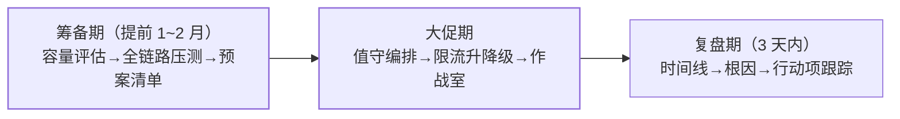

大促（双 11/618/票务开售）是把系统推向**设计容量极限**的日历事件。
混沌工程篇讲了"主动制造故障"，本篇讲大促场景的完整保障体系：
**筹备（压测+预案）→ 大促（值守+升降级）→ 复盘（时间线+行动项）**
——三个阶段缺一环，事故就在缺的那一环发生。

## 保障日历：三阶段

## 筹备期：压测与预案

- **全链路压测**：用影子库/流量染色（全链路灰度篇的机制复用）在
  生产环境压出真实容量——单接口压测的数据在大促混合流量下不可信；
- **容量水位**：压测得出各服务容量上限，大促预估流量 ≤ 上限的
  70%（留 30% 缓冲）；
- **预案清单**：每项预案四要素——**触发条件（指标阈值）、执行动作
  （限流/降级/扩容/切换）、负责人、预期效果**。没有触发条件的预案
  等于没有预案（真出事时没人敢拍板）；
- **预案演练**：混沌工程篇的方法——**平时不演练的预案，真出事时
  没人会执行**（演练发现执行权限/脚本/流程的坑）。

## 大促期：值守与升降级

- **值守编排**：oncall 分层（一线执行/二线决策/三线专家），作战室
  集中沟通，升级路径明确（15 分钟无进展自动升级）；
- **限流升降级**：按预案的触发条件实时调整——限流阈值动态化
  （Sentinel/Apollo 推送）、非核心功能降级开关（Feature Flag 篇）；
- **可观测**：核心大盘（流量/错误/延迟/资源）+ 业务大盘（订单量/
  支付成功率）——技术指标与业务指标同屏（可观测性三支柱）。

## 复盘期：时间线与行动项

- **时间线还原**：以秒为粒度还原"发现→响应→定位→恢复"全过程
  （依赖可观测数据，不靠记忆）；
- **根因分析**：5 Why 到机制层（"人失误"不是根因，"流程允许人失误"
  才是）；
- **行动项跟踪**：每项有负责人与截止日期，下季度复盘时先查上季度
  action 完成率——**复盘不流于形式的唯一方法是行动项有闭环**；
- 无责文化：对事不对人，否则下次没人敢说真话。

## 高频追问速答

- **限流阈值怎么定？** 压测实测容量 × 安全系数（70%）——拍脑袋的
  阈值要么形同虚设要么误伤；
- **降级开关平时怎么验证？** 定期演练降级路径（开关真的能关、降级后
  用户体验可接受）——开关常年不动，真用时可能已经失效
  （Feature Flag 篇的运维开关纪律）；
- **复盘为什么经常流于形式？** 行动项无跟踪、根因停在"人失误"、
  无责文化缺失——三条都占就只是走过场。

## 小结

- 三阶段：筹备（压测+预案清单）、大促（值守+升降级）、复盘
  （时间线+行动项闭环）——每环都有本站专篇支撑（压测/灰度/混沌/
  限流/可观测/Feature Flag）。
- 预案四要素：触发条件、动作、负责人、预期效果——**平时演练过的
  预案才是预案**。
- 复盘的核心产出是**带闭环的行动项**，不是 PPT。
