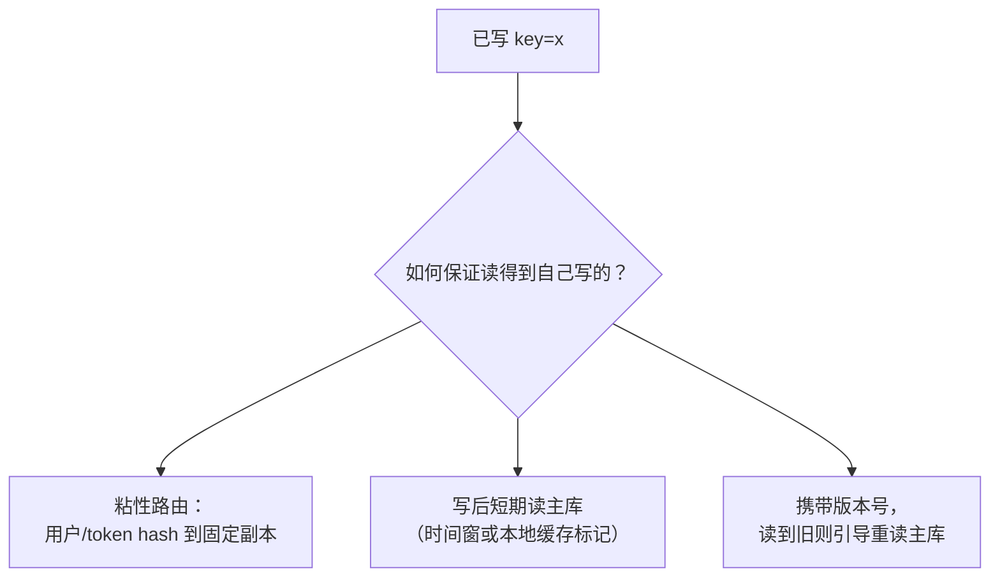
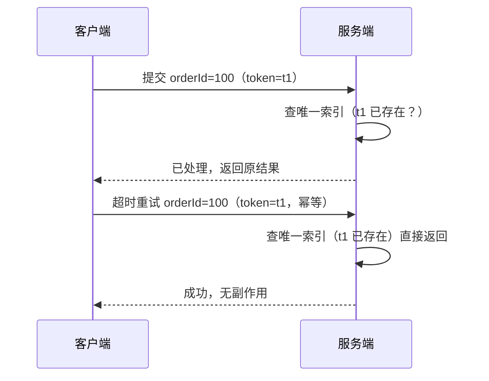

基础篇的 CAP 是"分区窗口内保 C 还是保 A"，本篇聊**平时不做选择**时，
怎么用工程手段把不一致收敛回来。

## 先选一致性强度

| 强度 | 保证 | 典型代价 | 适用 |
|---|---|---|---|
| 强一致（线性一致） | 读永远看到最新写 | 走共识/单一主，吞吐受限 | 订单号、余额扣减、配置、选主 |
| 读写一致（read-your-writes） | "我写的我读得到" | 读路由到写源/加版本号 | 评论/资料修改后立刻刷新 |
| 最终一致 | 停止写入后收敛 | 期间读到旧值 | 计数、点赞、缓存、DNS |

口诀：**核心资金类走强一致或共识**；**可容忍滞后的展示类走最终一致**。

## 读写一致的三件套：怎么让"自己写的读得到"

最终一致最大的坑不是"最终"，而是**自己刚写的读不到**——刚发完评论，刷新
看不到自己的评论。三种经典策略：



### 策略一：按用户粘性路由到主副本

把"写读来源"绑定，简单直接。实现上常用"一致性哈希 + 客户端 cookie 里的
路由标识"：

```python
# 请求进来时 → 读 cookie 里的 user_id → hash 到一个副本节点
def pick_node(user_id: str, nodes: list[str]) -> str:
    return nodes[hash(user_id) % len(nodes)]   # 同一 user_id 恒落同一节点
```

读请求和写请求都走同一决定 → 该用户的读总是打到写它的那个副本上，天然
满足 read-after-write。牺牲的是扩展性：单用户被绑定，弹性伸缩时迁移成本。

### 策略二：写后短期读主库（时间窗降级）

写标记 → 短时间内读主库；窗口过后可以切到从库（性能优先）。用本地缓存
或写时的时间戳实现：

```python
WRITE_WINDOW_S = 5          # 写后 5s 内强制读主库
recent_writes = set()       # 记下刚写过、正在窗口内的 key

def read_route(key: str, has_written: bool) -> "主库|从库":
    # 刚写过且在窗口内 → 读主库，保证读到自己的写
    if has_written or key in recent_writes:
        return "master"
    return "replica"
```

优点：读压力仍分散到从库，只有写者自己的读取短暂走主库。配合"本地缓存
兜底"（缓存里存了自己写的结果），能进一步缓解主库压力。

### 策略三：版本号/时间戳比对，读到旧引重读

读请求返回数据时**带上版本号**（数据自带 version 或 last_updated），如果
客户端发现自己持有更新的版本，就引导它**重读主库**：

```text
读从库 → 返回 v=10 → 客户端本地是 v=12 →
  客户端感知"比主库还新" → 强制重读主库 → 拿到 v=12
```

代价都是**牺牲扩展性换一致性**，只对"自己刚写的会话/痕迹"类数据用，别
对全局热点数据用。

## 副本收敛：用什么把不一致拉平

| 手段 | 机制 | 适合 |
|---|---|---|
| 异步复制 + 对账 | 定时比对核对，补发差异 | 最终一致落库 |
| 版本/LWW | 更新时间戳，后来者赢 | 无主模型（Cassandra） |
| 幂等 + 唯一约束 | 重复投递只生效一次 | 消息/支付回调 |
| 状态机复制 | 各节点按相同操作序列执行 | 共识/日志（见 Paxos 与 Raft） |

对账是最后防线：**无论上游怎么保证，都假设会出偏差，定期核对并告警**。

## 幂等：分布式一致性的"减振器"

重试是分布式常态（超时后客户端必然重试），所以接口必须幂等。**幂等的本质
是"重复请求不产生重复副作用"**，三板斧由强到弱：

**1. 业务唯一键 + 唯一索引（最硬）**

给需要幂等的表加业务唯一键，重复插入被数据库直接拦下：

```sql
CREATE TABLE payment (
    id         BIGINT AUTO_INCREMENT PRIMARY KEY,
    order_id   VARCHAR(32) NOT NULL,      -- 业务唯一键
    amount     DECIMAL(10,2) NOT NULL,
    status     VARCHAR(16) NOT NULL,
    UNIQUE KEY uk_order (order_id)         -- 重复 order_id 插不进去
);
```

```python
def handle_payment(order_id, amount):
    try:
        sql = "INSERT INTO payment(order_id, amount, status) VALUES(?,?,'NEW')"
        cursor.execute(sql, (order_id, amount))   # 已存在 → 抛 DuplicateEntry
        db.commit()
        do_transfer(order_id, amount)             # 只有第一次执行
    except DuplicateEntry:
        pass                                       # 重试/重复投递 → 直接返回已处理
    return query_original_result(order_id)         # 返回原结果，保证客户端能拿到
```

这是防"重复扣款"最可靠的实现——正确性不依赖应用态，靠 DB 唯一约束。

**2. 状态机：只允许前向迁移**

同一条记录通过**状态流转**去重，只有达到"终态"前的第一次操作生效：

```sql
UPDATE order_ SET status = 'PAID'
WHERE order_id = ? AND status = 'NEW'   -- 条件更新等效于"拿状态当锁"
```

```python
affected = cursor.execute(
    "UPDATE order_ SET status='PAID' WHERE order_id=? AND status='NEW'",
    (order_id,))
if affected.rowcount == 1:          # 只有 NEW→PAID 成功的那一次会进来
    do_paid_side_effects(order_id)  # 其余重复请求 rowcount=0，直接跳过
```

**3. token 机制：服务端签发一次性凭证**

客户端先请求一个唯一 token，提交时带上，服务端消费并标记已用：

```python
# 提交时：利用 DB 的原子插入"消费 token"
ok = db.execute(
    "INSERT INTO idem_token(token, used_at) VALUES(?, now()) "
    "ON DUPLICATE KEY UPDATE token=token",        # 已存在则不改，返回影响 0 行
    (token,))
if ok:
    process_form(token)          # token 首次被消费 → 执行
# 重复提交 token 已存在 → 直接返回，副作用只发生一次
```



> 幂等设计四连问：唯一键选对了吗（粒度够细，不能对整张订单表唯一）？
> 重复请求返回**原结果**了吗（不给"成功但无数据"让客户端误判）？
> 终态后再次请求会不会又触发副作用？并发相同 key 同时进来会不会都命中？

## 读场景的对账实现

写场景用幂等兜底，读场景（缓存与库/主从不一致）靠**对账 + 过期**：

```python
# 兜底：缓存里存了 key 的最后写入时间，超过 TTL 强制失效重读主库
def get_with_reconcile(key):
    cached = cache.get(key)
    if cached and cached.version >= expected_version(key):
        return cached.value
    value, version = master.get(key)      # 命中"我写过的更新" → 读主库
    cache.set(key, {value, version}, ttl=60)
    return value

# 对账任务：每小时比对缓存与主库，找出被写偏的 key 补发/失效
def reconcile_job():
    for key in cache.keys():
        if cache.get(key).version < master.get(key).version:
            cache.delete(key)              # 过期，下次读自愈
```

## 小结

- 先按数据性质选**一致性强度**，别默认最强。
- 读写一致用**粘性路由 / 写后读主库 / 版本引导重读**解决"读不到自己写的"。
- 收敛靠**复制/对账/版本/幂等**；幂等是必选兜底，**唯一键 + DB 约束**最可靠，
  **状态机**次之，**token** 场景化。
- 最终一致的底线是**有对账**，否则"最终"永远等不到。