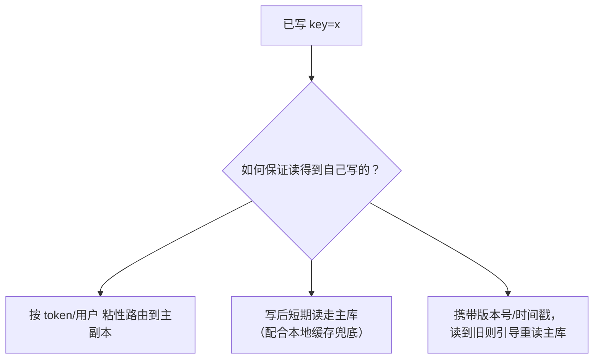
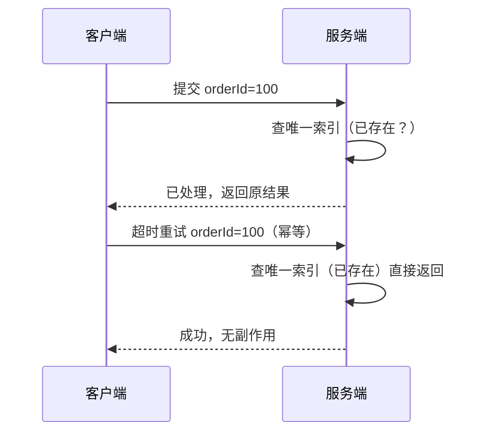

基础篇的 CAP 是"分区窗口内保 C 还是保 A"，本篇聊**平时不做选择**时，
怎么用工程手段把不一致收敛回来。

## 先选一致性强度

| 强度 | 保证 | 典型代价 | 适用 |
|---|---|---|---|
| 强一致（线性一致） | 读永远看到最新写 | 走共识/单一主，吞吐受限 | 订单号、余额扣减、配置、选主 |
| 读写一致（read-your-writes） | "我写的我读得到" | 读路由到写源/加版本号 | 评论/资料修改后立刻刷新 |
| 最终一致 | 停止写入后收敛 | 期间读到旧值 | 计数、点赞、缓存、DNS |

口诀：**核心资金类走强一致或共识**；**可容忍滞后的展示类走最终一致**。

## 读写一致的三件套

最终一致最大的坑不是"最终"，而是**自己刚写的读不到**。三种经典策略：

- **粘性路由**：把客户端 hash 到固定副本，简单直接。
- **读写分离补偿**：主库写 + 从库读，靠 二次校验 把不一致兜回来。
- 代价都是**牺牲一点扩展性**换一致，别对全局用。

## 副本收敛：用什么把不一致拉平

| 手段 | 机制 | 适合 |
|---|---|---|
| 异步复制 + 对账 | 定时比对核对，补发差异 | 最终一致落库 |
| 版本/LWW | 更新时间戳，后来者赢 | 无主模型（Cassandra） |
| 幂等 + 唯一约束 | 重复投递只生效一次 | 消息/支付回调 |
| 状态机复制 | 各节点按相同操作序列执行 | 共识/日志（见 Paxos 与 Raft） |

对账是最后防线：**无论上游怎么保证，都假设会出偏差，定期核对并告警**。

## 幂等：分布式一致性的"减振器"

重试是分布式常态（超时后客户端必然重试），所以接口必须幂等：

- **业务唯一键**：订单号、交易号，DB 放唯一索引，重复插入直接失败。
- **去重表/状态机**：同一 key 处理过就跳过。
- **token 机制**：服务端签发一次性 token，提交时校验并消费。

## 小结

- 先按数据性质选**一致性强度**，别默认最强。
- "自己写的读不到"用**读写路由**解决，性能换一致。
- 收敛靠**复制/对账/版本/幂等**，幂等是必选兜底。
- 最终一致的底线是**有对账**，否则"最终"永远等不到。