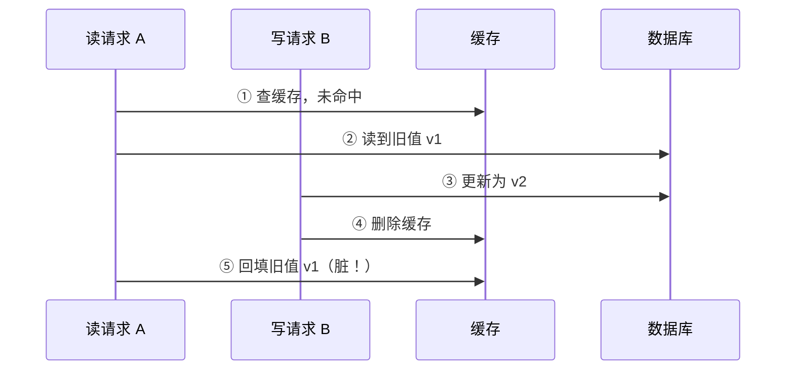
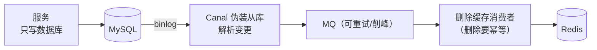

## 问题定义

数据同时存在 Redis 和 MySQL 两个地方，写操作怎么让它俩收敛？
组合只有四种：**先改谁、后改谁，以及改缓存用"更新"还是"删除"**。
面试考的就是你能否论证出主流选择"先更新数据库，再删除缓存"
（Cache Aside）不是拍脑袋。

## 四种策略光谱

| 策略 | 做法 | 问题 |
|---|---|---|
| 先更新缓存，再更新 DB | — | DB 写失败则缓存永久脏，**直接排除** |
| 先更新 DB，再更新缓存 | 双写 | 并发写 A/B 交错时**旧值覆盖新值**；写多读少场景做无效更新 |
| 先删缓存，再更新 DB | 删缓存 | 删后、写前的读会**回填旧值**（脏到下次删除） |
| **先更新 DB，再删缓存** ✅ | Cache Aside | 只有一个极苛刻的并发窗口（下文论证） |

为什么用**删除**而不是更新缓存：

1. 并发写时"更新"可能乱序覆盖（A 先写库后写缓存，B 后写库先写缓存
   → 缓存留下 A 的旧值）；删除是幂等的，读时回填自然取最新。
2. 懒加载思想：写多读少的 key 不必每次写都同步缓存，谁读谁回填。

## "先更库再删缓存"的不一致窗口

唯一能造成脏数据的时序：



成立需要同时满足：**读先于写发生、回填晚于删除完成**——即 A 的
一次读 + 回填，横跨了 B 的整个"写库 + 删缓存"。而现实中写库（含
锁）通常远慢于读，这个概率极低。所以结论要说得精确：Cache Aside
**不是绝对一致，是"概率最高的一致性性价比"**。要更严，往下加码。

## 加码一：延迟双删

针对"先删缓存"路线的补救，也常作为 Cache Aside 的补充动作：

```
1. 删除缓存
2. 更新数据库
3. 睡 N 毫秒（覆盖一次"读旧值回填"的耗时，一般 500ms~1s）
4. 再删一次缓存   ← 把窗口期内被回填的脏数据清掉
```

代价是 N 靠估、第二次删除失败仍脏——通常交给异步任务/消息重试。
它治标，原理值得讲：**删除动作重放，把不一致窗口压短**。

## 加码二：订阅 binlog 异步删（生产主流)

业务代码只管写库，删缓存交给**监听 binlog 的旁路**：



优点：业务零侵入；删除失败靠 MQ 重试**保证最终删成**；天然按
binlog 顺序处理，不会乱序。代价：引入 Canal + MQ 组件链路，
一致性变成秒级最终一致。

## 容易漏掉的坑

- **读写分离**：binlog 订阅要挂在**从库**位点，否则"写主成功 →
  删了缓存 → 读请求从延迟的从库回填旧值"，又脏了。
- **热点 key 击穿**：删除后瞬间的并发读都打到 DB——配合逻辑过期
  或互斥重建（见 [Redis 缓存问题](/redis/intermediate/usage/02-cache-problems/)）。
- **删缓存失败**：重试队列 + 兜底对账；更彻底的做法是"删除消息
  进 MQ + 消费重试"。
- **强一致怎么办？** 读写加分布式锁串行化——缓存意义大减；真要
  强一致就不该上缓存，这是 CAP 的取舍，不是技巧问题。

## 高频追问速答

- 为什么删缓存不是更新缓存？→ 并发乱序覆盖 + 懒加载省无效写。
- 先删后更为什么不行？→ 删后写前的读回填旧值，脏到下次删除。
- 先更后删就绝对一致吗？→ 不是，但窗口条件苛刻概率极低。
- 延迟双删删的是什么？→ 窗口期被读请求回填的旧值。
- 生产怎么保证删成？→ binlog + MQ 异步重试，最终一致。

## 小结

- 双写四选一：先更库再删缓存（Cache Aside）是默认解，胜在窗口
  极小 + 删除幂等。
- 一致性强度排序：先更缓存 ❌ < 先删后更 < 先更后删 < binlog 订阅
  重试 < 加锁强一致（性能依次变差）。
- 生产最终形态：业务只写库，Canal + MQ 旁路删缓存，消费幂等，
  从库位点防主从延迟。

## 延伸阅读

- [缓存更新的套路（陈皓 / 酷壳）](https://coolshell.cn/articles/17416.html)
- [Scaling Memcache at Facebook（NSDI'13，Cache Aside 的工业源头）](https://research.facebook.com/publications/scaling-memcache-at-facebook/)
- [Canal：MySQL binlog 增量订阅组件](https://github.com/alibaba/canal)
