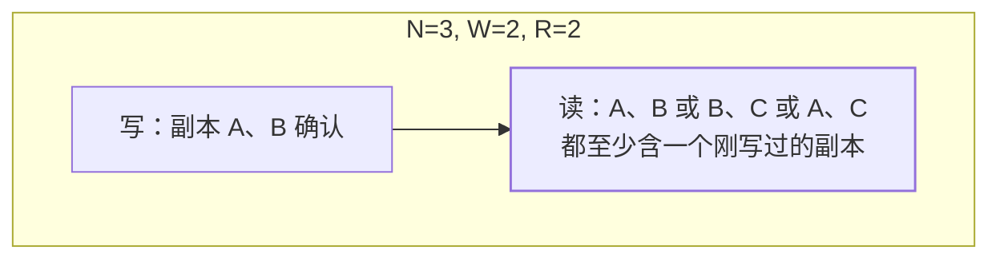

## 多副本读写的根本矛盾

数据复制 N 份后：**同步写全部副本**，一致但任一副本故障就写失败
（可用性塌）；**只写一份**，快但其他副本变旧，读经常读到旧值。
Quorum（法定人数）是中间的旋钮：**读写都不用全体通过，只要凑够
指定人数，且读写人数之和大于 N**。

## NWR 三参数

| 参数 | 含义 |
|---|---|
| N | 副本总数 |
| W | 写成功需要确认的副本数 |
| R | 读成功需要读取的副本数 |

两条核心不等式：

- **W + R > N**：读集合和写集合**必然相交**——任何一次读，至少读到一个
  刚被写过的副本，不会"新旧全错过"。
- **W > N / 2**：写法定多数派——两次并发写必有交集，天然防
  [脑裂](/distributed/advanced/availability/02-split-brain/)下双主各写各的。

## 三种旋钮调法

| 调法 | 特征 | 适用 |
|---|---|---|
| W=N, R=1 | 写全量才成功（慢、强），读随便读（快） | 写少读多、写正确性苛刻 |
| W=1, R=N | 写最快，读要读全量才最新 | 写极多读少，可容忍丢写 |
| **W=Q, R=Q**（Q=⌊N/2⌋+1） | 读写均衡，N=3 时 W=R=2 | Dynamo/Cassandra 默认档 |

N=3、W=2、R=2 是工程默认：容忍 1 个副本故障，读写都只碰 2 个副本。

## 重要的泼冷水：W+R>N ≠ 强一致

这是高级面试的分水岭。**quorum 只保证"读到至少一份最新副本"，
不保证读到的那份就是全局最新**：

- 读到新旧两份时，靠什么比较？**时间戳不可靠**（时钟偏差，见
  [分布式时钟与顺序](/distributed/advanced/consistency/04-time-order/)），
  Dynamo 用**向量时钟**判因果，冲突交给客户端合并。
- 并发写没有全序，"最新"本身可能没有定义——quorum 给的是
  "概率收敛的最终一致 + 因果可检测"，不是线性一致。
- 真线性一致要靠共识协议串行化写（Raft/Paxos），或读也走多数派
  且带 read-index 类机制——代价完全不同。

另外 Dynamo 系还有两个妥协可用性的补丁，知道即可：**sloppy
quorum**（首选节点不可用就找别的节点凑数，不在原集合里死等）、
**hinted handoff**（暂存代写，节点恢复再归还）——一致性进一步放松。

## 落地对照

| 系统 | 机制 |
|---|---|
| Dynamo | NWR 可按表配置，向量时钟解冲突 |
| Cassandra | `ANY/ONE/QUORUM/LOCAL_QUORUM/ALL` 可调；`LOCAL_QUORUM` 只统计同机房副本，兼顾延迟与多数派 |
| Kafka | 类似思想：`min.insync.replicas` + `acks=all` 是"写多数派"变体 |
| Raft 系 | 写 = 过半即提交（W=Q），读要额外机制保证不读旧主 |

## 小结

- NWR 是一致性与可用性之间的**连续旋钮**，W+R>N 保证读写集合
  相交，W>N/2 防脑裂分裂写。
- 默认档 N=3/W=2/R=2：容 1 副本故障、读写均衡。
- 会说"W+R>N 就是强一致"是高频错误：它保证"有最新副本被读到"，
  不保证"读出的是因果上最新的"——后者需要向量时钟或共识。

## 延伸阅读

- [Dynamo: Amazon's Highly Available Key-value Store（SOSP'07 论文）](https://www.allthingsdistributed.com/files/amazon-dynamo-sosp2007.pdf)
- [Cassandra 一致性级别官方文档](https://cassandra.apache.org/doc/latest/cassandra/dml/consistency.html)
- [数据一致性光谱（同分类前篇）](/distributed/advanced/consistency/01-consistency-patterns/)
