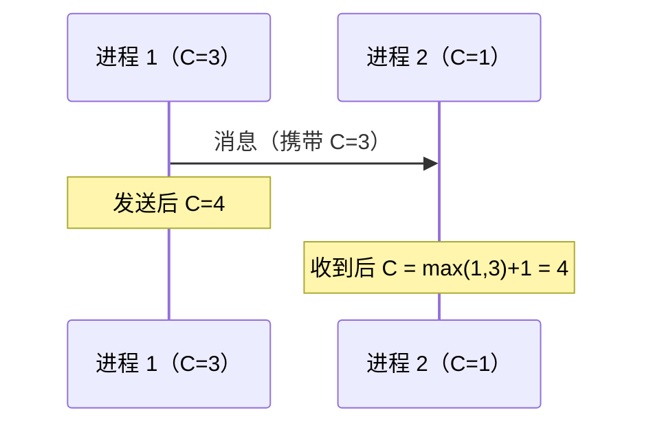

## "谁先发生"在分布式里是个难题

单机看时间戳就能排序，分布式不行：**每台机器的时钟各走各的**——
晶振漂移让时钟每天差几十毫秒，NTP 校时可能**回拨**，闰秒会让时间
重复或跳变。两个节点各记一个"10:00:00.000"，谁也不知道谁真在前。

由此推论出三条业务红线：

1. **不要用各机器的墙钟时间戳比较事件先后**（排序、对账、版本）。
2. **不要用时间戳做并发冲突检测**（要用版本号/向量时钟）。
3. 不要假设 `System.currentTimeMillis()` 单调——超时计算要用
   单调时钟（`System.nanoTime()`/`CLOCK_MONOTONIC`）。

## happens-before：顺序的逻辑定义

Lamport 用**因果关系**代替物理时间定义顺序：如果事件 a 能"影响"
事件 b（同进程内先后的传递，或 a 发消息、b 收消息），则记 `a → b`。
没有因果关系的两个事件是**并发**的，顺序随便定，只要全系统定得
一致。

### Lamport 逻辑时钟

规则只有两条：

1. 每个进程维护计数器 C，**每发生一个本地事件，C = C + 1**；
2. 发消息带上自己的 C，**接收方 C = max(本机 C, 消息里的 C) + 1**。

性质：`a → b` 则 `C(a) < C(b)`。**注意逆否命题不成立**——
`C(a) < C(b)` 推不出 a 因果上在先（两个并发事件的计数器也可能
一大一小）。逻辑时钟给全序但不识别并发。

### 向量时钟：把并发看清楚

每个节点维护**全集群的计数器向量**，消息携带整个向量，比较规则：

- 向量 A 的每一维都 ≤ 向量 B，且至少一维严格小 → A 因果在先；
- 各有一维更大 → **并发事件**，系统自己分不出先后。

Dynamo/Cassandra 就靠它识别"两个并发写"，冲突交给客户端按语义
合并（这正是 [NWR](/distributed/advanced/consistency/03-quorum-nwr/) 篇说"quorum 撞上并发写需要向量时钟"的出处）。
代价是向量长度 = 节点数，规模大了消息变大。

## 全序广播：让所有人看到同一个顺序

**所有节点以完全相同的顺序看到相同的消息序列**，且要么都看到、
要么都不看到。它是比快照更强的性质——只要拿到全序广播，
"互斥""复制状态机""主备日志一致"全部免费。

**全序广播等价于共识**：Raft 的日志复制就是全序广播的工程实现
（日志顺序 = 全序，提交 = 确认），所以 [Paxos/Raft](/distributed/intermediate/consensus/01-paxos-raft/)
是这类问题的终极答案。

## 业务侧的顺序保证套路（高频问答）

| 场景 | 套路 |
|---|---|
| 消息顺序消费 | 按业务 key 路由到同一分区/队列，**分区内单线程**即局部有序（Kafka 详见 [顺序性篇](/kafka/intermediate/core/)） |
| 数据库并发更新 | 版本号/状态机条件更新，**不用 updated_at 判先后** |
| 请求防重放 | 单调序列号/分布式 ID（趋势递增，见 [分布式 ID](/distributed/intermediate/transaction/02-distributed-id/)）+ 幂等 |
| 全局事件排序 | 单写者（让一个主来定序）或共识日志，别让各节点自己打时间戳 |
| 真要物理时间 | 上时钟基础设施：Spanner 用原子钟 + GPS 给出**带不确定区间**的 TrueTime，提交要等待区间过去——证明"能用，但很贵" |

## 小结

- 墙钟不可信是分布式三大公理级别的常识：漂移、回拨、闰秒，
  排序与冲突检测一律用逻辑手段。
- Lamport 时钟保因果序但分不清并发；向量时钟补上并发检测，
  代价是 O(N) 消息头。
- 全序广播 = 共识的另一种说法；需要全局顺序就上单写者或 Raft，
  不要发明时间戳排序。
- 业务顺序三板斧：按 key 分区、版本号条件更新、序列号 + 幂等。

## 延伸阅读

- [Time, Clocks, and the Ordering of Events（Lamport 1978 原论文）](https://lamport.azurewebsites.net/pubs/time-clocks.pdf)
- [Spanner: Google's Globally-Distributed Database（TrueTime）](https://research.google/pubs/spanner-googles-globally-distributed-database/)
- [数据一致性光谱（同分类前篇）](/distributed/advanced/consistency/01-consistency-patterns/)
