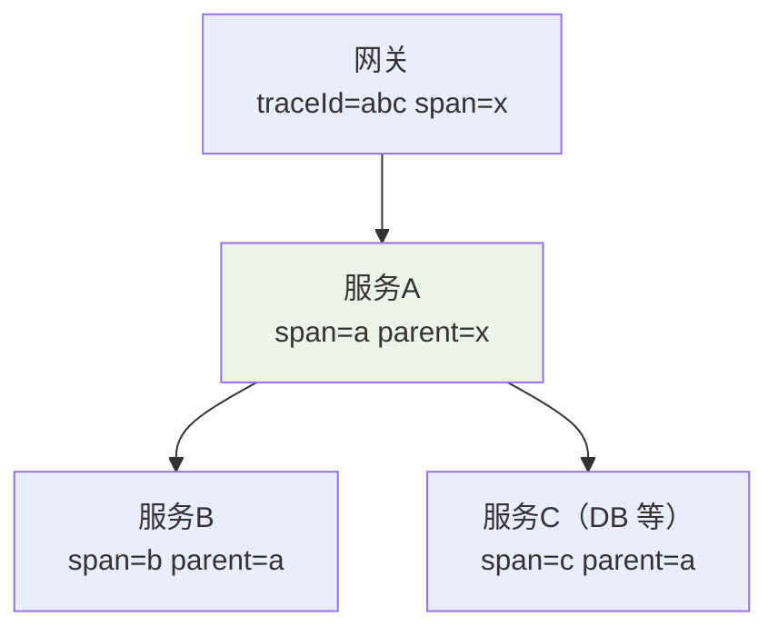
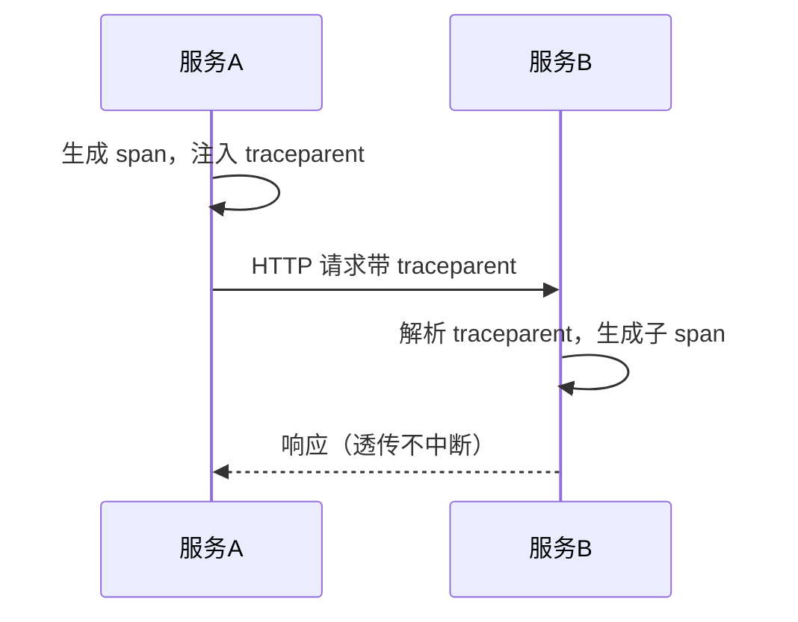

日志只告诉你"这个服务在报错"，链路追踪告诉你"请求究竟串过了哪些服务、
卡在哪个环节"。背后是一个很朴素的数据模型。

## 数据模型：Trace = 一棵 Span 树

| 概念 | 含义 | 类比 |
|---|---|---|
| **Trace** 一次分布式调用 | 一个请求的全过程 | 一整棵树 |
| **Span** 单次调用片段 | 一个服务内的一小段操作 | 树的每个节点 |
| **parent / child** | 调用的嵌套关系 | 树的父子结构 |
| **traceId** | 全局唯一，贯穿整条链路 | 树的根标识 |
| **spanId / parentId** | 定位节点及其父节点 | 拼出树的边 |



一条请求进网关时生成 `traceId`，此后每个服务**透传 traceId + 上级 spanId**，
上报时按 (parentId→spanId) 还原成树。这就是能看"瀑布图"的原因。

## 关键机制：Context 透传

调用关系靠 headers 在进程间透传，HTTP 场景最常用 W3C 的
`traceparent`（traceId + spanId + 采样标记）：



生成本地/跨 MQ 时同理：消息里带上 traceId，消费端续接同一 Trace。

## 采样：全量存不起

全链路全量采集的存储与带宽成本极高，现实必须采样：

| 策略 | 说明 |
|---|---|
| 固定/头部采样 | 按 traceId 头哈希决定留或不留，简单 |
| 尾部采样 | 请求结束后按结果（错误/慢）决定保留，准确但延迟 |
| **自适应采样** | 无错误/慢请求时降采样，异常时提升采样率——实践主流 |

常见组合：入口统一决策 + 保留 100% 错误/慢节点 + 对正常流量低位采样。

## 走向统一：OpenTelemetry

历史上 Jaeger/Zipkin/SkyWalking 各自定义协议，接入成本高。OpenTelemetry
（OTel）用**一套 SDK + 标准协议（OTLP）**把"埋点、透传、导出"统一起来，
后端可换。落地路径：

```
应用内 OTel SDK 埋点（自动/手动）
   └─> 本地 Exporter（OTLP）─> Collector（聚合/过滤/采样）
        └─> 后端存储展示（Jaeger / Tempo / SkyWalking…）
```

- SDK 会**自动埋点**常见框架（HTTP、gRPC、DB、MQ），接入成本极低。
- **Collector** 是统一入口，负责采样与转发，后端解耦。

## 小结

- 链路追踪 = **Trace(Span 树) + traceId 透传 + 采样 + 统一标准**。
- 对慢请求/耗时曲线的定位能力，是它在排查中的最大价值。
- **采样策略**决定成本与准度，务必保留错误与慢请求。
- 新服务优先用 **OpenTelemetry** 埋点并由 Collector 统一收口，避免各家
  自定协议形成孤岛。