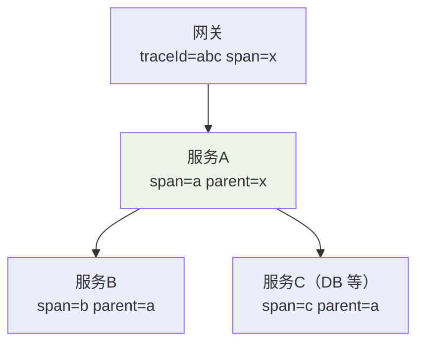
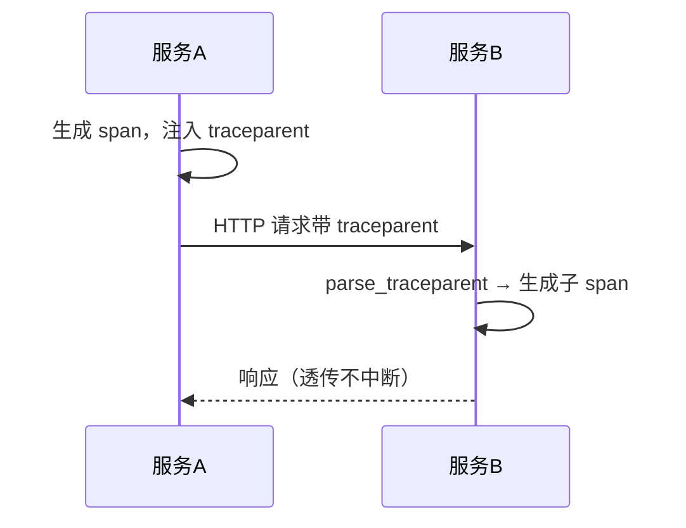

日志只告诉你"这个服务在报错"，链路追踪告诉你"请求究竟串过了哪些服务、
卡在哪个环节"。背后是一个很朴素的数据模型。

## 数据模型：Trace = 一棵 Span 树

| 概念 | 含义 | 类比 |
|---|---|---|
| **Trace** 一次分布式调用 | 一个请求的全过程 | 一整棵树 |
| **Span** 单次调用片段 | 一个服务内的一小段操作 | 树的每个节点 |
| **parent / child** | 调用的嵌套关系 | 树的父子结构 |
| **traceId** | 全局唯一，贯穿整条链路 | 树的根标识 |
| **spanId / parentId** | 定位节点及其父节点 | 拼出树的边 |



一条请求进网关时生成 `traceId`，此后每个服务**透传 traceId + 上级 spanId**，
上报时按 (parentId→spanId) 还原成树。这就是能看"瀑布图"的原因。

## 关键机制：Context 透传

调用关系靠 headers 在进程间透传。HTTP 场景最常用 W3C 的 `traceparent`，它是
**一段固定格式的字符串**，不是几个字段，格式为
`版本-traceId(32位十六进制)-spanId(16位)-trace-flags(2位)`：

```text
traceparent: 00-4bf92f3577b34da6a3ce929d0e0e4736-00f067aa0ba902b7-01
              │  └──── traceId ────┘ └── spanId ──┘  └─flags
              版本=00                          01 表示"要采样/已被采样"
```

### 注入端：出去前写头

服务调用下游前，用当前 span 的 id 作为子 span 的父 id：

```python
def inject_traceparent(current_span) -> "dict[str, str]":
    return {
        "traceparent": (
            "00-"
            f"{current_span.trace_id:032x}-"
            f"{current_span.id:016x}-01"
        )
    }

# 用法：构造下游请求前
headers = {**base_headers, **inject_traceparent(current_span)}
resp = httpx.get("http://service-b/api", headers=headers)
```

### 解析端：进来时续接

收到 `traceparent` 后，把它作为**当前请求的父 span**，本服务生成自己的子 span：

```python
def parse_traceparent(h: str | None) -> dict | None:
    if not h:
        return None
    ver, trace_id, span_id, flags = h.split("-")
    if ver != "00" or len(trace_id) != 32:
        return None          # 不合规就丢弃，别服务端把客户端带崩
    return {
        "trace_id": trace_id,
        "parent_span_id": span_id,
        "sampled": flags == "01",
    }
```



消息队列同理：发送时把 `traceparent` 塞进**消息头**，消费端读出续接。关键
是**跨任何边界都要带上 traceId**，否则链路就在这里断成一截一截。

> 实战提示：**排查"链路哪里断"先抓上下文丢失**。常见断点：异步线程/线程池
> 里没从主线程拷贝 context（Span 跨线程不自动传递）、HTTP 客户端库被包装没带
> header、网关改写 header。这是链路不完整的第一大原因，不是采集问题。

## 采样：全量存不起

全链路全量采集的存储与带宽成本极高，现实必须采样。**不同采样策略决定你能
"看到多少真相"**：

| 策略 | 说明 | 代价 |
|---|---|---|
| 固定/头部采样 | 请求进入时按 traceId 哈希决定留不留 | 简单但不感知结果，错误请求可能没采到 |
| 尾部采样 | 请求结束后按结果（错误/慢）决定保留 | 准确但要缓存整条链路，内存开销大 |
| **自适应采样** | 无错误/慢时降采样，出现异常自动提采样率 | 实践主流 |

常见组合：入口统一决策 + **保留 100% 错误/慢节点** + 对正常流量低位采样。
注意：**头部采样要保证 traceId 哈希稳定**（同一链路各节点对同一 traceId
算出的结果一致），否则会出现"网关采了、下游没采"的断链。

## 走向统一：OpenTelemetry

历史上 Jaeger/Zipkin/SkyWalking 各自定义协议，接入成本高。OpenTelemetry
（OTel）用**一套 SDK + 标准协议（OTLP）**把"埋点、透传、导出"统一起来，
后端可换。落地路径：

```
应用内 OTel SDK 埋点（自动/手动）
   └─> 本地 Exporter（OTLP）─> Collector（聚合/过滤/采样）
        └─> 后端存储展示（Jaeger / Tempo / SkyWalking…）
```

### 最小埋点：手动包一个函数

自动埋点能覆盖 HTTP/DB/MQ，但核心业务逻辑常要手动标 span 才能看清：

```python
from opentelemetry import trace

tracer = trace.get_tracer("order-service")

def handle_order(order_id: int):
    # 开启一个 span，context 自动进入当前线程的隐式上下文
    with tracer.start_as_current_span("handle_order") as span:
        span.set_attribute("order.id", order_id)   # 自定义标签，供检索/绘图
        result = do_payment(order_id)              # 自动埋点里也续在同一 Trace
        span.set_status(trace.StatusCode.OK if result else trace.StatusCode.ERROR)
        return result
```

关键点：`start_as_current_span` 把 span 放进**线程隐式 context**，此后该线程里
发起的任何自动埋点调用都自动挂在它下面——**这就是一次"逻辑操作"和"底层网络
调用"能拼成一个子树的原因**。

### Collector：统一收口与后端解耦

用 docker compose 起一个最小 Collector + Jaeger，应用只需上报 OTLP：

```yaml
services:
  collector:
    image: otel/opentelemetry-collector-contrib:latest
    command: ["--config=/etc/otel.yaml"]
    volumes:
      - ./otel.yaml:/etc/otel.yaml
    ports:
      - "4317:4317"        # 应用上报 OTLP gRPC
      - "4318:4318"        # 应用上报 OTLP HTTP
  jaeger:
    image: jaegertracing/all-in-one:latest
    ports:
      - "16686:16686"      # Jaeger UI
```

```yaml
# otel.yaml：接收 OTLP → 按 traceId 做尾部采样（保留错误）→ 转给 Jaeger
receivers:
  otlp:
    protocols:
      grpc: {}
      http: {}
processors:
  tail_sampling:
    decision_wait: 10s
    policies:
      - name: errors-keep-all          # 错误链路 100% 保留
        type: numeric_attribute
        numeric_attribute: { key: http.status_code, min_value: 400 }
      - name: default-low-rate         # 其余按千分之一采样
        type: probabilistic
        probabilistic: { sampling_percentage: 0.1 }
exporters:
  otlp: { endpoint: "jaeger:4317" }
service:
  pipelines:
    traces:
      receivers: [otlp]
      processors: [tail_sampling]
      exporters: [otlp]
```

后端从 Jaeger 换成 Tempo / SkyWalking 只需改 `exporters`，应用侧零改动——
这就是"后端解耦"。

## 实战：凭一个 traceId 排查慢请求

拿到用户的 traceId，逆着链路定位瓶颈的完整流程：

1. **用 traceId 在追踪平台搜**出整棵 Span 树，看瀑布图谁最宽（耗时最长）。
2. **看纯自耗时**：某 span 自身（不含子 span）占了总耗时大头 → 问题在它
   内部逻辑/本地计算，不是下游。
3. **看子 span 耗时**：被下游调用占了大头 → 把 traceId 丢给下游团队，让它
   继续往下追，或直接看该 span 的 DB/MQ 属性标签。
4. **对照标签**：`http.url`、`db.statement`、`messaging.destination` 一眼看出
   调用的是哪个接口/哪条 SQL/哪个队列。

```bash
# 命令行也能快速看原始 span：curl 后端查询（以 Jaeger 的 API 为例）
curl "http://jaeger:16686/api/traces/$TRACE_ID" | jq '.data[].spans[]
  | {name, dur_ns, localEndpoint: (.process.tags[]?"")}'
```

常见结论的判读：DB span 最宽 → 查慢 SQL；MQ span 宽但消费侧因业务重 →
改消费逻辑；两个服务间网络 span 异常宽 → 排查跨机房延迟/丢包。

## 小结

- 链路追踪 = **Trace(Span 树) + traceId 透传 + 采样 + 统一标准**。
- `traceparent` 用**固定格式**在 HTTP 头/消息头透传；跨线程要主动拷贝 context，
  否则链路断——这是排查不完整的头号原因。
- **采样策略**决定成本与准度，务必保留错误与慢请求（头部采样求哈希稳定）。
- 新服务优先用 **OpenTelemetry** 埋点并由 Collector 统一收口，后端可随时替换，
  避免各家自定协议形成孤岛。