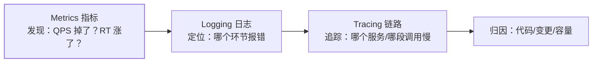

## 三支柱：发现、定位、归因的分工

[链路追踪](/distributed/advanced/observability/01-distributed-tracing/)
解决"请求在服务间怎么走"，但它只是可观测性三分之一。三支柱各管
一段排查链路：

| 支柱 | 形态 | 回答的问题 | 代价 |
|---|---|---|---|
| Metrics | 数字时序（可聚合） | **有没有**问题 | 极低，可长期保留 |
| Logging | 离散事件文本 | 问题**长什么样** | 高（存储/索引），通常 7~30 天 |
| Tracing | 带上下文的调用树 | 问题**在哪一跳** | 中（采样），全量不现实 |

三者的粘合剂是 **traceId/统一标签**：日志带 traceId、指标带服务
维度标签，才能从一张告警图一路点到具体慢调用。

## Metrics：Prometheus 的四类指标

| 类型 | 特征 | 典型用途 |
|---|---|---|
| Counter | 只增不减 | 请求总数、错误总数（配合 rate 算 QPS/错误率） |
| Gauge | 可增可减的瞬时值 | 内存占用、连接数、队列长度 |
| Histogram | 分桶统计分布 | RT 的 P50/P95/P99 |
| Summary | 客户端预聚合分位数 | 少用（不可聚合），一般选 Histogram |

**黄金四信号**（Google SRE）——告警先看这四个：

1. **延迟**：P95/P99 RT（平均值会吃掉长尾）。
2. **流量**：QPS/带宽，判断是不是流量型问题。
3. **错误**：错误率（5xx、业务失败码）。
4. **饱和度**：资源水位——CPU、连接池、队列堆积、磁盘。

配套两个方法论：**RED**（Rate/Errors/Duration，面向服务）与
**USE**（Utilization/Saturation/Errors，面向资源），一个是服务
视角一个是机器视角，生产两套都要。

## 告警设计：让人愿意相信告警

告警体系失败的最常见方式不是漏报，而是**告警疲劳**——狼来了
叫多了，真事故被淹在噪声里。纪律：

- **分级**：P0 电话/值班（核心链路不可用）、P1 即时消息（错误率
  爬升）、P2 工单（磁盘趋势），不同级不同响应路径。
- **基于症状，不基于原因**：给"用户请求失败率"告警（用户能感知
  的症状），不给"CPU 超 80%"告警（可能是正常波动）——资源类
  只做 P2 趋势预警。
- **可执行**：每条告警必须附"下一步做什么"；点了告警却无事可做
  的规则直接删。
- **静默与收敛**：变更窗口静默；关联告警收敛成一条根因通知
  （一个服务挂了引发的上游错误风暴要聚合成"源头"告警）。

## 线上排查的标准路径

"线上接口变慢怎么排查"的标准答法，本质是三支柱的调用顺序：

1. **看变更**：最近发布/配置/容量变更？——多数事故源于变更
   （先回滚再排查，见[发布策略](/distributed/advanced/availability/03-release-strategies/)）。
2. **看指标**：黄金四信号哪个劣化？流量型还是资源型？
3. **看链路**：traceId 抽样对比正常请求，定位慢在哪一跳。
4. **看日志**：那一跳的错误/慢日志，定位到具体 SQL/外部调用。
5. **复盘**：时间线、根因、action 项回填监控与预案——
   一次故障榨干一次价值。

## 小结

- 三支柱是流水线不是并列关系：Metrics 发现、Tracing 定位、
  Logging 归因，traceId 是粘合剂。
- 指标四类型 + 黄金四信号 + RED/USE 是监控词汇表，面试直接用。
- 告警要**基于症状、分级、可执行**；告警疲劳比漏报更危险。
- 排查从变更开始——"先回滚再定位"是止损第一原则。

## 延伸阅读

- [Google SRE：Monitoring Distributed Systems（黄金四信号出处）](https://sre.google/sre-book/monitoring-distributed-systems/)
- [Prometheus 官方文档：四种指标类型](https://prometheus.io/docs/concepts/metric_types/)
- [分布式链路追踪（同分类前篇）](/distributed/advanced/observability/01-distributed-tracing/)
