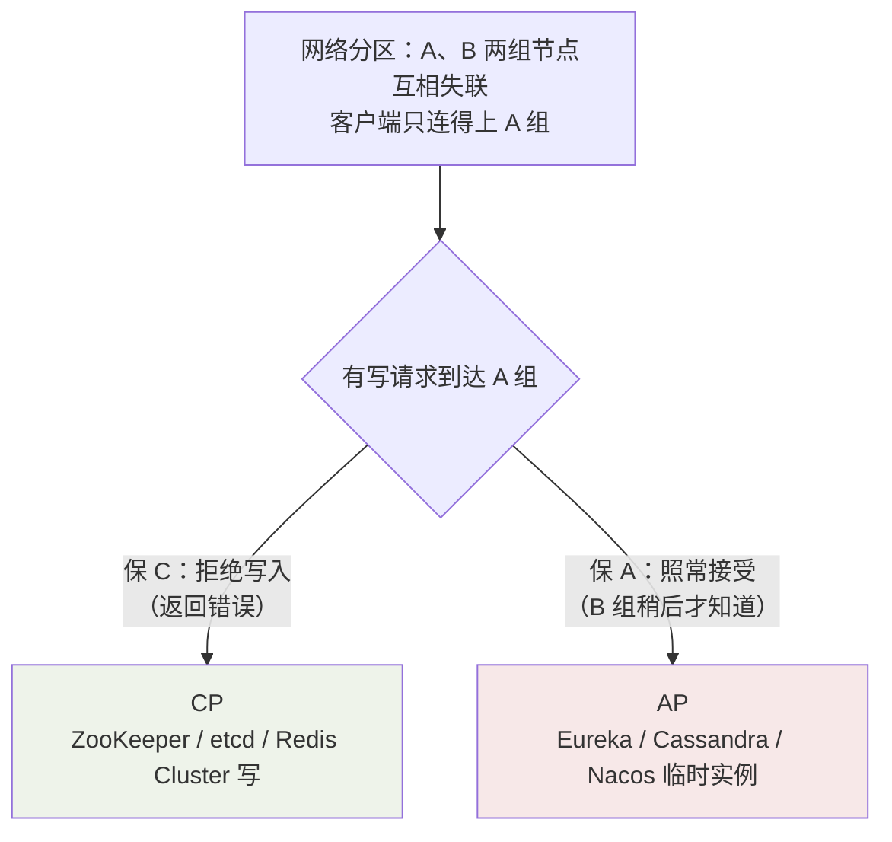

## CAP 的准确表述

| 字母 | 含义 | 常见误解 |
|---|---|---|
| C 一致性 | **线性一致性**：读总能看到最新写入 | 不是事务 ACID 的 C（那是约束） |
| A 可用性 | **每个**请求都能得到（非错误）响应 | 不是"高可用率 99.9%" |
| P 分区容错 | 网络分区（节点间断联）时系统仍能工作 | 不是"防宕机" |

**P 不是可选项**：跨节点的网络随时可能断（交换机抖动、机房光纤被挖）。
放弃 P 意味着分区时直接停服——单机系统才不需要 P。所以真实的选择题
是**分区发生时，保 C 还是保 A**：



CP 的典型体验：ZooKeeper 集群挂掉过半节点后**拒绝所有写请求**——宁可
不可用，不给"两边各自为政"的机会。

**CA 存在吗**：只在**无分区的单机或强同步网络**里讨论才有意义（如
单机 MySQL）。经典说法"三选二"并不严谨——论文作者 Brewer 后来自己也
补充：P 发生概率低，平时 C 和 A 可以兼得，**只在分区窗口内被迫取舍**。

## 分区时的两难（为什么不能全要）

```
客户端 ──写 x=1──> 节点 A（可达）     节点 B（与 A 断联）
                              客户端 ──读 x──> 节点 B（可达）
```

A 组接受了写入 x=1；B 组收不到同步。此时客户端读 B：

- B 返回旧值 x=0 → **一致性破了**（C 没保住），但两边都响应了（A 有）。
- B 拒绝响应等同步 → **可用性破了**（A 没保住）。

没有第三种答案——**C 和 A 的冲突在分区内不可调和**，只能选边站或事后
补偿（见 BASE）。

## BASE：AP 的工程续命

| 字母 | 含义 |
|---|---|
| **BA** Basically Available 基本可用 | 故障时允许降级：响应时间变长、返回有限服务（降级页） |
| **S** Soft state 软状态 | 允许中间态：节点间数据允许短暂不一致（"同步中"） |
| **E** Eventually consistent 最终一致 | 经过同步后，所有副本**最终**收敛到一致 |

BASE 不是"不要一致"，而是**放弃实时强一致，换取分区期间持续服务**——
本质是 CAP 里选 A，再用异步复制把 C 补偿回来。


日常所见大多是最终一致：DNS 传播、Redis 主从异步复制、电商"已下单，
库存稍后更新"、朋友圈评论跨地区延迟可见。

## 一致性光谱（进阶铺垫）

实际系统的"一致性"不是开关而是一条光谱，从强到弱：

| 级别 | 保证 | 例子 |
|---|---|---|
| 线性一致 | 读一定看到最新写（含全局顺序） | ZK 的写、etcd |
| 顺序一致 | 各节点**顺序一致**但可能滞后 | 概念基准 |
| 因果一致 | 有因果关系的操作保序 | 评论必须后于帖子可见 |
| 最终一致 | 停止写入后最终收敛 | DNS、AP 系统 |

## 主流组件选型地图

| 组件 | 取舍 | 分区时的表现 |
|---|---|---|
| ZooKeeper / etcd | CP | 少数派不可写/不可服务，等选主 |
| Eureka | AP | 自我保护，保留过期实例照常服务 |
| Nacos | AP + CP 双模 | 临时实例 AP，永久实例 Raft |
| Cassandra | AP | 读写都走可用侧，冲突靠时间戳/LWW 收敛 |
| Redis Cluster | 混合 | 主不可达的槽不服务（偏 CP 的可用性妥协） |
| 单机 MySQL | "CA" | 无分区概念，靠主从异步复制做最终一致 |

选型口诀：**元数据/协调（锁、配置、选主）选 CP——错的元数据比没有更
危险；业务数据/在线服务选 AP 或最终一致——停机的代价高于短暂不一致**。

## 小结

- P 是前提，真实选择是"分区窗口内保 C 还是保 A"。
- BASE = 选 A + 软状态 + 最终一致，用异步复制事后补偿。
- 按数据性质选边：协调数据 CP、业务数据 AP——ZK 与 Eureka 的设计差异
  全部由此展开。
