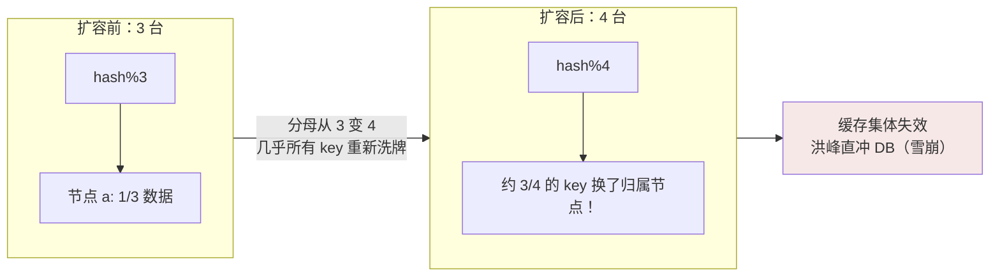
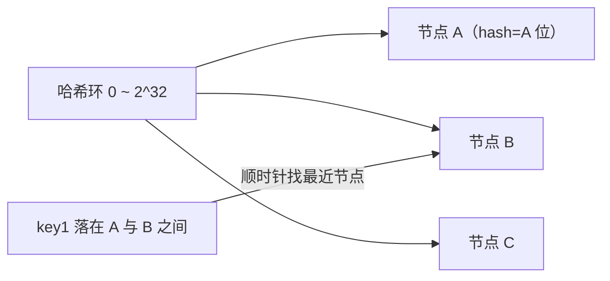
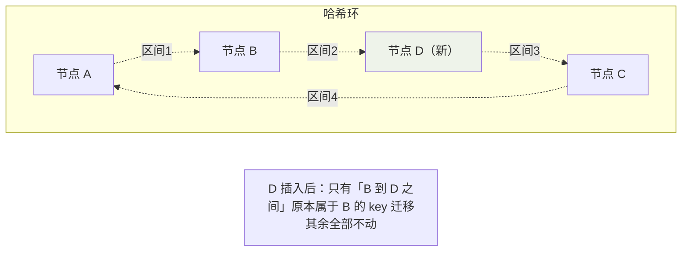

## 普通 hash 取模的问题

```java
// 3 台缓存服务器，key 的归属：
server = servers[hash(key) % 3];
```

扩容 3 → 4 台的瞬间：



数学直觉：分母从 N 变 N+1，hash 值模数改变的 key 占 N/(N+1)——**扩容
一台，四分之三的缓存作废**。一致性哈希把代价压到**只移动 1/(N+1)**。

## 哈希环

把哈希空间首尾相接成环（如 2^32），节点和 key 都映射到环上，**key 归
属顺时针遇到的第一个节点**：



```java
// 核心逻辑：对节点地址哈希放入环，查询时找"第一个 >= keyHash 的节点"
TreeMap<Long, String> ring;                     // hash -> server
public String route(String key) {
    long h = hash(key);
    // ceilingEntry：环上第一个 >= h 的节点；绕回起点用 firstEntry
    Map.Entry<Long, String> e = ring.ceilingEntry(h);
    return e != null ? e.getValue() : ring.firstEntry().getValue();
}
```

### 扩容的代价分析

新增节点 D 落在 A 与 B 之间时：**只有原本属于 B 的一段 key 需要迁移
给 D**，A 与 C 的数据纹丝不动——每个新节点只"接管"环上自己那一段，
平均迁移量 ≈ 总量 / (N+1)。



## 数据倾斜与虚拟节点

理想很美：环是均匀的。现实是：**3 个真实节点的哈希落点随机**，完全可能
挤在一起——某节点占了环的 60%，数据严重倾斜。

**虚拟节点（VNode）**是标准解法：每个物理节点在环上撒几百上千个虚拟
点位（`hash(node-1) ... hash(node-500)`），环被切得足够碎，概率论让
负载趋于均匀：

```java
for (String node : List.of("10.0.0.1", "10.0.0.2", "10.0.0.3")) {
    for (int i = 0; i < 500; i++) {           // 每个物理节点 500 个虚拟节点
        ring.put(hash(node + "#VN" + i), node);
    }
}
```

附带福利：**权重控制**（性能强的机器多撒虚拟节点，多扛流量）和**异构
集群**（8C16G 与 4C8G 混部）都有了抓手。

## 谁在用一致性哈希

- **Memcached / Twemproxy**：客户端分片的经典实现（ketama 算法）。
- **Cassandra / DynamoDB**：数据分片的主算法（虚拟节点是标配）。
- **负载均衡**：客户端连接亲和（同一会话粘同节点）。

## Redis Cluster 为什么没选它

Redis Cluster 用的是**哈希槽（16384 slots）**（见 Redis 高可用篇）：

| 维度 | 一致性哈希 | 哈希槽 |
|---|---|---|
| 归属计算 | `顺时针找最近节点`（要维护环结构） | `CRC16(key) % 16384` 查槽映射表 |
| 扩缩容 | 迁移"环上一段"的 key（范围模糊） | **按槽整块迁移**，边界清晰可控 |
| 权重 | 虚拟节点间接实现 | 直接按槽数量分配（如节点 A 管 0~5460） |
| 谁负责路由 | 客户端/中间件 | 服务端协议支持（MOVED/ASK） |

槽是**显式、离散、可管理**的分配单位——运维要"把槽 100~200 从 A 挪到
B"是一句明确指令；哈希环上"挪一段弧"连续又模糊。当**人工运维介入多、
需要精确控制迁移节奏**时，槽优于环；纯客户端自动分片场景，环更省事。

## 小结

- 取模扩容迁移量 N/(N+1)，一致性哈希降到 1/(N+1)——key 归属"顺时针
  最近节点"。
- 虚拟节点治倾斜、控权重；Cassandra/Dynamo 是最佳实践现场。
- Redis Cluster 选槽不选环：显式可控的离散分配，换来运维友好。
