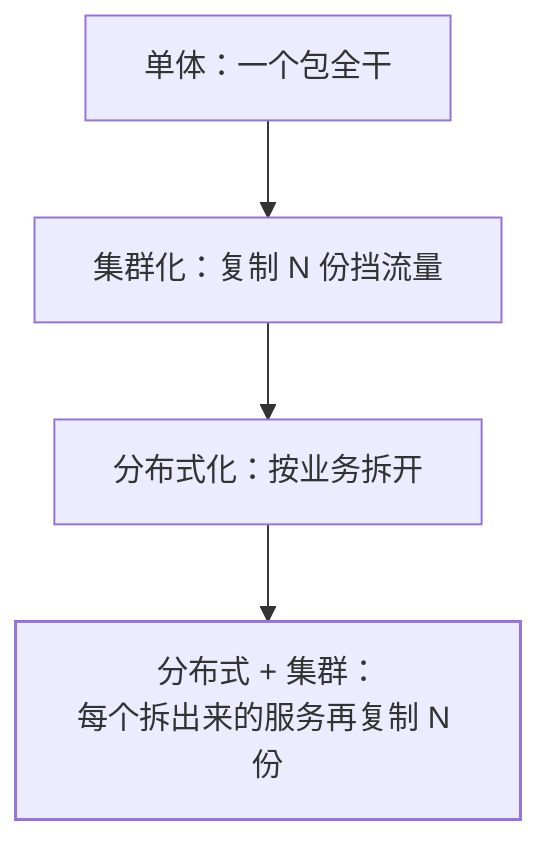
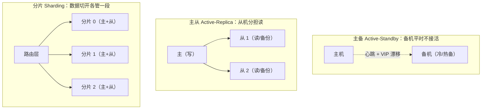

## 一句话分清

| 维度 | 集群（Cluster） | 分布式（Distributed） |
|---|---|---|
| 做什么 | **多台相同角色**的机器，对外像一个整体 | **一个任务拆给多台不同角色**的机器协作 |
| 解决什么 | 单机**不够快**（分流）、**不可靠**（冗余） | 单机**做不了**（容量/算力上限） |
| 手段 | 复制（replication）、分担（load balancing） | 拆分（分而治之，SOA/微服务） |
| 举例 | 3 台一样的订单服务 + Nginx | 订单、库存、支付各自独立部署 |

两者不是对立而是叠加：微服务系统里，**服务之间是分布式拆分，每个服务
自身又集群化部署**——"订单服务"是一个分布式组件，同时它有 4 个副本
组成集群。

面试常问"集群和分布式的区别"，答案就抓两个动词：**集群靠复制，
分布式靠拆分**。

## 集群的三种形态（重点）

面试里"主从、主备、分片什么区别"是高频题，本质是**冗余资源的
闲置方式**不同：

| 形态 | 结构 | 冗余利用率 | 典型实现 |
|---|---|---|---|
| 主备 | 一主一备，故障才切换 | 低（备机闲置） | Keepalived + VIP、冷备磁带库 |
| 主从 | 一主多从，主写从读 | 高（从机扛读/备份） | MySQL 主从复制、Redis 主从+哨兵 |
| 分片 | 数据按规则切给多组节点 | 最高（写也分散） | Redis Cluster 槽位、ES 分片、分库分表 |

- **主备**解决"挂了怎么办"，**主从**顺带解决"读多写少"，**分片**
  才真正解决"写不动/存不下"。三者可组合：每个分片内部再主从——
  这正是 Redis Cluster / MongoDB 分片集群的通用套路。
- 对等（无中心）形态：所有节点角色等价、无主（Eureka 两缓对等、
  Cassandra 环形哈希），用一致性哈希等规则分担数据，牺牲一致性换
  可用性，属于 AP 阵营的集群形态。

## 单点故障：集群存在的一切理由

**单点（SPOF）**：挂了全站跟着挂的组件。排查思路是顺着请求链路逐个
问"它挂了会怎样"：

- 无状态服务：天然好扩容——挂一台流量切走即可。
- 有状态组件（DB/缓存/注册中心）：必须冗余 + **自动故障转移**。
- 最隐蔽的单点：负载均衡器自身、配置中心、时钟（NTP）。

消除单点两板斧：**冗余**（多副本）+ **自动故障转移**（探活、选主、
流量切换，见[容灾与多活](/distributed/advanced/availability/01-dr-multi-active/)）。
而"冗余"能成立的前提是**无状态化**：任何机器都能顶替任何机器，
不依赖本地内存里的会话与数据——这正是下一分类[分布式会话](/distributed/intermediate/cluster/02-session-sharing/)要解决的问题。

## 分布式系统的五个固有代价

单机变分布式不是免费午餐，面试聊架构时能主动说出代价是加分项：

1. **网络不可靠**：超时≠失败——请求可能成功在路上丢（分布式计算
   八大谬误第一条就是"网络可靠"）。
2. **没有全局时钟**：各机器时钟会漂移，不能用时间戳排序事件，只能
   用逻辑时钟/版本号。
3. **部分失败**：单体失败是"全挂"，分布式是"有的活着有的死了"，
   你必须处理"不知道对方死没死"的状态。
4. **数据一致性问题**：多副本之间总有不一致窗口，CAP 的取舍从此开始
   （见 [CAP 与 BASE](/distributed/basic/theory/01-cap-base/)）。
5. **复杂度转移**：业务简单了，运维/排障/测试复杂度指数上升——
   所以链路追踪、容器编排这些配套才会诞生。

## 小结

- 集群靠**复制**解决单机的速度与可靠性，分布式靠**拆分**解决单机的
  能力上限；微服务 = 服务间分布式 + 服务内集群。
- 集群三形态：主备（冷冗余）→ 主从（读写分离）→ 分片（数据切分），
  利用率和复杂度递增，可组合使用。
- 无状态化是横向扩展的前提；有状态组件靠冗余 + 自动故障转移消除单点。
- 分布式的固有代价（网络不可靠、无全局时钟、部分失败）是所有上层
  设计（共识、事务、一致性）的出发点。

## 延伸阅读

- [分布式计算的谬误（Wikipedia）](https://en.wikipedia.org/wiki/Fallacies_of_distributed_computing)
- [Shared-nothing 架构（Wikipedia）](https://en.wikipedia.org/wiki/Shared-nothing_architecture)
- [主从复制详解见 MySQL 篇](/mysql/advanced/performance-ha/02-replication-sharding/)
