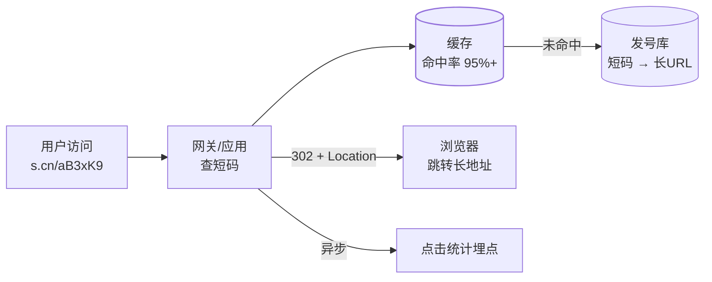

## 题面与核心链路

输入长 URL 返回短码（如 `s.cn/aB3xK9`），访问短码 302 跳转到
原链接。两件事：**存储映射**（长↔短）与**高并发读**（跳转 QPS
远大于生成 QPS，典型读多写少）。

## 短码生成：发号器方案（主流）

**自增 ID + 62 进制编码**：

- 全局自增发号器（号段模式/雪花 ID，见
  [分布式 ID](/distributed/intermediate/transaction/02-distributed-id/)），
  62 进制（0-9a-zA-Z）编码压缩：62⁶ ≈ 568 亿，6 位足够。
- 优点：实现简单、单调递增、无碰撞——**不需要碰撞检测重试**。
- 对比哈希方案（MurmurHash 长 URL 取前 6 位）：无需发号器，但
  **必然处理碰撞**（撞了加盐重试），且长 URL 重复提交要么每次
  同码（需按长 URL 建唯一索引）要么浪费，工程上不如发号器干净。

**防遍历**：连续发号让短码可枚举（`aB3xK9` +1 即下一个），竞争
产品可爬遍你所有短链。对策：发号后对 ID 做位混淆/加随机段，或
直接用带随机性的 ID 方案，牺牲一点长度换不可枚举。

## 重定向：302 还是 301（必考）

| 码 | 语义 | 后果 |
|---|---|---|
| 301 | 永久重定向 | 浏览器**缓存**，后续不再访问短链服务 |
| **302** | 临时重定向 | 每次都经过短链服务 |

选 **302**：短链服务的价值在**点击统计、风控校验、随时改指向**，
301 一次缓存就失去了这一切。代价是跳转 QPS 常驻——所以缓存架构
是重点。面试说清这个取舍即可。

## 读多写少的缓存架构

- **缓存优先**：短码为 key 缓存长 URL，命中率天然极高（头部短链
  被疯狂点击）；未命中查库回填。
- **不存在的短码**用布隆过滤器前置拦截（防穿透，原理见
  [Redis 缓存问题](/redis/intermediate/usage/02-cache-problems/)），
  也可对"查无此码"缓存空值短 TTL。
- 热点加本地缓存二级兜底；统计埋点走**异步**（发 MQ/内存聚合
  批量落库），别让计数拖慢跳转主链路。

## 存储与扩展

- 存储：发号库单表 `short_code + long_url + 状态`，短码唯一索引；
  量级到顶按短码 hash [分库分表](/distributed/intermediate/sharding/01-sharding-methods/)。
- 高可用：无状态服务 + 缓存集群 + DB 主从即可，架构简单是优点。
- 安全：跳转前校验短链状态（封禁/过期）；开放生成接口要防被当
  免费跳板（鉴权 + 频控 + 长 URL 白名单/黑名单检测）。

## 一分钟答法总结

1. 生成：全局发号器 + 62 进制编码，无碰撞；混淆防遍历。
2. 跳转：**302** 保留统计与管控能力，说清与 301 的取舍。
3. 读架构：缓存为主（命中率天然高），布隆过滤器防穿透，统计
   异步化。
4. 扩展：单表到顶后按短码分片；服务无状态水平扩展。

## 小结

- 短链系统是"读多写少 + 简单映射"的最小完整案例：发号器、编码、
  重定向语义、缓存架构四个点答全即满分。
- 302 vs 301 和防遍历是最容易拉开差距的两个追问点。
- 与秒杀对照记忆：秒杀是"写洪峰"问题，短链是"读洪峰"问题。

## 延伸阅读

- [分布式 ID 方案（同站）](/distributed/intermediate/transaction/02-distributed-id/)
- [HTTP 301 与 302 语义（RFC 9110）](https://httpwg.org/specs/rfc9110.html#status.301)
- [Redis 缓存三大问题（同站）](/redis/intermediate/usage/02-cache-problems/)
