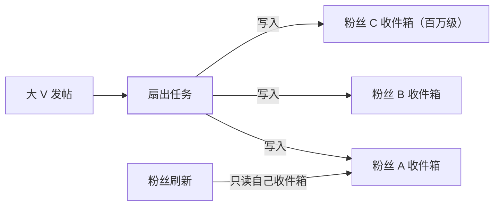

## 题面

用户发了内容，他的百万粉丝打开 App 就要看到——"新内容怎么到达
每个粉丝的时间线"是 Feed 流的核心问题。两种极端模式对应**读写
压力的搬运方向**，推拉结合是大厂的最终答案。

## 推模式（写扩散）：发的时候写进每个粉丝的收件箱

- 读快：刷新时只读自己的收件箱（Redis List/ZSet），一次查询出
  完整时间线。
- 写贵：**粉丝量 = 写放大**，百万粉大 V 发一条帖子要写百万次；
  "僵尸粉"收件箱白白占用存储。
- 适用：粉丝少而读多（普通用户、私信）。

## 拉模式（读扩散）：看的时候现拉关注列表聚合

- 写便宜：发帖只写自己的**发件箱**（一条记录）。
- 读贵：刷新时要拉**所有关注对象**的发件箱再内存归并排序——
  关注 2000 人 = 一次刷新 2000 次查询，延迟不可控。
- 适用：写多读少、或粉丝结构极端的大 V 内容。

## 推拉结合：按活跃度分而治之

大厂的通用解：**普通用户推，大 V 拉**——刷新时收件箱里是
"普通人内容的推 + 大 V 内容的实时拉"两部分归并：

| 维度 | 纯推 | 纯拉 | 推拉结合 |
|---|---|---|---|
| 读延迟 | 极低 | 高且抖动 | 低 |
| 写成本 | 随粉丝数爆炸 | 常数 | 只有普通粉扇出 |
| 冷启动账号 | 收件箱空也要建 | 无存储浪费 | 折中 |
| 复杂度 | 低 | 低 | 高（要维护在线/粉丝画像） |

工程细节：扇出走**异步任务/MQ**（发帖接口不等扇出完成）；大 V
发帖可先只推"在线粉丝"，离线粉等上线拉取——**在线推、离线拉**
是推拉结合的第二个维度。

## 排序、分页与去重

- **排序**：时间线按 `score = 时间戳` 存 ZSet；叠加互动权重
  （转发/点赞加权）就是简化推荐流。
- **分页**：游标翻页（`last_score + limit`），别用 offset——
  收件箱是持续插入的流式结构（同[分片篇](/distributed/intermediate/sharding/01-sharding-methods/)深翻页结论）。
- **去重**：转发链会重复出现同一内容，按内容 ID 全局去重。
- **删除/屏蔽**：推模式删帖要回收所有粉丝收件箱里的副本——
  实践上读时过滤（状态位）比物理回收便宜。

## 存储选型速答

| 组件 | 选型 |
|---|---|
| 收件箱/发件箱 | Redis ZSet（score 排序 + 天然游标），只保留最近 N 条 |
| 历史时间线 | 冷数据落库/按用户分片（见[分库分表](/distributed/intermediate/sharding/01-sharding-methods/)） |
| 关注关系 | 缓存 + 关系库；扇出任务按关注列表分片并行 |
| 内容正文 | 只存一份（发件箱侧），收件箱只存内容 ID |

## 一分钟答法总结

1. 两种极端：推=写扩散读快，拉=读扩散写省——本质是搬运读写压力。
2. 大 V 问题（写爆炸）→ 推拉结合：普通粉推、大 V 拉、在线推
   离线拉。
3. 扇出异步化（MQ），存储 ZSet + 游标分页，正文单份存储按 ID 引用。
4. 删帖用状态位读时过滤，不做物理回收。

## 小结

- Feed 流没有银弹，**按用户结构混合策略**是标准答案；说清"谁推
  谁拉、为什么"比背名词重要。
- 所有读扩散结构都要回答深分页与去重——游标 + 内容 ID 引用是
  通用解。
- 与秒杀对照：秒杀是瞬时写洪峰，Feed 是持续写放大——都是把
  "错误的层"的压力搬到"正确的层"。

## 延伸阅读

- [短链接系统设计（同分类：读多写少案例）](/distributed/intermediate/case-studies/02-short-url/)
- [秒杀系统设计（同分类：写洪峰案例）](/distributed/intermediate/case-studies/01-flash-sale/)
- [Redis 数据结构（ZSet 细节）](/redis/basic/core/01-data-structures/)
