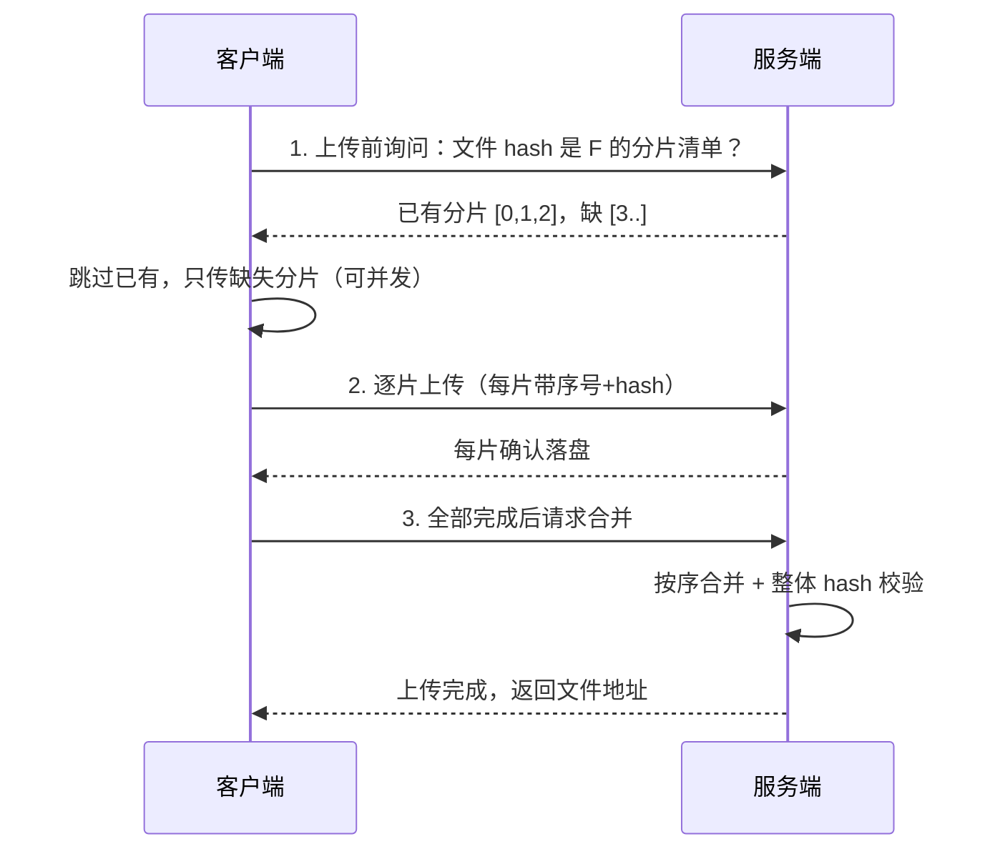

网盘传几 GB 的视频、移动端弱网传素材——**一次 HTTP 请求把大文件发完**
注定失败：连接一断全部重来，服务器内存也被大请求打爆。大文件上传是
系统设计场景题的高频选手（与秒杀、短链同系列），核心三件套：
**分片、断点续传、秒传**。

## 为什么必须分片

把大文件切成固定大小的分片（chunk，通常 2~10 MB），逐片上传：

- **失败代价小**：某片失败只重传那一片，不用整个文件重来；
- **并发提速**：多个分片并行传，吃满带宽（与消息批量、rsync 增量同一
  思想：把大任务拆小）；
- **内存友好**：服务端流式接收落盘/转存，不把几 GB 读进内存。

**分片大小的权衡**：太大 → 单片失败重传代价高、弱网下超时概率大；
太小 → 请求数量爆炸（HTTP 开销、对象存储请求数计费）。经验值 4~8 MB，
按网络质量与平均文件大小调。

## 断点续传：记住传到哪了

断点续传 = **已传分片的记录 + 只传缺的**：

- 进度记录存**服务端**（客户端换设备也能续传，清单按文件 hash 索引）；
- 每个分片带**自身 hash**，服务端落盘前校验，坏片当场拒收；
- 合并后做**整体 hash 校验**——分片都对不代表拼接没错。

## 秒传：hash 先行，命中即引用

上传前先算**整个文件的 hash**（MD5/SHA-256，客户端本地算）发去查询：
服务端已存在同 hash 文件 → **直接返回文件引用，一个字节都不用传**。
网盘"秒传"的本质是**全平台去重 + 引用计数**（删除时只减计数，归零才真删）。

- hash 碰撞风险极低但存在（MD5 已可构造碰撞，用 SHA-256）；
- 隐私注意：hash 查询接口意味着"我能探测某文件是否已被别人传过"——
  网盘场景可接受，企业内部需评估。

## 生产关键：对象存储直传

大文件流量**不要过应用服务器**——应用集群的带宽和内存是稀缺资源。
生产标准姿势是**客户端直传对象存储（OSS/S3）**：

1. 服务端只做鉴权 + 生成**预签名 URL**（或分片上传凭证），返回给客户端；
2. 客户端拿着凭证**直传 OSS**（分片/续传/秒传 OSS 原生支持）；
3. 上传完成回调通知业务服务（写库、转码触发）。

应用服务器从"数据搬运工"变成"发门票的"——带宽、稳定性、成本全面解耦
（CDN 篇的思路同源：静态流量别过应用）。

## 高频追问速答

- **孤儿分片怎么清理？** 用户传了一半走人了——服务端按"上传会话"过期
  时间定期清理未合并的分片（对象存储用生命周期规则），否则存储费用
  白白增长。
- **合并怎么做才不卡？** 分片已各自落盘，合并只是按序拼接（对象存储
  甚至有原生 combine 接口）；大文件合并放异步任务，完成后状态置为可用。
- **并发分片数怎么定？** 客户端并发 3~5 片即可吃满带宽，再多徒增服务端
  连接压力；移动端还要做网络类型感知（弱网降并发、调大超时）。

## 小结

- 大文件上传三件套：分片（拆小降失败代价）、断点续传（服务端记清单，
  只传缺的）、秒传（hash 先行命中即引用）。
- 分片大小 4~8 MB 起步权衡；合并后整体 hash 校验兜底。
- 生产关键在**对象存储直传 + 预签名**：应用发门票，流量不过门。
