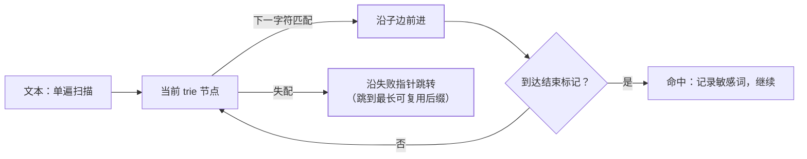

评论、昵称、商品描述——只要有 UGC，就有敏感词过滤。"几万条敏感词、
每秒上万条内容，怎么过滤得又快又准"——工程演进从朴素匹配到 trie 再到
AC 自动机，每一层都有明确的性能理由，演进过程本身就是这道面试题的答案。

## 从朴素匹配的灾难说起

最直觉的实现：词库里每个词都 `content.contains(word)` 一遍。

- 词库 1 万条、正文平均 1 千字 → 每条内容做 1 万次子串扫描，
  复杂度 O(词数 × 文本长 × 词长)——单机撑不住，且随词库线性变慢；
- 忽略了**前缀共享**：["爱好", "爱惜", "爱情"] 三次扫描都在重复比较
  前缀"爱"。

## trie：前缀树，共享前缀只比一次

把词库建成一棵 trie（前缀树）：相同前缀的词共享路径节点。扫描文本时
**从每个字符出发沿树走**，走到"结束标记"即命中——前缀只比一次。

- 单字符出发的匹配复杂度 O(最长词长)，与词库大小无关（词库大小只影响
  树的内存）；
- 但仍有浪费：从每个位置都要从头走一遍树，**失配后不能利用已比较的
  信息**。

## AC 自动机：trie + 失败指针，一次扫描匹配所有

Aho-Corasick 是 trie 与 KMP 思想的结合：给每个节点加**失败指针**——
当前匹配失配时，跳到"最长的其他可复用后缀"继续匹配，**文本指针永不回退**：

- **一次 O(文本长) 的扫描**（不计跳转，均摊后仍近线性）同时匹配**全部**
  万级词——词库翻倍只增加构建时间，查询几乎不变；
- 与 KMP 的关系：AC 是 KMP 的多模式推广，KMP 是单模式串的 AC 特例。

## 工程：变体绕过与词库管理

算法只是地基，生产上真正的麻烦是"对抗"：

- **变体绕过**：全角/半角（ａ与 a）、拼音（v 与 微）、拆字（马 化 腾）、
  插入符号（a*b*c）——**统一归一化预处理**（全角转半角、繁转简、去分隔符）
  再进自动机；命中后用原文位置还原，不能把归一化结果直接展示；
- **词库热更新**：运营随时加词——重建 trie/自动机后**双缓冲切换**
  （新旧实例原子替换，避免查询打半截）；
- **误杀治理**：命中≠必杀——分词库等级（必杀/疑似），疑似走人工审核
  或上下文判断；白名单兜底（"AVR 单片机"这类误伤）。

## 高频追问速答

- **AC 自动机和 KMP 什么关系？** KMP 的失配指针思想推广到多模式串：
  trie 的失败指针指向"当前串的最长真后缀对应的另一节点"。
- **词库十万条会撑爆内存吗？** trie 节点数 ≈ 词总字符数，十万短词在
  百万节点量级，int 数组实现几十 MB——可接受；更省用双数组 trie。
- **为什么不用正则拼接？** 把万条词拼成 `(a|b|c...)` 大正则：回溯失控
  风险 + 每次编译/匹配都慢，正则引擎不是为万级固定模式设计的。

## 小结

- 演进三层：朴素 contains（词库越大越慢）→ trie（前缀共享）→
  AC 自动机（失败指针，单遍扫全文匹配所有词）。
- 工程大头在对抗：归一化预处理防变体、双缓冲热更新、分级命中+人工审核。
- 记住定位：这是"多模式串匹配"问题，算法选择决定上限。
