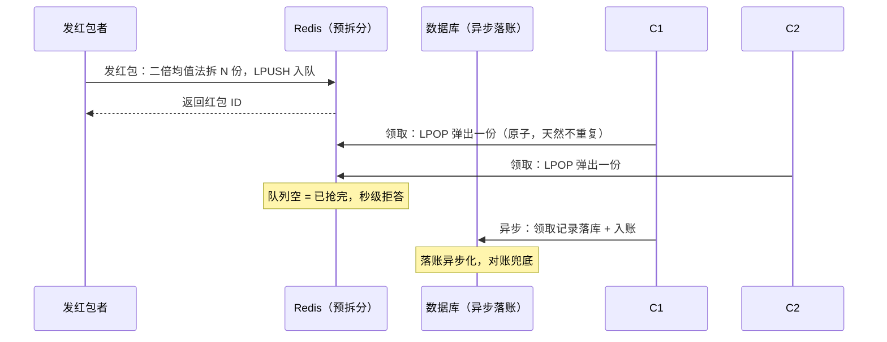

微信抢红包是并发设计的经典教材：**一个红包几百人同一毫秒点开、金额随机
且总和精确、一分钱不能错**。它把"秒杀"的并发问题 + "账务"的精确性问题
揉在一起，面试官用它看你能不能同时想清楚**性能**和**正确性**。

## 先拆需求

- **拼手气随机**：总额固定，每人金额随机且不减到 0.01 以下（最后一人
  拿剩余），总和精确等于总额——不能超发也不能少发；
- **高并发瞬时**：发红包者在群里说"手慢无"，几百人同一瞬间点开；
- **账务正确**：每一笔都要落账，可对账、可审计——钱的问题零容忍。

## 金额分配：二倍均值法

随机拆分不能一次随机（先拆的人可能拿走 90%）。业界标准是**二倍均值法**：

```
每次领取的金额上限 = 剩余金额 / 剩余人数 × 2
```

- 数学性质：每次的**期望值 = 剩余金额 / 剩余人数**（均匀的期望），方差
  又足够大（有"手气最佳"的乐趣）——随机性与公平期望同时满足；
- 1 分钱兜底：每次最少 0.01，最后一人拿全部剩余（数值用"分"做整数运算，
  **永远不用浮点数处理钱**）。

## 并发领取：预拆分 + Redis 原子出队

几百人并发点开，瓶颈在"抢"这一步。思路与秒杀同构：**把数据库争抢前移到
内存**——发红包时就把金额**预拆分**成 N 份，推入 Redis List：



- **LPOP 是原子操作**：同一份金额天然不会被两人领到——不需要分布式锁；
- 抢完（队列空）直接拒绝，压力不透传到数据库；
- **两阶段**：抢（内存，毫秒）与拆（落库入账，异步）分离——用户体验
  与账务压力解耦，一致性靠异步落库 + 对账兜底（最终一致，见缓存一致性篇）。

## 热点账户：被忽略的另一半

抢是热读热点，**发红包者与领取者的账户余额是热写热点**——一行余额被
高频更新会锁成串行。解法：

- **缓冲记账**：入账先累计到内存/中间层，定时汇总入账（牺牲实时性）；
- **拆分子账户**：余额分桶，随机写不同桶；
- 微信红包的实际处理：红包金额在拆分时已确定，入账只做"把预拆记录
  写流水 + 汇总调余额"，把热点写摊平。

## 高频追问速答

- **为什么不用分布式锁？** 锁是把并发串行化，Redis List 的 LPOP 本身就是
  原子出队——能不锁就不锁（对照秒杀的 Redis 预扣库存）。
- **怎么保证账务一定不错？** 预拆分记录是唯一事实源；落库流水 + 定时
  对账（预拆总额 = 领取总额 = 落账总额），差异告警人工介入——对账是
  资金系统的最后防线。
- **过期红包退回怎么做？** 24 小时未领完，队列剩余部分退回发红包者
  账户——同样走异步 + 对账。

## 小结

- 金额：二倍均值法（期望公平 + 方差有趣），整数分运算，最后一人兜底。
- 并发：预拆分入 Redis，LPOP 原子领取，抢与拆两阶段分离，DB 异步落账。
- 钱的纪律：不用浮点、热点账户缓冲记账、对账兜底——性能方案必须配
  正确性方案。
