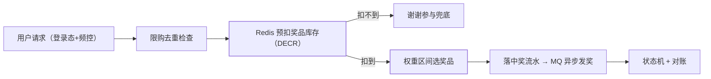

大促转盘抽奖是并发设计的另一道经典题：**概率要精确可配、奖品不能超发、
一个用户不能薅羊毛、瞬时并发又是峰值**——它比秒杀多了"随机性配置"，
比红包多了"外部奖品的库存与发放"。

## 先拆需求

- **概率可配**：每个奖品的概率由运营配置（合计 100%），活动期间可调；
- **库存刚性**：iPhone 只有 10 台，绝不能发出第 11 台；
- **规则约束**：每人限抽 N 次/每天限抽、中奖后是否还能抽；
- **瞬时并发**：活动开始瞬间是流量洪峰。

## 概率配置：权重区间法

把各奖品的概率变成**数轴上的区间**，随机数落在哪个区间就中哪个奖：

```
一等奖 1%   → [0, 1)
二等奖 9%   → [1, 10)
三等奖 30%  → [10, 40)
谢谢参与 60% → [40, 100)
随机数 r = random(0, 100)，落在哪段中哪段
```

- 实现上用**权重**而非小数概率（整数权重求和，避免浮点精度误差——
  与红包的"整数分"同一纪律）；
- 运营改概率 = 改区间表，支持活动期间热更新（配置中心推送）。

## 库存与限购：Redis 预扣 + 去重

并发下"不能超发"的解法与秒杀同构：**奖品库存预扣在 Redis**（DECR 原子），
扣完直接走"谢谢参与"兜底——**谢谢参与不是凑数，是系统的安全阀**（任何
请求都必须抽得出结果，兜底奖品库存无上限）。

- **限购去重**：`SET user:{uid}:draw:{date} 1 EX 86400`（或 Set/HyperLogLog
  按精度选），重复请求直接拒绝；
- **防刷**：登录态 + 频控（单位时间请求数）+ 黑名单，抽奖接口永远在
  登录态后面（对照 Agent 护栏篇的"外部输入不可信"）。

## 中奖之后：异步发奖与对账

抽中 ≠ 发到手里，发奖按奖品类型分通道：

- 虚拟奖（优惠券/积分）：写 MQ 异步发放，失败重试 + 死信告警；
- 实物奖：中奖记录落库 → 用户填地址 → 发货流程，走人工/物流对接；
- **中奖记录是唯一事实源**：抽奖流水 + 发奖状态机（待发放/已发放/失败），
  定时对账（中奖数 ≤ 库存扣减数），发放失败可人工补发。



## 高频追问速答

- **概率精确性怎么保证？** 整数权重 + 区间法，不叠加多次随机（叠加会改变
  分布）；需要"保底"逻辑（N 抽必中）在区间外用计数器单独实现。
- **奖品发超了怎么办？** 预扣制下不该发生——发生了说明预扣与发奖之间
  有旁路；对账发现后补库存 + 复盘旁路。
- **大奖中奖瞬间服务挂了怎么办？** 预扣发生在 Redis（成功即占位），
  中奖流水落库失败可凭流水重放发奖——**先扣库存后落流水**的窗口要靠
  流水补偿闭环，这也是"账务类系统先记录后执行"的通用纪律。

## 小结

- 概率用整数权重区间配置，随机数落区间选奖品，热更新走配置中心。
- 库存 Redis 预扣 + 谢谢参与兜底 + 限购去重，并发问题复用秒杀解法。
- 中奖流水是事实源，发奖异步化 + 状态机 + 对账——抽奖系统 = 随机性
  （业务）+ 秒杀（并发）+ 账务（正确性）三套纪律的合体。
