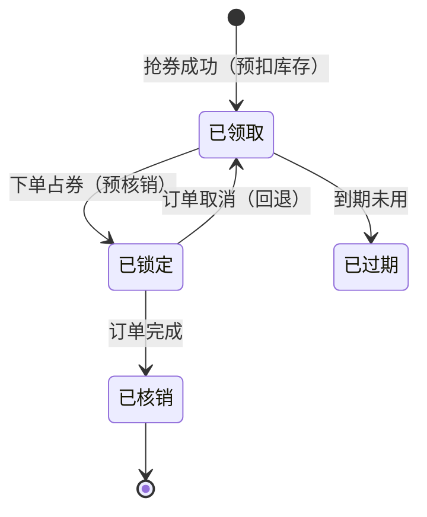

优惠券是营销系统的核心组件，也是把**库存超发**与**状态机**两套纪律合在
一起的经典场景：领券像秒杀（不能超发），用券像订单（状态不能乱）。
"券被薅了/券用了一次还能用/退款券没回来"——每个事故都对应一个状态机
漏洞。

## 先建模：券模板与用户券

- **券模板（coupon template）**：活动方配置——总发放量、每人限领、面额、
  使用门槛、有效期（固定日期 vs 领取后 N 天）；
- **用户券（user coupon）**：用户领到的那一份，有自己的**状态机**：

- **状态流转必须由服务端驱动**且每步有唯一性约束（数据库唯一索引/
  乐观锁），重复核销、并发取消在状态机层面天然互斥。

## 领券：与秒杀同构的并发模型

领券 = 一次"库存预扣 + 限领去重"：

- **库存预扣在 Redis**：`DECR coupon:{tid}` 扣到负数即售罄回补，
  数据库异步落"用户券"记录（秒杀篇同一套骨架）；
- **每人限领**：`SADD coupon:{tid}:users uid`（SADD 返回 0 = 已领过），
  去重与预扣一起在内存层完成；
- **券码类券**（兑换码换券）多一层：兑换码预生成 + 唯一索引防重放。

## 核销：与订单联动的两阶段

用券不是"直接用掉"，要和订单生命周期挂钩：

1. **锁券（预核销）**：下单时把券置为"已锁定"——券被占住但订单没完成；
2. **核销**：订单完成才置"已核销"；
3. **回退**：订单取消/退款，锁定的券**回退到已领取**（有效期顺延或恢复
   原到期时间，按业务定）。

防重复核销三板斧：状态机前置校验 + 数据库行锁/乐观锁 + 核销记录唯一
索引（订单号+券 ID）——三层里任何一层失效都不会重复核销。

## 高频追问速答

- **领券超发事故怎么复盘？** 经典根因是"Redis 预扣成功但 DB 落库失败
  没回补"——预扣与落库之间要有补偿（失败回滚 Redis）+ 定时对账
  （Redis 剩余 + 已发数 = 总量）；
- **"领取后 7 天有效"怎么实现？** 发券时算死到期时间戳（领取时刻 + 7d），
  过期用惰性判定（用时检查）或定时任务批量置过期——惰性判定省定时任务，
  但统计"过期数"需要兜底任务；
- **券和库存系统什么关系？** 营销库存与商品库存是两套账：用券降价不改
  商品库存，核销成功只影响营销成本账——边界不清就会在对账时打架
  （营销成本对账：发放量 × 面额 vs 实际核销成本）。

## 小结

- 券模板 + 用户券状态机（已领取/已锁定/已核销/已过期），状态流转由
  服务端驱动 + 唯一约束兜底。
- 领券复用秒杀骨架（Redis 预扣 + 去重），核销走锁券→核销→回退两阶段，
  与订单生命周期绑定。
- 事故高发点：预扣与落库的补偿缺失、状态机旁路、营销与商品两套账
  的边界混淆——对账是最后防线。
