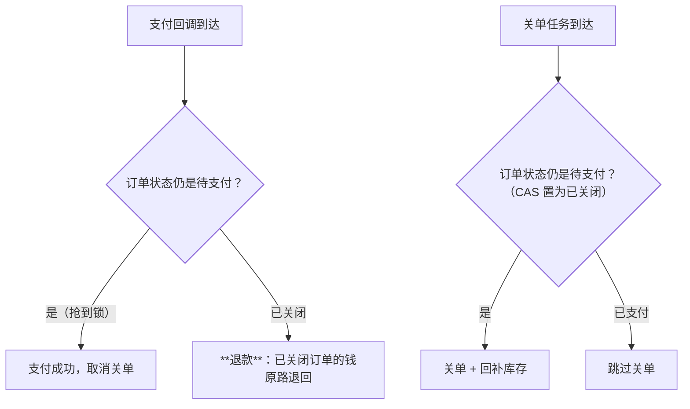

"下单 30 分钟未支付，自动关闭并释放库存"——人人都会写 `setTimeout`，
但**分布式下的可靠延迟任务**才是这道题的考点：关单消息丢了库存就永久
泄漏，关单和支付同时发生就是资损事故。四种实现方案各有明确的适用边界。

## 四种方案对比

| 方案 | 原理 | 优点 | 致命短板 |
| --- | --- | --- | --- |
| DB 定时轮询 | 定时任务扫"待支付且超时"订单 | 实现最简单、可靠（DB 为准） | 延迟=轮询间隔；大表扫描压力 |
| 内存延迟队列 | JDK DelayQueue / 时间轮 | 精度高、零外部依赖 | **单机内存态，重启丢任务**，无法分布式 |
| Redis 过期监听 | key 过期事件回调 | 简单 | **不保证及时/可达**（惰性删除+事件丢失） |
| MQ 延迟消息 | RocketMQ 延迟级别 / RabbitMQ TTL+死信 | 可靠投递、分布式、精度够 | 引入 MQ（多数系统本来就有） |

- **生产推荐 MQ 延迟消息**：下单成功发一条 30 分钟后投递的延迟消息，
  消费端做关单检查——投递语义由 MQ 保证，重启不丢（RocketMQ 延迟消息篇
  的定时轮实现可对照）；
- **Redis 过期监听只能做辅助**：过期事件是"尽力而为"（key 惰性清理、
  事件发布不重试），做主方案等于把关键流程押在不可达语义上——这是
  面试的辨析点；
- **轮询也没死**：小体量系统"每分钟扫一次"完全够用，且它是**兜底对账**
  的天然形态（MQ 方案也建议配一个低频轮询兜底——消息可能丢）。

## 关闭与支付的撞车：状态机 + 幂等

最危险的时刻：第 30 分钟整，用户点了支付、关单消息也到了——两者并发：

- 关单用**条件更新（CAS）**：`UPDATE orders SET status='CLOSED' WHERE
  id=? AND status='UNPAID'`——影响行数 0 说明已被支付，直接跳过；
- 支付回调发现订单已关闭 → **自动退款**（钱进了不能不认）——这条兜底
  流程没有，就是资损事故；
- 库存回补也要幂等（关单消息重复投递时回补两次 = 库存虚增）——按
  订单号做幂等键。

## 高频追问速答

- **为什么不用 Redis 过期监听做主方案？** 惰性删除导致过期事件可能
  延迟很久才触发；keyspace notification 是 fire-and-forget，丢事件
  无人补偿——可靠关单不能押在"不保证可达"的机制上。
- **轮询和延迟消息怎么选？** 量小、精度要求宽松 → 轮询（简单即正义）；
  量大、时效敏感 → MQ 延迟消息 + 低频轮询兜底，两者不是对立而是
  分层。
- **关单后用户坚持要买？** 重新下单即可——关单只回补库存不保留订单，
  简单一致；"恢复已关闭订单"会把状态机复杂度翻倍，不值得。

## 小结

- 四方案：轮询（简单可靠）、内存队列（单机玩具）、Redis 过期监听
  （不可靠，只做辅助）、MQ 延迟消息（生产推荐 + 轮询兜底）。
- 关单与支付撞车的正解：状态机 CAS 关单 + 已关闭自动退款 + 回补幂等。
- 延迟任务的考点从来不是"怎么定时"，是"定时到了之后，并发与丢消息
  的世界里还能不能做对"。
