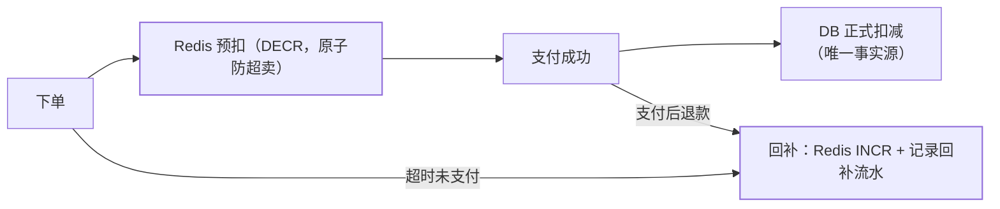

"库存什么时候扣"看似是细节，实则是**超卖与少卖两难的选择题**：扣早了
怕恶意占库存，扣晚了怕支付时没货。秒杀篇讲了预扣的并发骨架，本篇把
**三种扣减时机的一般化权衡**讲透——普通电商与秒杀的库存模型差异就在这。

## 三种时机与各自的坑

| 时机 | 超卖风险 | 少卖/占库存风险 | 体验 | 复杂度 |
| --- | --- | --- | --- | --- |
| **下单减** | 低（下单即占） | **高**：恶意下单占着不买 | 好（下单即锁定） | 中（必须配超时回补） |
| **支付减** | **高**：多人下单都成功，支付时才竞争 | 低 | 差（支付时被告知没货） | 低 |
| **预扣**（下单锁、支付转正、超时释放） | 低 | 低（超时释放） | 好 | 高（回补链路） |

- **下单减**的命门：占库存不付款——没有订单超时关闭（上一篇的延迟任务）
  配合，库存被恶意订单锁死；
- **支付减**的命门：下单时不校验真实库存，"成功下单"在支付那一刻失效——
  电商早期"下单成功付不了款"的投诉都源于此；
- **预扣**是两者的折中，也是**生产主流**：下单锁额度 → 支付转正式扣减 →
  超时/取消释放。

## 生产组合拳：Redis 预扣 + DB 正式扣 + 回补闭环

- **Redis 是可丢的计数器，DB 才是事实源**：Redis 预扣挡并发，支付成功
  后 DB 层再正式扣（`UPDATE stock SET num=num-1 WHERE sku=? AND num>0`
  的条件更新兜底防超卖）；
- **回补必须幂等**：订单关闭/取消/退款三条路都可能触发回补，按订单号
  做幂等键（回补流水唯一索引）——回补两次 = 凭空多库存；
- **对账兜底**：定时比对"Redis 剩余 + 已扣 DB = 初始库存"，Redis 与 DB
  漂移即告警（红包/优惠券篇的对账纪律通用）。

## 高频追问速答

- **DB 扣减用 `UPDATE ... WHERE num>0` 还是先查再改？** 条件更新的原子性
  由行锁保证，天然防超卖——先查再改在并发下必超卖（除非显式锁）。
- **爆款单 SKU 怎么扛？** 单行 UPDATE 是热点行（InnoDB 行锁串行）——
  **库存分桶**：100 件拆成 10 个桶行，请求路由到随机桶，合并统计
  （对照热点账户的缓冲记账）。
- **少卖怎么发现？** 回补失败/幂等误判都会让库存"凭空变少"——对账发现
  差异后以 DB 记录为准修正 Redis；所以回补流水不只防重复，也是修复
  依据。

## 小结

- 三时机权衡：下单减怕占库存、支付减怕超卖在支付端、预扣是生产主流
  ——预扣必须配超时释放，衔接订单超时关闭篇。
- Redis 预扣挡并发、DB 条件更新做事实源、回补幂等 + 对账兜底，
  三层缺一不可。
- 爆款 SKU 用库存分桶拆热点行——并发问题的最后一步永远是"拆热点"。
