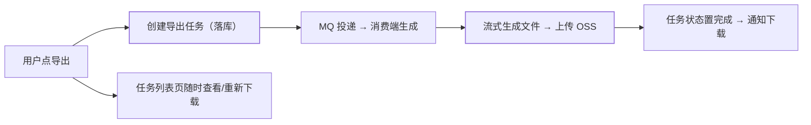

中后台系统的"导出报表"和"批量导入"，是**看起来最简单、上线后最先崩**
的功能：同步导出百万行直接 OOM，导入校验不严脏数据入库。本篇讲清
什么时候必须异步、任务中心怎么设计、错误怎么优雅地还给用户。

## 同步导出的三宗罪

`SELECT 全表 → POI 写 Excel → 返回文件` 的同步接口有三个致命伤：

- **OOM**：百万行数据全部加载进内存构建 Excel——几十 GB 堆也撑不住；
- **超时**：网关/浏览器超时（30s~60s）远小于生成时间——用户看到失败，
  服务端还在白算；
- **无法重试**：失败后只能从头再来。

解法分两档：**小数据量流式同步导出**（SXSSF 流式写、分页查询边查边写、
不缓存响应体），**大数据量走异步任务中心**。

## 异步导出：任务中心模式

- **任务状态机**：待处理/处理中/完成/失败——任务列表页可查、可重下、
  可重新触发（幂等：同参数导出复用未过期结果文件）；
- **生成端流式**：分页查询（游标，防深分页）+ 流式写 Excel
  （SXSSF/CSV）；超大批量按 10 万行拆分文件再打包 zip；
- **文件治理**：上传 OSS 用临时链接（过期失效）+ 定期清理——导出文件
  会变成存储垃圾源（大文件上传篇的孤儿治理同理）。

## 导入：校验、部分成功与错误回执

导入的难点不是读 Excel，是**坏数据的处理策略**：

- **两级校验**：格式校验（类型/必填/长度，逐行即时）+ 业务校验
  （唯一性/依赖存在性，批量查库）；
- **部分成功策略**：默认"错误行跳过、正确行入库"，结束后生成**错误
  回执文件**（原行号 + 失败原因）供用户修正重传——"全部回滚"体验差，
  "全部入库"脏数据多；
- **幂等导入**：业务唯一键（如手机号/编号）用 upsert（存在即更新），
  重复导入不产生重复数据（幂等篇的唯一索引武器）；
- **并发与限流**：导入也是高 CPU/IO 任务，走异步任务中心与导出同构，
  用户导入配额限流。

## 高频追问速答

- **百万行导出具体怎么做？** 流式查询（游标分页）+ SXSSF（滑动窗口写，
  内存中只保留窗口行）+ 超阈值拆分 zip——全程内存占用恒定；
- **导入 10 万行怎么提速？** 批量入库（rewriteBatchedStatements）、
  校验批量查库（一次 IN 查 1000 个）而非逐行查、关闭自动提交分批提交；
- **任务中心的状态怎么推进？** 消费端处理完才置"完成"，失败记录错误
  摘要——**任务表是用户视角的事实源**，别让用户对着转圈的按钮猜。

## 小结

- 数据量决定形态：小量流式同步、大量异步任务中心——OOM 与超时是
  同步接口的固定死穴。
- 任务中心 = 任务状态机 + MQ 异步生成 + OSS 文件治理 + 可重试幂等。
- 导入的用户体验在**错误回执**：行号 + 原因 + 可修正重传，upsert
  保证重复导入幂等。
