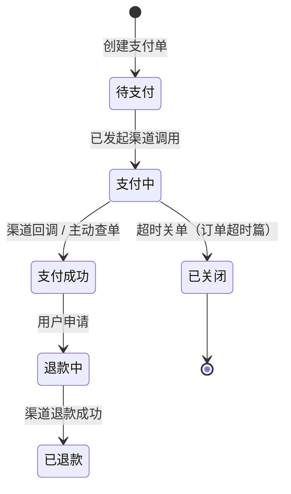

电商订单链的收口是支付。关键认知：**应用不自建支付，做的是"渠道聚合 +
状态同步"**——把微信/支付宝的差异封装掉，把"钱到底到没到"这件事用状态机
和对账体系管到滴水不漏。

## 渠道抽象：统一支付网关

微信、支付宝、银联的参数格式、签名算法（MD5/RSA/证书）、回调报文各不相同。
应用侧做一层**统一支付网关**：

- 对内暴露统一接口：`pay(订单号, 金额, 渠道, 商品描述)`；
- 对外适配各渠道：参数映射、签名生成、回调验签解析——渠道差异终结在
  网关层；
- 金额单位陷阱：微信分、支付宝元——**统一用"分"（整数）**，与红包篇
  同一条纪律。

## 支付状态机：回调为准，查单兜底

两条信息源：**渠道异步回调（主）+ 主动查单（兜底）**——回调可能丢失
或延迟（掉单），定时用"支付中的单"去渠道查单补状态，这就是掉单治理。

## 回调处理纪律：验签 → 幂等 → ACK

渠道回调会被**重复发送**（没收到你的成功应答就一直重发），处理纪律：

1. **验签**：防伪造回调（伪造"支付成功"是直接资损）；
2. **校验单据**：金额与订单匹配（防改单）、订单存在且状态合法；
3. **幂等处理**：按渠道交易号唯一索引——重复通知直接返回成功；
4. **及时 ACK**：业务处理成功才返回 success 约定报文，否则渠道持续重试；
   业务重（发货）走 MQ 异步，回调接口只改状态，**绝不同步干重活**。

## 对账：每天一次的兜底

渠道每天生成对账单（当日全部交易），与本地支付流水逐笔核对：

- **长款**（渠道有本地无）：掉单漏处理——查单补状态；
- **短款**（本地有渠道无）：本地状态异常——人工核实；
- **金额不一致**：差错单进人工池。对账是支付系统的**最后防线**——
  状态机、回调、查单都是为了"少出差错"，对账保证"出了差错必被发现"
  （红包/库存篇的对账纪律在此收口）。

## 高频追问速答

- **掉单怎么办？** 用户付了钱、系统不知道——两层兜底：支付中的单定时
  主动查单；每日对账抓长款补状态。根因减少靠回调链路高可用。
- **为什么支付要"支付中"这个中间态？** 区分"还没发起/已发起结果未知"——
  查单兜底只扫"支付中"，避免全量扫单。
- **退款怎么做？** 逆向调用渠道退款接口 + 退款单状态机 + 原路退回；
  退款同样要幂等与对账（部分退、多次退是常规定制点）。

## 小结

- 应用做支付 = 渠道聚合（统一网关封装差异）+ 状态同步（回调为准、
  查单兜底）+ 对账兜底。
- 回调四纪律：验签、校单、幂等、及时 ACK；重活异步化。
- 掉单靠查单，差错靠对账——支付系统的可靠不是"不出问题"，是
  "出了问题必被发现"。
