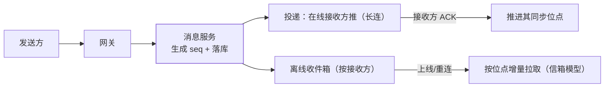

IM（微信/QQ 类）是实时系统设计的集大成者：**消息不丢不重不错序、
多端同步、在线推离线拉**——Feed 流篇讲的是"内容分发"，IM 讲的是
"点对点与群聊的消息可靠性"，两者是近亲但模型不同。

## 消息模型：服务端 ID 是秩序的根基

- **messageId 由服务端生成**（会话内单调递增的 seq，非客户端 UUID）——
  客户端时钟不可信、并发发送无全局顺序，**只有服务端分配的 seq 才能做
  消息排序与同步位点的标尺**；
- 会话维度维护 `conversationId + seq`：同会话内 seq 严格递增，
  跨会话不要求全局有序（业务上也不需要）。

## 收发链路：在线推，离线拉，推拉结合

- **在线推送 + 离线拉取**：接收方在线走长连直推；不在线/推送失败落
  收件箱，上线后**按自己的同步位点增量拉**——位点之前视为已读；
- **ACK 推进位点**：客户端确认收到才推进位点，没 ACK 下次还拉得到
  ——不丢的来源；
- **去重靠 messageId**：推送与拉取可能重复投递，客户端按 ID 幂等
  （至少一次投递 + 客户端去重 = 恰好一次的观感，与 Kafka 幂等消费
  同构）。

## 多端同步：每个端自己的位点

手机、平板、PC 同时登录——**每个端独立维护同步位点**（sync seq），
互不影响：手机看过的消息，PC 上线仍要完整同步（除非业务定义"已读
跨端共享"）。登录后流程：上报端自身位点 → 服务端增量下发 → 客户端
确认推进。这就是"消息漫游"的实现底座。

## 群聊：读写扩散的选择题

- **写扩散**（每个群成员一份收件箱，写时复制）：读简单、写爆炸——
  500 人大群一条消息写 500 份；
- **读扩散**（消息只写会话一份，成员按会话拉）：写省、读要聚合多个
  会话（信箱聚合查询）；
- 经验：**小群写扩散、超大群读扩散、混合分级**——与 Feed 流篇的
  推拉结合同构（大 V 读扩散、普通用户写扩散），同一个权衡换了马甲。

## 高频追问速答

- **消息顺序怎么保证？** 会话内按服务端 seq 排序展示；发送方本地
  "发送中"状态只是 UI，最终顺序以服务端 seq 为准。
- **发送失败/超时怎么办？** 客户端带本地 ID 重发，服务端按
  （发送方，本地 ID）幂等去重——重发不产生重复消息。
- **已读回执怎么做？** 已读也是消息（特殊类型），按会话推进对方的
  "已读位点"——多端各自维护，与消息同步同机制。

## 小结

- 服务端单调 seq 是 IM 的秩序根基：排序、同步位点、增量拉取全靠它。
- 推拉结合 + ACK 位点 + messageId 去重 = 不丢不重的观感。
- 群聊读写扩散与 Feed 流推拉同构——**收件箱模型**是两者的公共底座。
