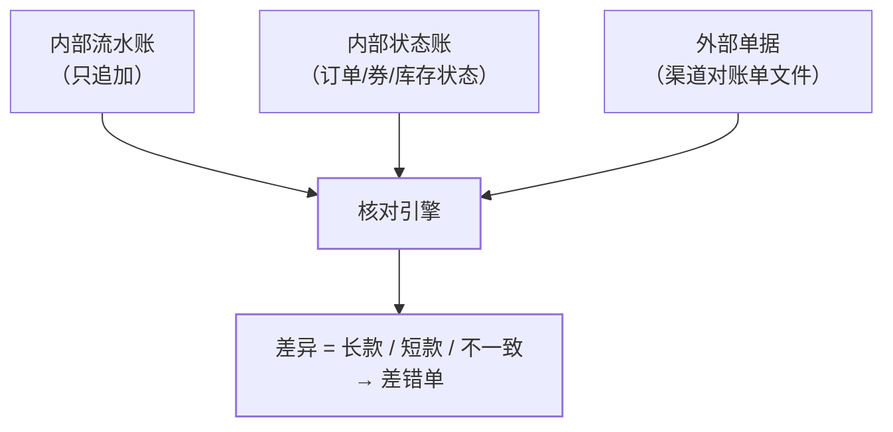

本站红包、库存、支付、优惠券各篇都有一句相同的收尾：**"对账兜底"**。
为什么所有资金/库存类系统最终都靠对账？因为**分布式系统的每个环节都
可能丢消息、不同步、被旁路写入**——重试、幂等、状态机把出错概率压低，
对账保证"出错必被发现"。这篇把散落的对账收拢成体系。

## 对账的本质：两套独立记录互为证据

两套**独立产生**的记录（各自有完整写入链路）互为证据：

- 内部流水 vs 内部状态（支付流水 vs 订单状态）——抓"状态机旁路"；
- 内部流水 vs 外部单据（本地支付流水 vs 渠道对账单）——抓"掉单/多单"；
- 账面 vs 实物/资金（库存账 vs 实际库存、应收 vs 实收）——抓"资损"。

关键设计前提：**流水不可变、只追加**（幂等篇的唯一索引保证）——
流水可以被"未处理"，不能被"改写"，否则对账失去基准。

## 对什么账：三层核对

- **准实时对账**：流式核对（T+0 分钟级），抓"及时性敏感"的差异——
  成本高、覆盖主链路；
- **T+1 全量对账**：渠道对账单逐笔核对，抓全量差异——**每天一次的
  最终防线**，两者不是二选一。

## 怎么对：算法与工程

- **核对键**：唯一业务键（渠道交易号/订单号）——键设计决定对账能否
  唯一命中（幂等篇的键纪律延伸）；
- **算法**：两侧按键排序后归并比对（大文件内存放不下就哈希分桶——
  同 hash 桶内比对，外部排序思想）；或直接灌进临时表用 SQL 全连接
  差集；
- **量级**：亿级对亿级——分桶并行 + OLAP 引擎（对账本身也是批处理，
  埋点篇的 OLAP 思路通用）。

## 差错闭环：发现之后怎么办

差异不是终点，**差错单闭环**才是：

1. **差错单生成**：每条差异落差错表（类型：长款/短款/状态不一致）；
2. **分类处理**：可自动补偿的走补偿任务（如掉单补状态——支付篇的
   查单兜底）；复杂的转人工（有工作流引擎走审批，审批流篇）；
3. **闭环核销**：差错单处理完必须"核销"（处理记录关联差错单），
   未核销差错持续告警——**差错单不许凭空消失**；
4. **根因回流**：差错类型统计反哺系统改进（某类掉单频发 → 修回调
   链路）。

## 高频追问速答

- **对账发现差异，自动修还是人工修？** 规则明确、单向可推的（掉单补
  状态）自动修；涉及钱的真实差异必须人工——**自动修复错一次比人工
  慢一次贵得多**。
- **对账任务本身挂了怎么办？** 对账任务也要监控（上次成功时间告警）
  ——防线系统自身也要有防线（可观测性三支柱的递归）。
- **准实时对账和 T+1 的关系？** 准实时抓"正在发生的资损"，T+1 抓
  "全量遗漏"——层级化防线，与限流的"多层级过滤"同思想。

## 小结

- 对账 = 两套独立记录互证 + 唯一键核对 + 差错单闭环；流水不可变是
  全部前提。
- 准实时 + T+1 分层防线；自动修复限于规则明确场景，钱的差异人工核。
- 为什么所有资金系统最后都长出对账：**分布式系统的每层保障都是
  概率性的，只有对账是确定性的**。
