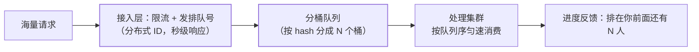

12306 抢票排队、银行叫号、演唱会开票——**请求洪峰超过处理能力**时的
标准答案不是硬抗，而是排队。它和限流是近亲但承诺不同：**限流是"超出
的直接拒绝"，排队是"超出的人请等待，会被处理"**——这个承诺决定了
排队系统必须额外解决公平、进度与超时。

## 核心抽象：排队号 + 位置 + 调度

- **排队号的本质是异步削峰**：接入层秒级发号（发号本身轻），重活交给
  后台按处理能力匀速消费——洪峰被"时间换空间"（秒杀篇的 MQ 削峰是
  同一思想的隐式版：MQ 队列就是排队）；
- **与限流配合**：排队号发放本身也要限流（发号阶段挡掉明显超额的），
  排队是处理洪峰的第二级。

## 分桶队列：百万级排队怎么存

单一 Redis List 扛百万级排队号会遇到大 key 与单点热点：

- **分桶**：按用户 hash 分成 N 个桶队列（如 64 个），发号时路由到桶；
- **调度顺序**：桶间轮询消费（公平性）——桶内 FIFO 保证先来先到；
- **进度反馈**：用户位置 = 前面桶的总数 + 本桶内位置（近似值即可，
  排队体验要的是"在动"不是"精确"）。

## 公平与过号：真实世界的不完美

- **公平性边界**：严格 FIFO 是理想，现实有 **VIP 通道**（会员优先队列
  ——业务分层的合法"插队"）与**优先级队列**（风控豁免）。公平是
  产品决策不是技术洁癖；
- **过号与超时**：叫号 3 次无人应答 → 出队或延后重排；抢票排队中
  用户关页面 → 定时清理（延迟任务篇的过期出队）——**清理策略要
  配合业务语义**；
- **防插队的技术面**：排队号与用户绑定（uid 唯一），重复请求返回
  已有号（幂等，防同一用户占多个号）。

## 高频追问速答

- **排队和 MQ 有什么区别？** MQ 是系统内部的异步解耦（调用方不感知），
  排队是面向用户的显式等待（有进度、有承诺）——用户体验要求完全不同。
- **排队期间用户取消/关页面怎么办？** 定时扫描超时未确认的号出队；
  用户主动取消则出队并清路由——泄漏的排队号会造成"虚高的队列"。
- **为什么发号用分布式 ID？** 排队号要全局唯一且趋势递增（公平性
  可审计）——分布式 ID 篇的号段/雪花模式直接复用。

## 小结

- 排队 = 异步削峰 + 公平调度 + 进度反馈；与限流的本质区别是
  "等待承诺"。
- 百万级靠分桶队列 + 桶间轮询；进度反馈求"在动"不求精确。
- 过号清理、防重复占号、VIP 分层——排队系统一半的代码在处理
  "真实世界的不完美"。
