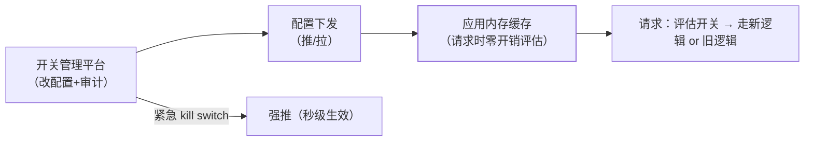

灰度发布篇管的是"**部署层面**的放量"（新版本机器逐步接流量），
功能开关管的是"**代码逻辑层面**的开关"——新功能上线了但藏在一个
if 后面，随时一键全量或一键关闭（kill switch）。大厂标配，出事时的
最后阀门。

## 四类开关，生命周期完全不同

| 类型 | 用途 | 生命周期 | 治理重点 |
| --- | --- | --- | --- |
| 发布开关（release） | 新功能隐藏上线、逐步放开 | **短期**（天~周） | 用完必须删，防技术债 |
| 运维开关（ops） | 降级某昂贵功能（kill switch） | 长期常驻 | 稳定性演练（开关真的能关） |
| 实验开关（A/B） | 实验分组对照 | 实验周期 | 分组一致性 |
| 权限开关 | 按租户/角色启用 | 随商务合同 | 与权限体系对齐 |

- 发布开关是**技术债制造机**：半年前的开关还在代码里，组合状态爆炸
  （测试矩阵 = 2^n）——**开关到期必须清理**（平台自动提醒）。

## 评估架构：配置源 + 缓存 + 实时性

- **评估时机**：请求时实时评估（值缓存在内存，配置变更推送刷新）——
  启动时快照会导致 kill switch 失效期长达一次发布周期；
- **值不止布尔**：百分比放量（hash(uid) % 100 < x）、白名单、多变量
  （实验分组）；
- **kill switch 的响应时间**是唯一 KPI：从"发现问题"到"全站生效"
  要在分钟级——平时就该演练（降级开关不演练等于没有）。

## 高频追问速答

- **开关配置放哪？** 配置中心（Nacos/Apollo）或专用平台——Redis 直读
  会打爆缓存（每请求都查）；**内存缓存 + 变更推送**是标准解。
- **开关嵌套怎么办？** 开关里套开关 = 组合状态爆炸，测试覆盖不住——
  约束：一个开关管一件事，嵌套深了说明功能该拆。
- **和配置中心的普通配置什么区别？** 普通配置是"参数值"，开关是
  "代码路径选择"——开关必须有清理生命周期与审计，普通配置没有。

## 小结

- 四类开关生命周期迥异：发布开关短期必清，运维开关长期常驻。
- 评估架构 = 平台管理 + 配置推送 + 内存缓存实时评估；kill switch
  分钟级生效是唯一 KPI。
- 开关是技术债：**加开关时就想好删除日期**——治理成本与开关数量
  同比增长。
