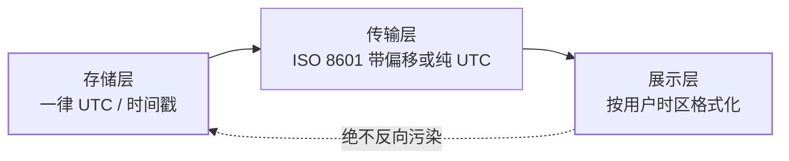

"时间差了 8 小时"是后端工程师的成人礼——每个国际化系统都会踩，
踩过的人都知道：时区问题的解药不是某个技巧，是**一条纪律**：
**存储与传输永远用 UTC，展示才转本地时区**。

## 三层分离：黄金法则

- **存储层**：数据库时间列统一 UTC（或 BIGINT 时间戳），不带本地时区
  ——服务器搬机房、时区规则变了（夏令时政策）都不影响存量数据；
- **传输层**：API 用 ISO 8601 且**带偏移量**（`2026-09-08T04:00:00Z`
  或 `+08:00`）——不带偏移的时间字符串是歧义的；
- **展示层**：按**用户的**时区格式化——服务器时区与浏览器时区都
  不可信（用户可改系统时区，优先取用户 profile 里的时区设置）。

## 数据库的时区行为差异

- **MySQL**：`DATETIME` 不存时区（存什么读什么——存本地时间就是坑），
  `TIMESTAMP` 存 UTC 内部转换（但受连接 `time_zone` 影响、2038 问题）；
- **PostgreSQL**：`timestamptz` 实际存 UTC 并按连接时区渲染——语义
  更清晰；
- 排查纪律：**写与读必须同一时区上下文**，连接串显式声明时区；
  MySQL 经典事故：存入按 UTC 读出按 CST（或反之），差 8 小时即此。

## 三个经典坑

1. **夏令时**：某些时区一年拨动两次——"每天 2:00 执行"在夏令时切换日
   会跑两次或跳过；跨时区调度用 UTC 计算再加偏移（定时任务篇的
   OnCalendar 用 UTC 语义需注意）；
2. **服务器时区不可控**：容器默认 UTC、云主机镜像时区各异——代码里
   依赖"服务器本地时间"就是埋雷（日志时间与业务时间对不上）；
3. **前端时间不可信**：用户可改设备时区伪造"今天"——业务关键时间
   （签到日、活动截止）以服务端 UTC 为准换算。

## 高频追问速答

- **为什么存 UTC 而不是"存用户本地时间"？** 本地时间丢掉了时区信息
  无法还原；多区域部署/夏令时规则变更（历史上改过）会让存量数据
  无法解释——UTC 是唯一无歧义的坐标。
- **"差 8 小时"怎么排查？** 固定清单：①存入时用的什么时区 ②读取
  连接时区 ③展示层转换是否重复 ④数据本身是不是被别的系统按本地
  时间写入——四步走，别上来就"+8/-8 试"。
- **定时任务用哪个时区？** 全局任务用 UTC（服务器与时区无关）；
  "每天上午 9 点对用户"类要按用户时区分别计算——定时任务篇的
  换算纪律。

## 小结

- 一条纪律管所有：**存储与传输 UTC、展示才本地化**；数据库/服务器/
  前端时区全部不可信。
- MySQL 的 DATETIME 与 TIMESTAMP 时区语义不同，连接时区显式声明。
- 差 8 小时排查走固定清单——时区问题的解药是纪律，不是技巧。
