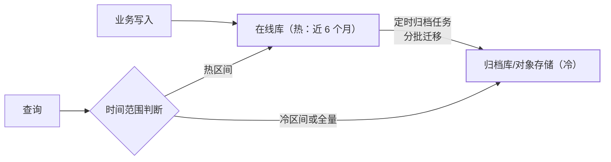

订单 3 个月后几乎没人查，但**必须可查**——放任不管的结局：在线表无限
膨胀（索引变深、备份变慢、查询退化）、DDL 无法执行（Online DDL 篇的
大表困境）。数据归档（冷热分离）是解药，它和分库分表是**正交的两刀**：
分库分表切容量维度，归档切时间维度。

## 为什么要归档：在线表的膨胀代价

- **索引变深**：行数翻倍，B+ 树多一层——所有查询慢一拍；
- **备份/DDL 变慢**：备份窗口、Online DDL 耗时都与表大小线性相关；
- **缓存命中率下降**：冷数据挤占 buffer pool（页缓存篇），热查询
  反而变慢；
- 冷热分离后：在线表恒定大小（只放 6 个月热数据），性能可预期。

## 归档架构：在线库 → 归档库的双层

- **查询路由**：按时间范围自动路由（应用层或中间件）——全量查询
  双查合并；归档库也有索引，不是"存起来就行"；
- **更冷的层**：极冷数据（3 年前）压缩后放对象存储，按需恢复——
  存储成本再降一档。

## 工程细节：怎么删才不炸

- **分批删除**：`DELETE ... LIMIT 1000` 循环 + 批间 sleep——一次性
  删百万行 = 大事务（锁表、binlog 巨型化、主从延迟爆炸）；
- **先归档后删除**：归档确认落库成功**才**删在线数据——顺序反了就是
  丢数据（与大文件上传的"先传分片后合并"同构）；
- **删除边界**：只归档"创建时间 < 边界"的行，边界内的新写入不动
  ——避免归档任务与业务写入竞争同一批行；
- **幂等**：归档任务重跑不能重复插归档库（归档表唯一键 = 原表主键）。

## 高频追问速答

- **归档任务失败怎么办？** 归档是事务性的：一批"插归档+删在线"要么
  都成要么都重跑（幂等键保证重跑不重复）——批次表记录进度，断点续跑；
- **归档库也要查询，是不是白分了？** 归档库索引更小、行更少——冷查询
  在归档库上反而快；代价是跨层全量查询要双查合并（业务上极少全量）。
- **和分区表什么关系？** MySQL 分区表是"逻辑一张表物理多文件"——
  归档场景可用分区裁剪 + DROP PARTITION（秒删）；但分区表运维限制多
  （很多 DDL 不支持），大厂更常用"物理分表 + 归档库"。

## 小结

- 归档切时间维度、分库分表切容量维度——正交的两刀，大系统都要。
- 归档纪律：分批删防大事务、**先归档后删除**、幂等键防重、边界内
  不动。
- 双层查询路由 + 归档库有索引——冷数据不是"扔了"，是"换个性价比
  更高的地方放着"。
