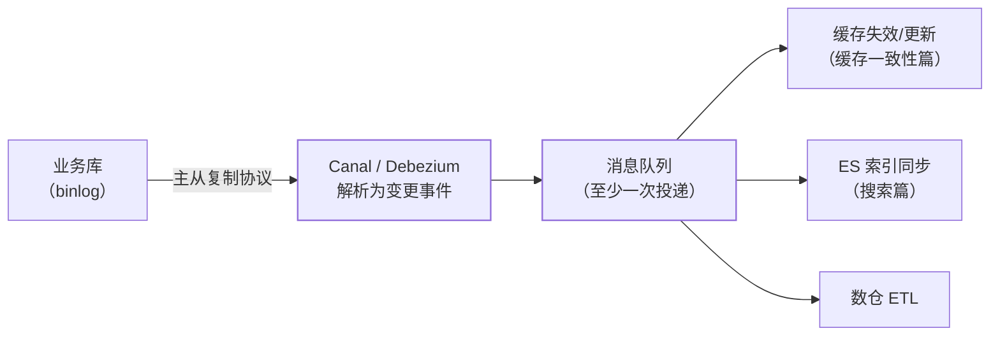

"数据库一变，缓存、搜索索引、下游服务都要跟着变"——轮询是本能答案，
CDC（Change Data Capture，变更数据捕获）是生产答案。它把"数据库的每次
变更"变成**可订阅的事件流**，是缓存一致性、搜索索引、数仓同步的公共
底座。

## 轮询的三宗罪

不带 CDC 的同步靠"定时扫表"（`WHERE updated_at > 上次时间`）：

1. **漏**：物理删除抓不到（行没了）；updated_at 无索引就是全表扫；
2. **慢**：轮询间隔就是同步延迟下限——分钟级起步；
3. **压**：扫表压力全打在业务库上，表越大越疼。

## CDC 原理：伪装成从库读 binlog

MySQL 的 binlog 记录了**每一行变更**（三大日志篇）——CDC 工具
（Canal/Debezium）伪装成 MySQL 的从库，向主库拉 binlog 并解析成
结构化变更事件：

- **对业务零侵入**：业务代码不用写"同步缓存"的代码——数据层变更
  自动广播（对比双写的代码侵入与不一致风险，缓存一致性篇）；
- 实时性毫秒级（binlog 是流式的）。

## 工程要点：至少一次 + 下游幂等

- CDC 投递是**至少一次**（宕机重放会重复）——下游（缓存更新/索引
  写入/ETL）必须幂等（幂等篇：按主键 upsert 天然幂等）；
- **DDL 变更**：表结构变更事件的解析与下游兼容（加列好办，改列名
  下游要跟着改）——schema 演进的治理；
- **全量+增量**：新接入下游要历史数据——先全量快照同步、再切增量
  流（位点对齐，位标语义与 IM 同步位点同源）；
- **选型**：Canal（阿里，MySQL 生态成熟、中文资料多）、Debezium
  （Red Hat，多数据库支持、Kafka Connect 生态）——按数据库类型与
  下游基础设施选。

## 高频追问速答

- **CDC 会丢数据吗？** 正常不丢（binlog 位点持久化，重启续传）；
  但**至少一次**——下游幂等是必须的。位点误删/保留期过短会丢，
  监控位点延迟。
- **直接双写缓存不行吗？** 双写有代码侵入、双写不一致（一边成功一边
  失败）、事务边界问题——CDC 把同步职责从业务代码剥离（缓存一致性
  篇的方案对比）。
- **CDC 对主库有压力吗？** 有——拉 binlog 是主从复制的同类负载，
  通常可忽略；大规模场景拉从库的 binlog 或用 binlog offload。

## 小结

- CDC = 解析数据库变更日志为事件流：实时、无侵入、覆盖删除——
  三点全胜轮询。
- 铁律：至少一次投递 + 下游幂等；schema 演进与全量增量切换是两大
  工程点。
- 场景：缓存失效、ES 索引同步、数仓 ETL——一次捕获多方订阅。
