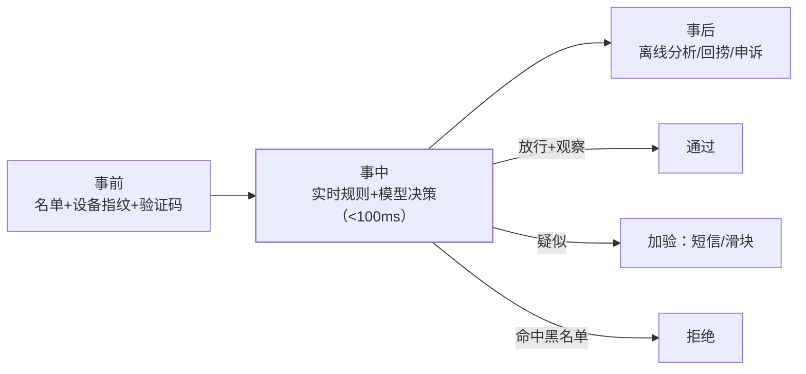

抽奖防刷、登录防撞库、交易反欺诈——本站多个场景篇的"防刷"都只是
一句带过，因为**风控本身是一个对抗性子系统**：它的特殊性在于
**对手会演化**（攻防持续博弈），任何静态规则都会被磨掉——风控系统
的设计核心是"分层布防 + 快速迭代"。

## 风控的三层布防

- **事前**：把已知的坏流量挡在门外——黑名单直接拒、可疑设备加验证码；
- **事中**：实时决策是核心——毫秒级判断"这个请求放不放"（抽奖/秒杀
  篇的限流挡的是量，风控挡的是"人"）；
- **事后**：离线大数据分析发现新攻击模式（同设备批量注册、资金异常
  流转）→ 回捞损失 → **新模式反哺规则**——对抗演化的闭环。

## 名单体系与设备指纹

- **黑白灰三名单**：黑（直接拒）、白（直接过）、灰（加验）——Redis
  Set 存储，名单更新要实时生效（Feature Flag 篇的推送机制同构）；
- **设备指纹**：把设备特征（UA/屏幕/字体/传感器）聚合成唯一 ID——
  识别"同一设备换号再薅"；对抗手段是改指纹，所以指纹算法持续迭代；
- **关联分析**：一个设备/IP/支付账号关联的账号数——批量小号的
  主要识别信号。

## 实时决策：延迟与准确的平衡

- **延迟要求 <100ms**（不能拖慢正常用户）——规则引擎（可配置的
  条件-动作）+ 轻量模型；**深度模型只做事后离线分析**，不上实时链路；
- **规则引擎自研 vs Drools**：规则量小用自研（规则表+表达式求值），
  复杂用 Drools/CEP——与敏感词过滤的 AC 自动机一样，"规则可配置"
  是风控系统的核心需求；
- **窗口聚合**：Flink 实时统计"1 分钟内同 IP 注册 10 个账号"这类
  频率特征——流式计算（可观测性篇的指标管线同源）。

## 误杀与体验：风控是概率系统

风控永远有**误杀**（把好人当坏人）——处置分级：

- **直接拒绝**：确定性黑（已定罪特征）；
- **加验**：疑似（短信/滑块/人脸）——多一道验证换通过；
- **放行+观察**：轻微可疑——限流观察后续行为；
- **申诉通道**：误杀必须有出口（人工审核），申诉数据反哺模型——
  与对账篇的"差错闭环"同一哲学：**出错必被发现，发现必有出口**。

## 高频追问速答

- **规则引擎自研还是 Drools？** 规则 <百条自研（规则表+表达式引擎）
  快速可控；复杂嵌套/大量规则用 Drools——门槛是规则的可维护性。
- **风控规则被绕过怎么办？** 必然被绕过（对抗性）——监控绕过模式、
  快速上新规则、模型层兜底——**风控系统的 KPI 是"新攻击的响应
  速度"不是"永不绕过"**。
- **验证码怎么选？** 图形验证码（弱）、滑块（中）、行为验证码
  （强）——强度与体验反比，按风险等级动态升压。

## 小结

- 三层布防：事前名单/指纹、事中实时决策（<100ms）、事后离线反哺
  ——对抗性系统的核心是**快速迭代而非完美规则**。
- 名单黑白灰 + 设备指纹 + 关联分析识别批量小号。
- 处置分级：拒/加验/放行观察——误杀必有申诉出口（概率系统要有
  人道出口）。
