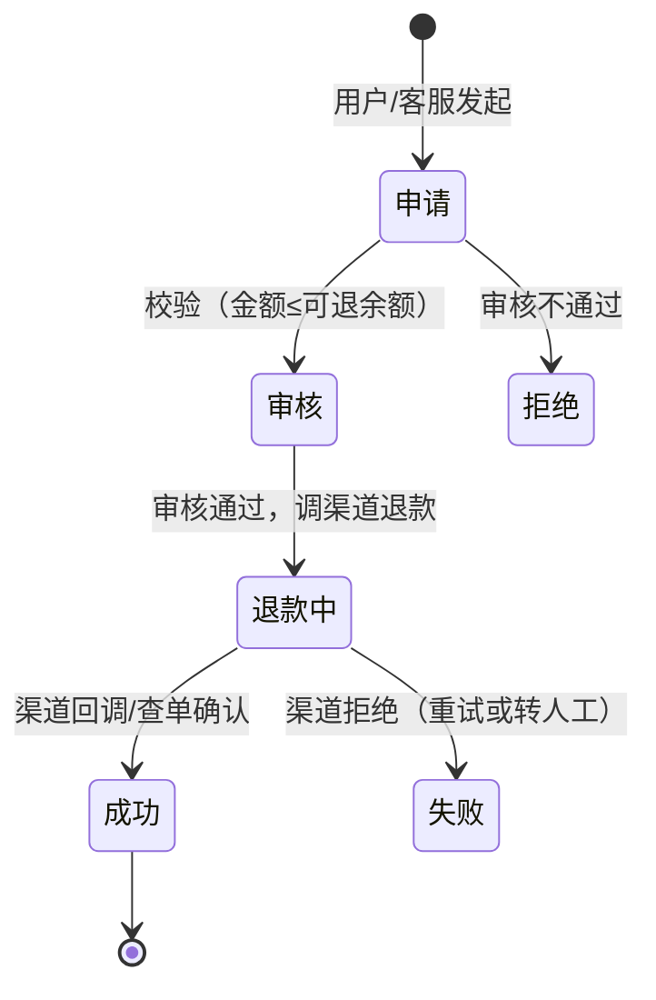

电商面试的深水区不在下单，在**售后**：正向链路（下单→支付→发货）是
设计出来的直线，逆向链路（退款/退货/换货）是**钱、货、券三条线各自
回退**的网——任何一条线不同步就是资损或客诉。

## 退款单：独立的状态机与事实源

退款不是订单的一个字段，是**独立的退款单**（退款单号/关联订单/金额/
状态/原因）——一笔订单可**多次部分退款**（累计不超实付）：

- **可退余额** = 实付金额 − 已退款累计 − 锁定中（处理中的退款单）——
  并发申请靠"锁定中"状态 + 唯一约束防超退；
- **渠道退款接口本身要幂等**（用退款单号做幂等键）——重试不会重复退。

## 三线回退：钱、货、券的一致性

| 线 | 动作 | 触发时机 |
| --- | --- | --- |
| 资金线 | 渠道原路退款 | 审核通过（异步，有渠道处理时长） |
| 库存线 | 回补可售库存 | 退货入库确认（非仅退款场景） |
| 优惠券线 | 退回使用的优惠券 | 订单整单取消时 |

三线**异步且时长不同**（渠道退款 T+1、物流回仓 3 天）——不可能同步
强一致，靠**各自状态机 + 最终对账**（对账体系篇）：三线都以订单为
关联键，对账任务核对"退款单状态 vs 资金流水 vs 库存回补流水"。

## 撞车场景：退款与发货并发

"申请退款"和"商家发货"同时发生——解法与订单超时关闭篇同构：

- **发货前置校验**（CAS）：发货动作检查订单是否已进入退款流程；
- **退款审核时检查物流状态**：已发货 → 转"退货退款"流程（用户先寄回）；
- 兜底：已发货但退款成功的极端情况 → **拒收退回**的物流线兜底。

## 高频追问速答

- **退款失败怎么办？** 渠道拒绝（余额不足/账户异常）→ 重试退避 +
  超限转人工——退款失败单要有**告警**（用户在等钱，静默失败就是
  投诉）。
- **渠道退款有额度/时限吗？** 有：渠道退款有效期（如一年）、单笔/
  单日限额——超期订单走线下打款（凭证入账，对账体系覆盖）。
- **仅退款（不退货）怎么防薅？** 风控篇的名单+规则：高风险用户/
  高价值商品限制仅退款，走退货退款。

## 小结

- 退款单是独立事实源（状态机 + 可退余额公式），部分退款靠"累计 ≤
  实付 + 锁定中"防超退。
- 三线回退（钱/货/券）异步不同步——状态机 + 对账兜底，强求同步
  是设计错误。
- 撞车场景（退款 vs 发货/收货）靠 CAS 前置校验 + 物流兜底。
