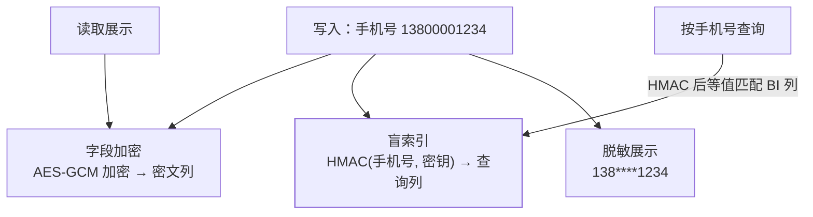

《个人信息保护法》之后，手机号、身份证、银行卡的存储与展示不再是
"可选优化"而是**合规红线**。密码存储篇解决了密码（不可逆哈希），
本篇解决**可逆的敏感字段**（要能解密回来看，但要防泄露、防内鬼、
还要能按手机号查询）。

## 三件套：加密、盲索引、脱敏

- **字段加密**（AES-GCM）：密文列存真实数据——拖库拿到密文没有
  密钥解不开；
- **盲索引（blind index）**：`HMAC(手机号, 盲索引密钥)` 单独一列——
  密文无法 WHERE，盲索引列支持**等值查询**（HMAC 是确定性哈希，
  同输入同输出）；
- **展示脱敏**：按角色分级——客服看 `138****1234`，风控看全号
  （有审计）。

## 三个设计要点

1. **密钥与数据分离**：加密密钥不放数据库/同一配置——密钥泄露 =
   加密白做；生产用 KMS（密钥管理服务）+ 密钥轮换；
2. **盲索引用 HMAC 不是裸 hash**：手机号空间只有 10^11 个——裸
   SHA256 可被穷举还原（彩虹表思路），HMAC 带密钥让穷举失效
   （密码存储篇的"慢哈希防穷举"在查询列的变体）；
3. **范围查询是天然弱点**：盲索引只能等值——"查上月手机号 138 开头"
   做不到密文查询，方案是应用层过滤或专门的加密检索方案（成本高）。

## 高频追问速答

- **为什么不用数据库自带的透明加密（TDE）？** TDE 防的是"偷磁盘
  文件"（静态加密），**有权限的查询仍看到明文**——防内鬼与
  应用层泄露要字段级应用层加密。
- **日志里的敏感数据呢？** 日志脱敏（手机号/身份证打码）+ 日志
  分级（日志管理篇）——**日志是泄露重灾区**（debug 打印全字段）。
- **导出报表怎么办？** 导出走脱敏（或审批+水印+审计）——导出是
  泄露的主通道之一。

## 小结

- 三件套：字段加密（AES-GCM 防拖库）、盲索引（HMAC 支持等值查询）、
  展示脱敏（按角色分级）。
- 密钥与数据分离 + HMAC 防穷举 + 范围查询是天然弱项——设计与
  限制都要心里有数。
- 与密码存储篇组成完整的"敏感数据安全"：密码不可逆哈希，
  可逆字段加密+盲索引。
